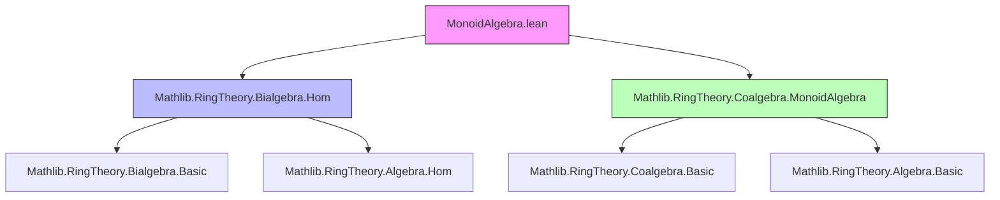

### Technical Metadata Brief: `MonoidAlgebra.lean`

---

#### **1. Key Definitions & Theorems**

| Name | Type / Signature | Purpose |
|------|------------------|---------|
| `instBialgebra` | `Bialgebra R A[M]` | Constructs the $R$-bialgebra structure on the monoid algebra $A[M]$, assuming $A$ is an $R$-bialgebra and $M$ a monoid. |
| `mapDomainBialgHom` | `f : M →* N ↦ R[M] →ₐc[R] R[N]` | Induced bialgebra homomorphism on monoid algebras from a monoid homomorphism $f: M \to N$. |
| `mapDomainBialgHom_id` | `mapDomainBialgHom R (.id M) = .id R R[M]` | Identity preservation for `mapDomainBialgHom`. |
| `mapDomainBialgHom_comp` | `mapDomainBialgHom R (f ∘ g) = mapDomainBialgHom R f ∘ mapDomainBialgHom R g` | Compatibility with composition of monoid homs. |
| `mapDomainBialgHom_mapDomainBialgHom` | `mapDomainBialgHom R f (mapDomainBialgHom R g x) = mapDomainBialgHom R (f ∘ g) x` | Explicit action of composed maps on elements. |
| `AddMonoidAlgebra.mapDomainBialgHom` | `f : M →+ N ↦ AddMonoidAlgebra R M →ₐc[R] AddMonoidAlgebra R N` | Additive monoid version of `mapDomainBialgHom`. |
| `LaurentPolynomial.instBialgebra` | `Bialgebra R A[T;T⁻¹]` | Inherits $R$-bialgebra structure on Laurent polynomials via identification $A[T;T⁻¹] \cong A[\mathbb{Z}]$. |
| `comul_T` | `comul (T n) = T n ⊗ T n` | Comultiplication on Laurent polynomial generator $T^n$. |
| `counit_T` | `counit (T n) = 1` | Counit on Laurent polynomial generator $T^n$. |

---

#### **2. Naming Conventions**

- **Prefixes**:
  - `mapDomain*`: For maps induced by monoid homomorphisms on domain.
  - `inst*`: For typeclass instances (`instBialgebra`).
- **Suffixes**:
  - `BialgHom`: Denotes bialgebra homomorphisms (`→ₐc[R]`).
  - `comp`, `id`: For composition and identity lemmas.
- **Notable patterns**:
  - `single_*`, `comul_single`, `counit_single`: Use of `single` (i.e., $ \delta_m $) as building blocks.
  - `TensorProduct.map_tmul`, `lsingle_apply`: Low-level tensor and support manipulation.

---

#### **3. Tactic Stack**

Frequently used tactics in proofs:

| Tactic | Role |
|--------|------|
| `simp` | Simplification using definitional equalities, especially for `single`, `comul`, `counit`, and algebra structures. |
| `ext` | Extensionality to prove equality of linear maps or algebra homomorphisms. |
| `rw` / `simp_rw` | Rewriting using lemmas like `comul_single`, `Bialgebra.comul_mul`, etc. |
| `aesop` | Not explicitly used here, but `simp` suffices due to highly structured definitions. |
| `ring` | Not needed — arithmetic is handled via `simp` on semiring structure. |
| `change`, `exact`, `refine` | Used implicitly in `by` blocks for fine control. |

---

#### **4. Proof Logic**

- **Structure**: Proofs rely heavily on:
  - **Extensionality** (`ext`) to reduce to checking on `single m`.
  - **Simplification** using:
    - Definitions of `comul`, `counit` on `single m`.
    - Properties of bialgebras (`Bialgebra.comul_mul`, `Bialgebra.counit_one`, etc.).
    - Finsupp lemmas (`Finset.sum_mul_sum`, `map_sum`, `lsingle_apply`).
    - Tensor product identities (`TensorProduct.map_tmul`, `tmul_mul_tmul`).
- **Induction**: Not needed — proofs are pointwise on support-finite functions (`single` basis).
- **Key strategy**:
  - Reduce to verifying identities on `single m` (basis elements).
  - Use `Coalgebra.Repr.arbitrary` to express arbitrary elements as sums of `single`.
  - Apply distributivity and naturality of tensor product maps.

---

#### **5. Imports**

| Module | Purpose |
|--------|---------|
| `Mathlib.RingTheory.Bialgebra.Hom` | Provides bialgebra homomorphism interface (`→ₐc[R]`). |
| `Mathlib.RingTheory.Coalgebra.MonoidAlgebra` | Supplies coalgebra structure on `MonoidAlgebra`/`AddMonoidAlgebra`. |

---

#### **6. Theory Overview & Dependencies**

##### **Dependency Graph (Mermaid)**



##### **Overview Diagram (Mermaid)**

```mermaid
graph LR
  R[CommSemiring R] --> A[Bialgebra R A]
  M[Monoid M] --> A[M][MonoidAlgebra R M]
  A -->|induces| A[M]
  A[M] -->|instBialgebra| Bialgebra_R_A_M[Bialgebra R A[M]]

  M -->|f: M→*N| N[Monoid N]
  A[M] -->|mapDomainBialgHom f| A[N][MonoidAlgebra R N]

  A[T;T⁻¹] <-->|≅| A[Z][A[ℤ]]
  A[Z] -->|instBialgebra| Bialgebra_R_A_Z[Bialgebra R A[ℤ]]
  A[T;T⁻¹] -->|instBialgebra| Bialgebra_R_A_Laur[Bialgebra R A[T;T⁻¹]]

  style R fill:#ddf,stroke:#333
  style A fill:#ddf,stroke:#333
  style M fill:#ddf,stroke:#333
  style A[M] fill:#ffd,stroke:#333
  style A[N] fill:#ffd,stroke:#333
  style A[Z] fill:#ffd,stroke:#333
  style A[T;T⁻¹] fill:#ffd,stroke:#333
```

---

#### **7. Theory Scope**

- **Core domain**: Bialgebra theory over monoid algebras and Laurent polynomial algebras.
- **Scope**:
  - Extends coalgebraic structure on `MonoidAlgebra` to full bialgebra.
  - Constructs functoriality of monoid algebra w.r.t. monoid homs *as bialgebra homs*.
  - Applies to Laurent polynomials via `ℤ`-graded structure.
- **Limitations** (per TODOs):
  - `mapDomainBialgHom` currently only for `R[M] → R[N]`, not for general $A[M] → A[N]$.
  - No universal property or adjunctions formalized yet.

--- 

Let me know if you'd like a formalized dependency graph in `leanpkg` format or a summary of missing lemmas for future work.
