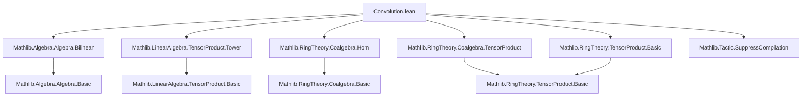

### Technical Brief: Convolution Product on Linear Maps from a Coalgebra to an Algebra

---

#### **1. Key Definitions & Theorems**

| Name | Type / Signature | Purpose |
|------|------------------|---------|
| `convMul` | `Mul (C →ₗ[R] A)` | Defines multiplication on `C →ₗ[R] A` via `f * g = μ ∘ (f ⊗ g) ∘ δ` |
| `convMul_def` | `f * g = mul' R A ∘ₗ TensorProduct.map f g ∘ₗ comul` | Explicit definition of convolution product |
| `convMul_apply` | `(f * g) c = mul' R A (.map f g (comul c))` | Pointwise evaluation of convolution product |
| `Coalgebra.Repr.convMul_apply` | `(f * g) a = ∑ i ∈ 𝓡.index, f (𝓡.left i) * g (𝓡.right i)` | Sweedler-style expansion using coalgebra representation |
| `convNonUnitalNonAssocSemiring` | `NonUnitalNonAssocSemiring (C →ₗ[R] A)` | Constructs semiring structure without unit or associativity |
| `convNonUnitalSemiring` | `NonUnitalSemiring (C →ₗ[R] A)` | Adds associativity of multiplication (but no unit) |
| `convSemiring` | `Semiring (C →ₗ[R] A)` | Adds multiplicative unit (`1 = algebraMap ∘ counit`) |
| `convCommSemiring` | `CommSemiring (C →ₗ[R] A)` | Adds commutativity under cocommutativity of `C` |
| `convNonUnitalNonAssocRing`, `convNonUnitalRing`, `convRing`, `convCommRing` | Analogous ring structures | Extend above to additive inverses (i.e., `Ring`/`CommRing`) |
| `toSpanSingleton_convMul_toSpanSingleton` | `toSpanSingleton x * toSpanSingleton y = toSpanSingleton (x * y)` | Embedding of algebra multiplication into convolution |
| `TensorProduct.map_convMul_map` | `(f ⊗ₘ g) * (h ⊗ₘ k) = (f * h) ⊗ₘ (g * k)` | Compatibility of convolution with tensor product maps |
| `nonUnitalAlgHom_comp_convMul_distrib`, `algHom_comp_convMul_distrib` | `h (f * g) = h f * h g` | Convolution is natural w.r.t. algebra homs |
| `convMul_comp_coalgHom_distrib` | `(f * g) ∘ h = (f ∘ h) * (g ∘ h)` | Convolution is natural w.r.t. coalgebra homs |

---

#### **2. Naming Conventions**

- **Prefixes**:
  - `conv*`: All convolution-related definitions (`convMul`, `convOne`, `convSemiring`, etc.)
  - `toSpanSingleton_*`: Embedding of algebra elements into linear maps via span singleton
- **Suffixes**:
  - `*Hom_*`: Hom-functoriality lemmas (`algHom_comp_convMul_distrib`, `convMul_comp_coalgHom_distrib`)
  - `*_tensor*`: Tensor-related properties (`TensorProduct.map_convMul_map`, `map_map_comp_assoc_symm_eq`)
- **Scope markers**:
  - `scoped[ConvolutionProduct]`: All instances and lemmas scoped under `ConvolutionProduct`
  - `open scoped ConvolutionProduct`: Enables `*` notation for convolution multiplication

---

#### **3. Tactic Stack**

Frequently used tactics in proofs:

| Tactic | Usage |
|--------|-------|
| `simp` | Simplifying definitions (`convMul_def`, `convOne_def`, coalgebra axioms) |
| `ext` | Extensionality for linear maps (proving equality by evaluating at all inputs) |
| `rw` / `nth_rw` | Rewriting using known equalities (e.g., coassociativity, associativity of `μ`) |
| `congr` | Congruence reasoning (e.g., to reduce equality of compositions to subterms) |
| `simp_rw` | Combined simplification + rewriting (used in `TensorProduct.map_convMul_map`) |
| `calc` | Chain of equalities (e.g., in `mul_assoc` proof) |
| `aesop` | Not used in this file — proofs are mostly manual and structural |

---

#### **4. Proof Logic**

- **Structure**: Inductive-style reasoning over algebraic structure (semiring/ring/coalgebra axioms).
- **Common pattern**:
  1. Expand convolution using `convMul_def` or `convMul_apply`.
  2. Apply naturality/simp lemmas for `TensorProduct.map`, `comul`, `mul'`, `counit`.
  3. Use structural properties:
     - Coassociativity: `δ ∘ δ = (δ ⊗ id) ∘ δ = (id ⊗ δ) ∘ δ`
     - Associativity of `μ`: `μ ∘ (μ ⊗ id) = μ ∘ (id ⊗ μ)`
     - Unit laws: `μ ∘ (η ⊗ id) = id = μ ∘ (id ⊗ η)`
     - Cocommutativity (for `comm` variants): `δ = swap ∘ δ`
- **Typical flow**:
  - For associativity: rewrite `(f * g) * h` and `f * (g * h)` using `convMul_def`, then apply associativity of `μ` and coassociativity of `δ`.
  - For unit laws: use `counit` axioms and `algebraMap` properties.
  - For commutativity: use cocommutativity of `δ` and commutativity of `μ`.

---

#### **5. Imports**

| Module | Role |
|--------|------|
| `Mathlib.Algebra.Algebra.Bilinear` | Bilinear maps, tensor product universal property |
| `Mathlib.LinearAlgebra.TensorProduct.Tower` | Tower law for tensor products |
| `Mathlib.RingTheory.Coalgebra.Hom` | Coalgebra homomorphisms |
| `Mathlib.RingTheory.Coalgebra.TensorProduct` | Tensor product of coalgebras |
| `Mathlib.RingTheory.TensorProduct.Basic` | Basic tensor product constructions |
| `Mathlib.Tactic.SuppressCompilation` | Optimization for compilation (used in `suppress_compilation`) |

---

#### **6. Dependency & Theory Overview**

##### **Mermaid Diagram: Module Dependencies**



##### **Mermaid Diagram: Theory Flow**

```mermaid
graph TD
  subgraph "Coalgebra & Algebra Setup"
    C[CoalgebraStruct R C]
    A[NonUnitalNonAssocSemiring A]
    T[TensorProduct R C C]
  end

  subgraph "Convolution Product"
    δ[comul : C →ₗ C ⊗ C]
    μ[mul' : A ⊗ A →ₗ A]
    *[(f * g) = μ ∘ (f ⊗ g) ∘ δ]
  end

  subgraph "Algebraic Structures"
    NUNAS[NonUnitalNonAssocSemiring]
    NUS[NonUnitalSemiring]
    S[Semiring]
    NUNAR[NonUnitalNonAssocRing]
    NUR[NonUnitalRing]
    R[Ring]
    CS[CommSemiring]
    CR[CommRing]
  end

  C --> δ
  A --> μ
  δ & μ & T --> *
  * --> NUNAS
  NUNAS --> NUS
  NUS --> S
  S --> CS
  * --> NUNAR
  NUNAR --> NUR
  NUR --> R
  R --> CR
```

##### **Key Theory Context**

- **Domain**: Linear maps from a coalgebra `C` to an algebra `A` over a commutative semiring `R`.
- **Core idea**: The convolution product generalizes group convolution, Hopf algebra convolution, and is foundational in:
  - Hopf algebra cohomology
  - Representation theory (e.g., convolution of characters)
  - Deformation theory and quantum groups
- **Scope**: Avoids conflict with composition multiplication on `Module.End R A` by scoping under `ConvolutionProduct`.

---

#### **7. Notable Design Decisions**

- **Non-unital/non-associative variants first**: Builds up from minimal structure to full ring/semiring.
- **Scoped instances**: Prevents global conflicts with composition; `*` only available under `ConvolutionProduct`.
- **Sweedler notation support**: `Coalgebra.Repr.convMul_apply` allows concrete computation using coalgebra representations.
- **Naturality lemmas**: Ensure compatibility with algebra/coalgebra morphisms — essential for functoriality.

--- 

Let me know if you'd like a formalized dependency graph (e.g., in `.dot` format) or a proof sketch for a specific theorem.
