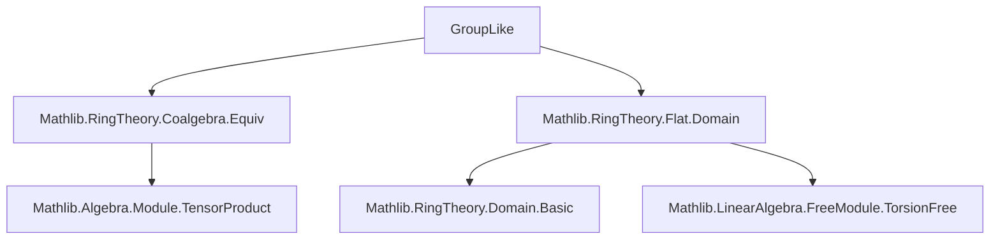
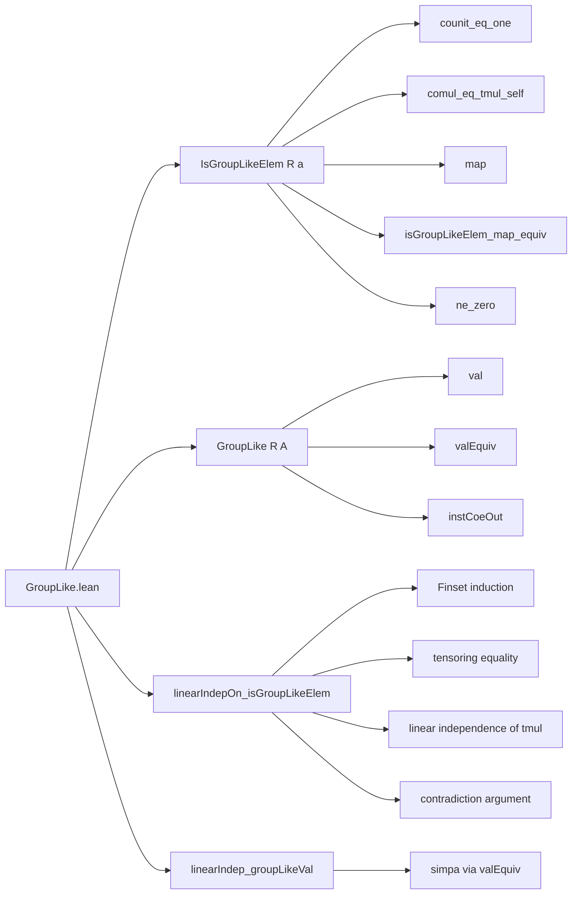

### Technical Brief: `GroupLike.lean`

---

#### **1. Key Definitions & Theorems**

| Name | Type / Signature | Purpose |
|------|------------------|---------|
| `IsGroupLikeElem R a` | `Prop` | Predicate stating that `a : A` in a coalgebra `A` over `R` satisfies:  • `counit a = 1`  • `comul a = a ⊗ₜ a` |
| `GroupLike R A` | `Type*` | Type of group-like elements in coalgebra `A`, defined as a subtype `{a // IsGroupLikeElem R a}` |
| `IsGroupLikeElem.map` | `IsGroupLikeElem R a → IsGroupLikeElem R (f a)` | Coalgebra homomorphisms preserve group-likeness |
| `isGroupLikeElem_map_equiv` | `IsGroupLikeElem R (f a) ↔ IsGroupLikeElem R a` | Coalgebra equivalences reflect and preserve group-likeness |
| `linearIndepOn_isGroupLikeElem` | `LinearIndepOn R id {a | IsGroupLikeElem R a}` | Over a domain `R`, group-like elements are linearly independent |
| `linearIndep_groupLikeVal` | `LinearIndependent R GroupLike.val` | Values of `GroupLike R A` are linearly independent |

---

#### **2. Naming Conventions**

- **Predicates**: `isGroupLikeElem_*` — e.g., `isGroupLikeElem_self`, `isGroupLikeElem_val`
- **Structures**: `IsGroupLikeElem`, `GroupLike`
- **Lemmas**:
  - `*_map_*`: Behavior under coalgebra morphisms
  - `*_equiv_*`: Behavior under equivalences
  - `*_ne_zero`: Nonzeroness of group-like elements in nontrivial domains
  - `linearIndep_*`: Linear independence results
- **Attributes**: `@[mk_iff]`, `@[simp]`, `@[coe]`, `@[ext]`

---

#### **3. Tactic Stack**

Frequently used tactics in proofs:

| Tactic | Usage |
|--------|-------|
| `simp +contextual [...]` | Simplification with contextual knowledge (e.g., `comul_eq_tmul_self`) |
| `rw [...]` | Rewriting using lemmas like `ha.comul_eq_tmul_self` |
| `induction ... using Finset.cons_induction` | Structural induction on finite sets |
| `simp_rw [...]` | Simplify and rewrite in one step (e.g., over sums and tensor products) |
| `apply ... at ...` | Applying lemmas to hypotheses |
| `by_contra!` | Proof by contradiction with naming |
| `rwa [...]` | Rewrite and assumption |
| `congr!` | Congruence reasoning |
| `exact ...` / `refine ...` | Direct proof construction |

---

#### **4. Proof Logic**

**Main proof structure for `linearIndepOn_isGroupLikeElem`:**

1. **Reduction to finite sets**: Use `linearIndepOn_iff_linearIndepOn_finset`.
2. **Induction on finite set `s`**:
   - Base case `s = ∅`: trivial.
   - Step `s ∪ {a}`:
     - Assume linear relation: `∑_{x ∈ s} c x • x = d • a`.
     - Tensor both sides with themselves.
     - Use `comul a = a ⊗ a` and `comul(∑ c x • x) = ∑ c x • comul x`.
     - Expand both sides using bilinearity and `tmul_sum`, `sum_tmul`.
     - Apply linear independence of pure tensors (from `ih.tmul_of_isDomain` and `IsDomain R`).
     - Derive equations:
       - `c x² = d · c x`
       - `c x · c y = 0` for `x ≠ y`
     - Show `c x = 0` for all `x ∈ s` via contradiction:
       - Assume some `c x ≠ 0`, deduce `c y = 0` for `y ≠ x`, reduce to `c x • x = d • a`.
       - Then `x = a`, contradicting `a ∉ s`.
     - Conclude `d = 0` since `d • a = 0` and `a ≠ 0`.

---

#### **5. Imports & Dependencies**

| Import | Purpose |
|--------|---------|
| `Mathlib.RingTheory.Coalgebra.Equiv` | Coalgebra equivalences, homomorphisms, class instances (`CoalgHomClass`, `CoalgEquivClass`) |
| `Mathlib.RingTheory.Flat.Domain` | Tools for domains, torsion-freeness, flatness, and linear independence over domains (`IsDomain`, `IsTorsionFree`) |

**Core dependencies used**:
- `Coalgebra`, `TensorProduct`, `Module`, `Submodule`
- `LinearIndepOn`, `LinearIndependent`, `Finset.sum`, `smul`, `tmul`
- `Equiv`, `FunLike`, `CoalgHomClass`, `EquivLike`

---

#### **6. Mermaid Diagrams**

##### **Dependency Graph (Module-Level)**

##### **Overview of File Structure**

---

#### **7. Summary**

This module formalizes the theory of *group-like elements* in coalgebras over commutative semirings and rings. It establishes:
- Basic properties (counit/comultiplication conditions),
- Stability under coalgebra morphisms and equivalences,
- Nonzeroness in nontrivial rings,
- **Crucially**: linear independence over domains, leveraging tensor product techniques and torsion-freeness.

The proof of linear independence is a nontrivial application of tensoring linear relations and exploiting domain properties to isolate coefficients — a hallmark of advanced homological/algebraic reasoning in Lean.
