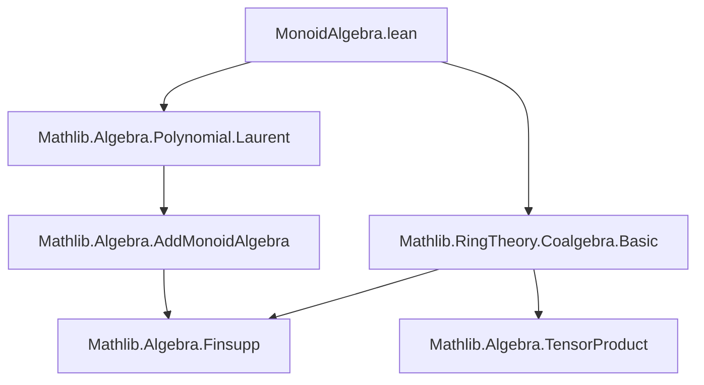

**Technical Brief: `MonoidAlgebra.lean` — Coalgebra Structure on Monoid Algebras**

---

### 1. **Key Definitions & Theorems**

| Name | Type / Signature | Purpose |
|------|------------------|---------|
| `instCoalgebra` (MonoidAlgebra) | `Coalgebra R A[X]` | Induces an $R$-coalgebra structure on the monoid algebra $A[X]$ from that on $A$, via `Finsupp.instCoalgebra`. |
| `instIsCocomm` (MonoidAlgebra) | `IsCocomm R A[X]` | Proves cocommutativity of $A[X]$ follows from cocommutativity of $A$. |
| `counit_single` | `Coalgebra.counit (single x a) = counit a` | Computes the counit on a basis element (`single x a`) as the counit of its coefficient. |
| `comul_single` | `comul (single x a) = TensorProduct.map (lsingle x) (lsingle x) (comul a)` | Describes comultiplication on basis elements: diagonal on the monoid index, coalgebra comul on coefficient. |
| `instCoalgebra` (LaurentPolynomial) | `Coalgebra R A[T;T⁻¹]` | Uses identification $A[T;T^{-1}] \cong A[\mathbb{Z}]$ to inherit coalgebra structure. |
| `instIsCocomm` (LaurentPolynomial) | `IsCocomm R A[T;T⁻¹]` | Inherits cocommutativity from $A$. |
| `comul_C` | `comul (C a) = map (lsingle 0) (lsingle 0) (comul a)` | Comultiplication of constant Laurent polynomials (i.e., image of $a \in A$ under `C`). |
| `comul_C_mul_T` | `comul (C a * T n) = map (lsingle n) (lsingle n) (comul a)` | Comultiplication of monomials $a T^n$. |
| `comul_C_mul_T_self` | `comul (C a * T n) = T n ⊗ₜ (C a * T n)` | Special case when $a \in R$: comultiplication is *trivial* on the monoid part (i.e., group-like). |
| `counit_C` | `counit (C a) = counit a` | Counit of constants matches coefficient counit. |
| `counit_C_mul_T` | `counit (C a * T n) = counit a` | Counit ignores the monoid index (as expected for group-like elements). |

---

### 2. **Naming Conventions**

- **Prefixes**:
  - `inst*`: typeclass instances (`instCoalgebra`, `instIsCocomm`)
  - `counit_*`, `comul_*`: lemmas about coalgebra structure maps
  - `single_*`: lemmas about `single` (basis embedding)
  - `C_*`: lemmas about `C` (inclusion of $A$ into monoid algebra)
  - `T_*`: lemmas about `T n` (group-like basis elements in Laurent polynomials)

- **Suffixes**:
  - `_single`: for basis elements `single x a`
  - `_C`, `_C_mul_T`: for constant or monomial elements in Laurent polynomials
  - `_self`: for special cases where coefficient lies in the base semiring $R$

- **Notable pattern**: `map (lsingle n) (lsingle n)` appears repeatedly — reflects diagonal embedding of monoid index.

---

### 3. **Tactic Stack**

- **Core tactics**:
  - `simp` (heavily used, especially with `@[simp]` attributes)
  - `rw` / `simp_rw` (via `← single_eq_C_mul_T`)
  - `exact` / `apply` (implicit in `inferInstanceAs`)
  - `intro`, `cases`, `refine` (used in `comul_C_mul_T` proof sketch)

- **No heavy automation** (e.g., no `aesop`, `linarith`, `ring`), indicating this is mostly structural algebra with direct computation.

---

### 4. **Proof Logic**

- **Strategy**:  
  1. **Lift structure**: Use existing `Finsupp` coalgebra instance to define `instCoalgebra` on `A[X]`.  
  2. **Compute on basis**: Prove lemmas for `single x a`, the canonical generators.  
  3. **Transport to Laurent polynomials**: Identify $A[T;T^{-1}] = A[\mathbb{Z}]$, then reuse previous results.  
  4. **Simplify using definitional equalities**: e.g., `single_eq_C_mul_T` identifies `single n a` with `C a * T n`.  
  5. **Special cases**: When $a \in R$, use `counit` and `comul` axioms for base-ring scalars (e.g., group-like elements).

- **Induction is not used** — all proofs are *computational* and rely on definitional properties of `Finsupp` and `single`.

---

### 5. **Imports & Dependencies**

| Import | Role |
|--------|------|
| `Mathlib.Algebra.Polynomial.Laurent` | Provides `LaurentPolynomial` as `A[ℤ]`, and `C`, `T` constructors. |
| `Mathlib.RingTheory.Coalgebra.Basic` | Defines `Coalgebra`, `IsCocomm`, `counit`, `comul`, `TensorProduct.map`, and `Finsupp` coalgebra instance. |

- **Core dependencies**: `Finsupp`, `TensorProduct`, `AddMonoidAlgebra`, `LaurentPolynomial`.

---

### 6. **Mermaid Diagrams**

#### **Dependency Graph (Module-Level)**



#### **Overview of Theory Flow**

```mermaid
flowchart LR
  R[CommSemiring R] --> A[Semiring A]
  A -->|Module| R
  A -->|Coalgebra R| C[Coalgebra R A]
  C -->|Finsupp.instCoalgebra| X[Coalgebra R A[X]]
  X -->|X = ℤ| L[Coalgebra R A[ℤ] = A[T;T⁻¹]]
  C -->|IsCocomm| Cc[IsCocomm R A]
  Cc -->|Finsupp.instIsCocomm| Xc[IsCocomm R A[X]]
  Xc -->|X = ℤ| Lc[IsCocomm R A[T;T⁻¹]]
```

- **Key insight**: The coalgebra structure is *pointwise* on coefficients and *diagonal* on monoid indices — a standard construction in Hopf algebra theory (though here only coalgebra, not bialgebra/Hopf).

---

### 7. **Additional Notes**

- **No Hopf algebra structure assumed**: No antipode or multiplication compatibility is proven here — only the *coalgebra* part.
- **Additive version**: `to_additive` attributes suggest future additive analogues (e.g., for group algebras over additive monoids).
- **Simp lemmas**: All main structural lemmas are marked `@[simp]`, indicating they are intended for automatic simplification in coalgebraic reasoning.

--- 

*End of Technical Brief.*
