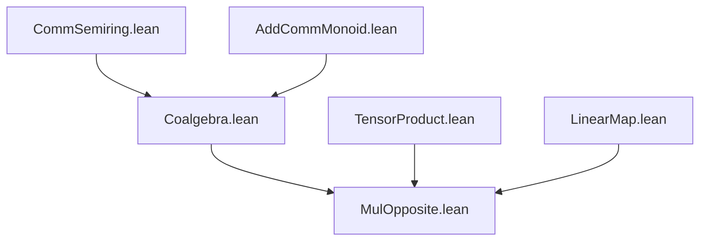
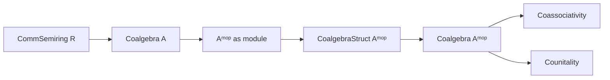

**Technical Brief: `MulOpposite.lean` — Coalgebra Opposite Construction**

---

### 1. **Key Definitions & Theorems**

| Name | Type / Signature | Purpose |
|------|------------------|---------|
| `CoalgebraStruct R A` | `Type u → Type v → [CommSemiring R] → [AddCommMonoid A] → [Module R A] → Type v` | Base structure for coalgebras over `R` (comultiplication `comul : A → A ⊗ A`, counit `counit : A → R`) |
| `Aᵐᵒᵖ` | `Type v` | Opposite multiplication object (underlying additive group same as `A`, but with reversed multiplication in *algebra* context; here used for coalgebra dualization) |
| `opLinearEquiv R` | `A ≃ₗ[R] Aᵐᵒᵖ` | Linear equivalence between `A` and its opposite module (identity on underlying additive group, but flips tensor factors implicitly via `op`) |
| `CoalgebraStruct R Aᵐᵒᵖ` | Instance | Defines coalgebra structure on `Aᵐᵒᵖ` via conjugation by `opLinearEquiv` |
| `comul_def` | `comul = map op op ∘ comul ∘ op.symm` | Explicit definition of comultiplication on `Aᵐᵒᵖ` |
| `counit_def` | `counit = counit ∘ op.symm` | Explicit definition of counit on `Aᵐᵒᵖ` |
| `Coalgebra R Aᵐᵒᵖ` | Instance | Proves `Aᵐᵒᵖ` satisfies coalgebra axioms: coassociativity and counitality |
| `coassoc` | `comul ≫ (comul ⊗ id) = comul ≫ (id ⊗ comul)` | Coassociativity of `Aᵐᵒᵖ` |
| `rTensor_counit_comp_comul` | `comul ≫ (id ⊗ counit) = id` | Right counitality |
| `lTensor_counit_comp_comul` | `comul ≫ (counit ⊗ id) = id` | Left counitality |

---

### 2. **Naming Conventions**

- **Prefixes**:
  - `op_`: refers to the opposite construction (e.g., `opLinearEquiv`, `op` in `map op op`)
  - `comul_`, `counit_`: standard coalgebra operations
  - `rTensor_`, `lTensor_`: right/left tensor versions of counitality diagrams
- **Suffixes**:
  - `_def`: definitions of derived operations
  - `_comp_`: composition-based identities (e.g., `rTensor_counit_comp_comul`)
- **Notation**:
  - `Aᵐᵒᵖ`: opposite object (Unicode `^m` + `o` + `p`)
  - `∘ₗ`: linear map composition
  - `map f g`: tensor map induced by `f ⊗ g`

---

### 3. **Tactic Stack**

- **Core tactics**:
  - `ext`: extensionality for linear maps (via `LinearMap.ext`)
  - `simp only [...]`: targeted simplification using lemmas like `coe_comp`, `LinearEquiv.coe_coe`, `Function.comp_apply`
  - `simp_rw [...]`: rewriting with equational lemmas involving `comp`, `TensorProduct.map`, etc.
  - `rw [...]`: rewriting definitions (`comul_def`, `counit_def`)
  - `simp [...]`: simplification using algebraic properties of tensor maps
  - `ring` not used (no polynomial/ring arithmetic needed)
  - `aesop` not used (proofs are highly structured, not heuristic)

---

### 4. **Proof Logic**

- **Strategy**: *Conjugation-based transport of structure*.
  - Define coalgebra operations on `Aᵐᵒᵖ` by pulling back along `opLinearEquiv : A ≃ₗ Aᵐᵒᵖ`.
  - Prove axioms by:
    1. Expanding definitions via `comul_def`, `counit_def`
    2. Unfolding tensor maps (`rTensor_def`, `lTensor_map`, etc.)
    3. Applying naturality and associativity of tensor maps (`map_map`, `map_map_assoc`, `lTensor_tensor`, `← lTensor_comp_rTensor`)
    4. Using `ext` + `fun _ =>` to reduce to element-wise verification (abstractly, via diagram chasing)

- **Pattern**:
  ```lean
  ext fun _ => by
    rw [comul_def, ...]
    simp only [...]
    simp_rw [← map_map_assoc, ...]
    simp [...]
  ```

---

### 5. **Imports**

- `Mathlib.RingTheory.Coalgebra.Basic`: core coalgebra theory (definitions, tensor products, linear maps)
- `TensorProduct`: for `⊗`, `map`, `lTensor`, `rTensor`, `TensorProduct.of`
- `LinearMap`: for `∘ₗ`, `LinearEquiv`, `coe_comp`, etc.
- `Coalgebra`: instance classes and basic lemmas

---

### 6. **Dependency & Theory Overview (Mermaid Diagrams)**

#### **Module Dependency**


#### **Theoretical Flow**


#### **Construction Diagram (Categorical)**

The coalgebra structure on $A^{\mathrm{op}}$ is induced by the diagram:

```mermaid
graph LR
  A^op --comul--> A^op ⊗ A^op
  A --comul--> A ⊗ A
  A^op --op⁻¹--> A
  A^op ⊗ A^op --op ⊗ op--> A ⊗ A
```

Formally:
$$
\Delta_{A^{\mathrm{op}}} = (\mathrm{op} \otimes \mathrm{op}) \circ \Delta_A \circ \mathrm{op}^{-1}, \quad
\varepsilon_{A^{\mathrm{op}}} = \varepsilon_A \circ \mathrm{op}^{-1}
$$

This mirrors the algebra case (`MulOpposite` for algebras), but dualized.

---

### 7. **Notes**

- This is a *dual* construction: while `MulOpposite` for algebras reverses multiplication, for coalgebras it reversves *comultiplication* in the sense of swapping tensor factors (via `op`).
- The proof relies heavily on naturality of tensor maps and properties of `opLinearEquiv`.
- No additional assumptions (e.g., finiteness, flatness) are needed — works for arbitrary coalgebras over a commutative semiring.

--- 

Let me know if you'd like the dual version for *bialgebras* or *Hopf algebras*, or a formalization of the universal property of `MulOpposite`.
