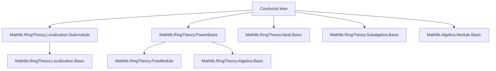

### Technical Brief: `Conductor.lean`

---

#### **1. Key Definitions & Theorems**

| Name | Type / Signature | Purpose |
|------|------------------|---------|
| `conductor (x : S)` | `Ideal S` | The **conductor ideal** of $ R\langle x \rangle \subseteq S $: the largest ideal of $ S $ contained in $ R\langle x \rangle $. Explicitly:  
$$ \mathfrak{c}_x = \{ a \in S \mid \forall b \in S,\, ab \in R\langle x \rangle \} $$ |
| `conductor_eq_of_eq` | `conductor R x = conductor R y` if $ R\langle x \rangle = R\langle y \rangle $ | Conductors depend only on the subalgebra generated. |
| `conductor_subset_adjoin` | $ \mathfrak{c}_x \subseteq R\langle x \rangle $ | Immediate from $ a = a \cdot 1 \in R\langle x \rangle $. |
| `mem_conductor_iff` | $ y \in \mathfrak{c}_x \iff \forall b,\, yb \in R\langle x \rangle $ | Membership characterization. |
| `conductor_eq_top_of_adjoin_eq_top` | If $ R\langle x \rangle = S $, then $ \mathfrak{c}_x = S $ | Trivial conductor when extension is full. |
| `conductor_eq_top_of_powerBasis` | If $ S $ has a power basis over $ R $, then $ \mathfrak{c}_{\text{gen}} = S $ | Special case for free rank-$ n $ extensions. |
| `adjoin_eq_top_of_conductor_eq_top` | $ \mathfrak{c}_x = S \Rightarrow R\langle x \rangle = S $ | Converse of above. |
| `conductor_eq_top_iff_adjoin_eq_top` | $ \mathfrak{c}_x = S \iff R\langle x \rangle = S $ | Equivalence of trivial conductor and generation of whole algebra. |
| `mem_coeSubmodule_conductor` | Membership in localized conductor ideal | Describes conductor after scalar extension via localization. |
| `prod_mem_ideal_map_of_mem_conductor` | Technical inclusion: $ p \in \mathfrak{c}_x \cap R,\, z \in I \cdot S \Rightarrow pz \in I \cdot R\langle x \rangle $ | Key step in proving base-change compatibility. |
| `comap_map_eq_map_adjoin_of_coprime_conductor` | Under coprimality: $ (I \cdot S) \cap R\langle x \rangle = I \cdot R\langle x \rangle $ | Fundamental ideal-theoretic property of conductors. |
| `quotAdjoinEquivQuotMap` | Isomorphism $ R\langle x \rangle / I \cdot R\langle x \rangle \xrightarrow{\sim} S / I \cdot S $ | Main structural result: quotient isomorphism under coprimality. |
| `quotAdjoinEquivQuotMap_apply_mk` | Action of the isomorphism on representatives | Confirms naturality of the isomorphism. |

---

#### **2. Naming Conventions**

- **Prefixes**:
  - `conductor_`: all definitions/theorems about the conductor ideal.
  - `mem_`: membership characterizations (`mem_conductor_iff`, `mem_coeSubmodule_conductor`).
  - `prod_mem_`, `comap_map_eq_`, `quotAdjoinEquivQuotMap`: descriptive compound names for technical lemmas and constructions.
- **Suffixes**:
  - `_iff`: biconditional statements (`conductor_eq_top_iff_adjoin_eq_top`).
  - `_of_`: conditional results (`conductor_eq_top_of_adjoin_eq_top`, `comap_map_eq_map_adjoin_of_coprime_conductor`).
  - `_apply_mk`: action on quotient representatives.

---

#### **3. Tactic Stack**

Frequently used tactics in proofs:

| Tactic | Role |
|--------|------|
| `simp only [...]` | Simplify using definitional equalities and lemmas (e.g., `zero_mul`, `mul_one`, `map_mul`). |
| `rw [...]` | Rewrite using equalities (e.g., `Ideal.mem_comap`, `Ideal.map`, `Set.mem_image`). |
| `exact`, `refine`, `exists_intro` | Construct witnesses or apply lemmas directly. |
| `cases subsingleton_or_nontrivial _` | Handle degenerate vs non-degenerate cases (common in localization). |
| `apply le_antisymm` | Prove equality of submodules/ideals via double inclusion. |
| `intro`, `rintro`, `obtain` | Introduce hypotheses and decompose existential/universal quantifiers. |
| `ring`, `aesop` | Not explicitly used here; lean relies on manual simplification and algebraic reasoning. |
| `convert`, `congr` | Not used — equality proofs are mostly direct via `ext` and ` rfl`. |

---

#### **4. Proof Logic**

- **Structure of proofs**:
  - **Definition-based reasoning**: Most proofs unfold definitions (`conductor`, `adjoin`, `Ideal.map/comap`) and apply module/algebra properties.
  - **Ideal-theoretic manipulations**: Use of `Ideal.mem_sup`, `Ideal.mem_map`, `Ideal.map_comap_le`, etc.
  - **Coprime condition exploitation**: Key in `comap_map_eq_map_adjoin_of_coprime_conductor` and `quotAdjoinEquivQuotMap`:  
    $ I + (\mathfrak{c}_x \cap R) = R \Rightarrow $ decomposition of 1 yields splitting of elements.
  - **Localization handling**: Cases split on `subsingleton_or_nontrivial`, then use properties of `IsLocalization` and `IsScalarTower`.
  - **Injectivity assumptions**: Used to lift equalities from $ S $ to $ R\langle x \rangle $ (e.g., in `adjoin_eq_top_of_conductor_eq_top` and `quotAdjoinEquivQuotMap`).

- **Typical flow**:
  1. Unfold definitions.
  2. Apply `Ideal.ext` or `Set.ext` to reduce to element-wise reasoning.
  3. Use `mem_conductor_iff` to reduce to membership in $ R\langle x \rangle $.
  4. Use algebraic identities (`mul_assoc`, `mul_comm`, `map_mul`) to rearrange terms.
  5. For isomorphisms: construct maps via universal properties (`Ideal.Quotient.lift`, `RingEquiv.ofBijective`), then verify bijectivity.

---

#### **5. Imports & Dependencies**

| Module | Purpose |
|--------|---------|
| `Mathlib.RingTheory.Localization.Submodule` | For `IsLocalization`, `coeSubmodule`, localization of modules and ideals. |
| `Mathlib.RingTheory.PowerBasis` | For `PowerBasis`, `pb.gen`, `pb.adjoin_gen_eq_top`. |

Other implicit dependencies:
- `Mathlib.RingTheory.Ideal` (core ideal theory)
- `Mathlib.RingTheory.Algebra` (algebra maps, adjoin, scalar towers)
- `Mathlib.RingTheory.Subalgebra` (for `adjoin`, `R<x>` notation)
- `Mathlib.Algebra.Module` (for `smul`, `map`, `comap`)
- `Mathlib.Data.Set.Image` (for `Set.mem_image`, `image` manipulations)

---

#### **6. Mermaid Diagrams**

##### **Dependency Graph (Module-Level)**



##### **Conceptual Overview (Theory Flow)**

```mermaid
flowchart LR
  A[Ring Extension R → S] --> B[Element x ∈ S]
  B --> C[Subalgebra R⟨x⟩ ⊆ S]
  C --> D[Conductor Ideal 𝔠ₓ = {a ∈ S | a·S ⊆ R⟨x⟩}]
  D --> E[Basic Properties: ⊆ R⟨x⟩, = ⊤ ⇔ R⟨x⟩ = S]
  D --> F[Localization Compatibility]
  D --> G[Ideal Interaction: (I·S) ∩ R⟨x⟩ = I·R⟨x⟩ under coprimality]
  G --> H[Quotient Isomorphism R⟨x⟩/I·R⟨x⟩ ≅ S/I·S]
  H --> I[Applications: Dedekind domains, integral closure, ramification]
```

---

#### **7. Theory Context & Applications**

- **Purpose**: Study the interaction between subalgebras $ R\langle x \rangle \subseteq S $ and ideals of $ S $, especially in non-maximal orders or non-smooth extensions.
- **Key application**: Prove that under mild hypotheses (e.g., $ S $ finite over $ R $, conductor coprime to $ I $), the natural map $ R\langle x \rangle / I \to S / IS $ is an isomorphism — crucial in:
  - Local-global principles for modules.
  - Descent of properties (e.g., flatness, regularity).
  - Arithmetic geometry (e.g., behavior of ideals in extensions, ramification theory).
- **Relation to classical conductor**: In number theory, the conductor ideal measures the failure of $ \mathcal{O}_K $ to equal $ \mathbb{Z}[\alpha] $; this generalizes that notion to arbitrary ring extensions.

--- 

Let me know if you'd like a formalized summary in `lean` docstring format or a proof sketch of `quotAdjoinEquivQuotMap`.
