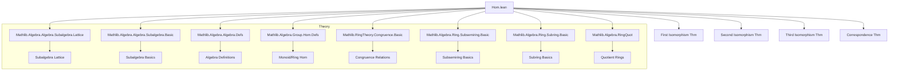
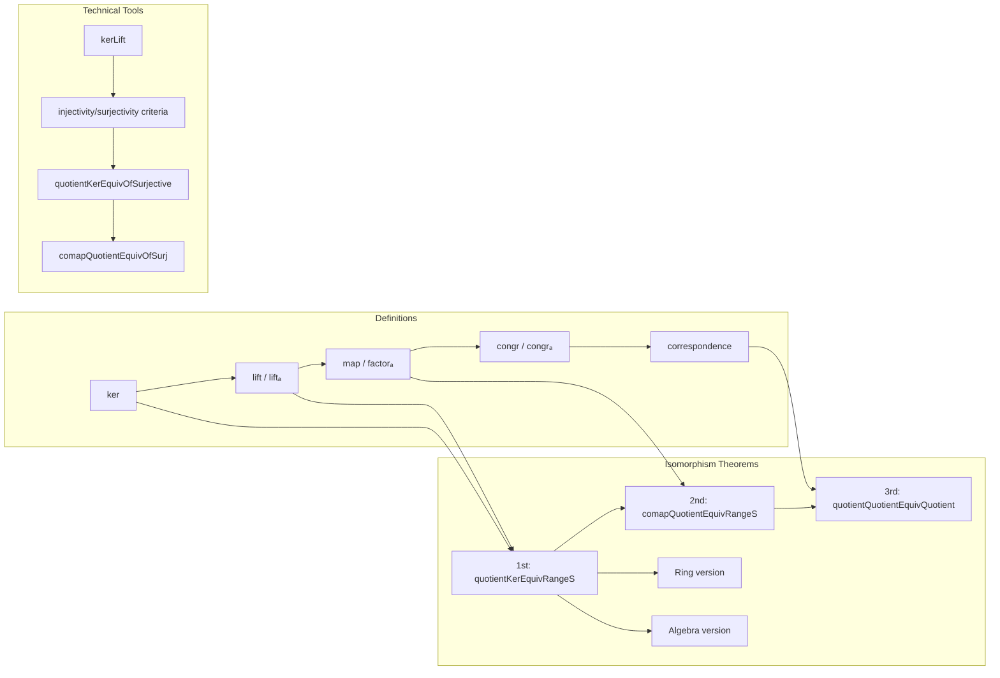

**Technical Brief: `Hom.lean` — Congruence Relations and Ring Homomorphisms in Lean 4**

---

### 1. KEY DEFINITIONS & THEOREMS

| Name | Type / Signature | Purpose |
|------|------------------|---------|
| `ker` | `ker (f : M →+* N) : RingCon M` | Defines the kernel congruence of a ring homomorphism: $x \sim y \iff f(x) = f(y)$. |
| `lift` | `lift (H : c ≤ ker f) : c.Quotient →+* P` | Universal property: lifts a ring homomorphism constant on $c$-classes to the quotient. |
| `liftₐ` | `liftₐ (c : RingCon M) (f : M →ₐ[R] P) (H : c ≤ ker f.toRingHom) : c.Quotient →ₐ[R] P` | Algebraic version of `lift`. |
| `map` | `map (c d : RingCon M) (h : c ≤ d) : c.Quotient →+* d.Quotient` | Induced map between quotients when $c \subseteq d$. |
| `mapₐ` (implicit via `factorₐ`) | `factorₐ R h : c.Quotient →ₐ[R] d.Quotient` | Algebraic version of `map`. |
| `congr`, `congrₐ` | `c = d → c.Quotient ≃+* d.Quotient` (resp. `≃ₐ[R]`) | Isomorphism of quotients when congruences are equal. |
| `correspondence` | `Set.Ici c ≃o RingCon c.Quotient` | Order-isomorphism between congruences above $c$ and congruences on $c.\text{Quotient}$. |
| `quotientKerEquivRangeS` | `(ker f).Quotient ≃+* f.rangeS` | First isomorphism theorem for **semirings** (using `rangeS`). |
| `quotientKerEquivRange` | `(ker f).Quotient ≃+* f.range` | First isomorphism theorem for **rings**. |
| `quotientKerEquivRangeₐ` | `(ker f.toRingHom).Quotient ≃ₐ[R] f.range` | First isomorphism theorem for **algebras**. |
| `comapQuotientEquivRangeS`, `comapQuotientEquivRange`, `comapQuotientEquivRangeₐ` | `d.Quotient ≃+* (c.mk'.comp f).rangeS` (etc.) | Second isomorphism theorem (semiring/ring/algebra). |
| `quotientQuotientEquivQuotient`, `quotientQuotientEquivQuotientₐ` | `(ker (c.map d h)).Quotient ≃+* d.Quotient` (resp. `≃ₐ[R]`) | Third isomorphism theorem (semiring/ring/algebra). |
| `kerLift`, `kerLiftₐ` | `(ker f).Quotient →+* P` / `→ₐ[R] P` | Canonical lift through the kernel congruence; injective. |
| `comapQuotientEquivOfSurj` | `d.Quotient ≃+* c.Quotient` under surjectivity and $d = c.\text{comap}\ f$ | Key tool for second iso thm in constructive settings. |

---

### 2. NAMING CONVENTIONS

- **Prefixes**:
  - `ker_`: kernel-related constructions (`ker`, `kerLift`, `kerLiftₐ`, `ker_mk'_eq`).
  - `lift_`: universal property lifts (`lift`, `liftₐ`, `lift_mk'`, `lift_coe`, `lift_unique`).
  - `map_`: induced maps on quotients (`map`, `mapGen`, `map_apply`, `mapₐ` → `factorₐ`).
  - `quotientKerEquiv_`: first iso thm variants (`quotientKerEquivRangeS`, `quotientKerEquivOfSurjective`, `quotientKerEquivRangeₐ`).
  - `comapQuotientEquiv_`: second iso thm variants (`comapQuotientEquivRangeS`, `comapQuotientEquivOfSurj`, `comapQuotientEquivRangeₐ`).
  - `quotientQuotientEquiv_`: third iso thm (`quotientQuotientEquivQuotient`, `quotientQuotientEquivQuotientₐ`).

- **Suffixes**:
  - `_S`: semiring version (e.g., `rangeS`, `quotientKerEquivRangeS`).
  - `_ₐ`: algebra version (e.g., `liftₐ`, `congrₐ`, `quotientKerEquivRangeₐ`).
  - `_mk`, `_mk'`: refer to canonical maps `mk' : M → c.Quotient`, `mkₐ R c : R →ₐ[M]`.
  - `_surjective`, `_injective`, `_bijective`: properties of induced maps.

- **Other**:
  - `hom_ext`, `Quotient.hom_ext`: extensionality principles for ring homs out of quotients.
  - `coe_`, `mk_`, `symm_`: coercion/symbolic simplification lemmas.

---

### 3. TACTIC STACK

| Tactic | Frequency | Role |
|--------|-----------|------|
| `rfl` | Very high | Definitional equalities, especially for `mk'`, `lift`, `quotientKerEquiv...`. |
| `simp` / `simp_rw` | High | Simplification using `@[simp]` lemmas (e.g., `lift_mk'`, `quotientQuotientEquivQuotient_mk_mk`). |
| `ext` / `ext''` | Medium | Extensionality proofs for ring homs, congruences, relations. |
| `induction` (on `Con.induction_on₂`) | Medium | Structural induction on quotient elements (via `Con.induction_on₂`). |
| `aesop` | Medium | Automated reasoning for simple goals (e.g., `lift_unique`). |
| `grind` | Low | Custom tactic for congruence reasoning (used in `mapGen_eq_map_of_surjective`). |
| `apply`, `exact`, `refine` | Medium | Goal-directed proof construction. |
| `convert`, `rw` | Medium | Rewriting with `congr`, `symm`, `trans`, `map_add`, `map_mul`. |

---

### 4. PROOF LOGIC

The file follows a **structured, categorical style** of reasoning:

1. **Congruence as kernel**: Define `ker f` as `comap ⊥ f`, then prove `ker f x y ↔ f x = f y`.
2. **Universal property**: Define `lift` via `AddCon.lift` + ring axioms; prove uniqueness via `Quotient.hom_ext`.
3. **Correspondence theorem**: Construct `correspondence` as an order-isomorphism using `mapGen` and `comap`.
4. **Isomorphism theorems**:
   - **First**: Construct `quotientKerEquivRangeS` as `codRestrict (kerLift f)`, using `quotientKerEquivRangeS` for rings/algebras.
   - **Second**: Use `comapQuotientEquivOfSurj` + `quotientKerEquivRangeS` to get `comapQuotientEquivRangeS`.
   - **Third**: Define `quotientQuotientEquivQuotient` via `Setoid.quotientQuotientEquivQuotient`, then verify ring/algebra structure.
5. **Algebraic lift**: Extend ring constructions to algebras via `liftₐ`, `factorₐ`, ensuring compatibility with scalar multiplication (`commutes'`).

Induction is often done via `Con.induction_on₂` (for binary predicates on quotients), and surjectivity of `mk'` is heavily used.

---

### 5. IMPORTS (PRIMARY DEPENDENCIES)

| Module | Role |
|--------|------|
| `Mathlib.Algebra.Algebra.Subalgebra.Lattice` | Lattice structure on subalgebras; used for `rangeS`, `range`. |
| `Mathlib.Algebra.Algebra.Subalgebra.Basic` | Subalgebra definitions. |
| `Mathlib.Algebra.Algebra.Defs` | Basic algebra definitions (`Algebra`, `AlgHom`). |
| `Mathlib.Algebra.Group.Hom.Defs` | Monoid/ring hom definitions (`→+*`, `→ₐ[R]`). |
| `Mathlib.RingTheory.Congruence.Basic` | `RingCon`, `Setoid`, `quotient`, `mk'`. |
| `Mathlib.Algebra.Ring.Subsemiring.Basic` | `rangeS`, `range`, subsemiring structure. |
| `Mathlib.Algebra.Ring.Subring.Basic` | Subring structure (for rings). |
| `Mathlib.Algebra.RingQuot` | Quotient ring constructions (`Quotient`, `mk'`, `lift`). |

> **Note**: The file builds on `Mathlib`’s foundational algebra hierarchy, especially `AddCon`, `Setoid`, and `RingHom`.

---

### 6. MERMAID DIAGRAMS

#### Dependency Graph (Top-Level)

#### Overview of `Hom.lean` Structure

---

### 7. SUMMARY

This file formalizes the **basic theory of congruence relations and quotient rings/semirings/algebras**, culminating in the three classical isomorphism theorems in full generality (semiring, ring, algebra). It leverages Lean’s `Setoid` and `AddCon` infrastructure, and extends it to ring and algebra contexts with careful attention to coherence (e.g., `liftₐ` preserves scalar multiplication). The naming and structure reflect a **modular, reusable design**, with `rangeS`/`range` variants for semirings/rings and algebraic lifts via `→ₐ[R]`. The file is a foundational module for further development in commutative algebra and scheme theory in `Mathlib`.
