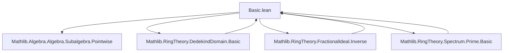

**Technical Brief: `Basic.lean` — Dedekind Domains and Invertible Fractional Ideals**

---

### **1. Key Definitions & Theorems**

| Name | Type / Signature | Purpose |
|------|------------------|---------|
| `IsDedekindDomainInv A` | `Prop` | Defines a Dedekind domain as an integral domain where every nonzero fractional ideal is invertible: `∀ I ≠ 0, I * I⁻¹ = 1`. |
| `isDedekindDomainInv_iff` | `IsDedekindDomainInv A ↔ ∀ I ≠ 0, I * I⁻¹ = 1` | Shows independence of the choice of field of fractions `K`. |
| `commGroupWithZero` | `CommGroupWithZero (FractionalIdeal A⁰ K)` | Constructs a commutative group with zero structure on fractional ideals under multiplication, assuming `IsDedekindDomainInv A`. |
| `isDedekindDomain` | `IsDedekindDomain A` | Proves that `IsDedekindDomainInv A ⇒ IsDedekindDomain A`, i.e., Dedekind domain in the classical sense (Noetherian, dim ≤ 1, integrally closed). |
| `isDedekindDomain_iff_isDedekindDomainInv` | `IsDedekindDomain A ↔ IsDedekindDomainInv A` | Equivalence of the two standard definitions of Dedekind domains. |
| `coe_ideal_mul_inv` | `I * I⁻¹ = 1` for nonzero integral ideals `I` | Shows that nonzero integral ideals are invertible in a Dedekind domain. |
| `Ideal.dvd_iff_le` | `I ∣ J ↔ J ≤ I` | In a Dedekind domain, divisibility of ideals corresponds to reverse inclusion. |
| `Ideal.uniqueFactorizationMonoid` | `UniqueFactorizationMonoid (Ideal A)` | Every nonzero ideal factors uniquely (up to order and units) into prime ideals. |
| `Ideal.normalizationMonoid` | `NormalizationMonoid (Ideal A)` | Provides a normalization (canonical choice of associate representatives) for ideals. |
| `exists_multiset_prod_cons_le_and_prod_not_le` | `∃ Z, (M ::ₘ Z).prod ≤ I ∧ ¬Z.prod ≤ I` | Minimal prime-product containment lemma used in invertibility proofs. |

---

### **2. Naming Conventions**

- **Prefixes**:
  - `isDedekindDomainInv` / `isDedekindDomain`: predicate definitions.
  - `coeIdeal_`: coercion from `Ideal A` to `FractionalIdeal A⁰ K`.
  - `inv_`: inverse of fractional ideals (e.g., `inv_zero`, `inv_mul_cancel₀`).
  - `mul_`: multiplication-related lemmas (e.g., `mul_inv_cancel`, `mul_left_strictMono`).
  - `le_`: order-related lemmas (e.g., `le_one_iff_exists_coeIdeal`).
  - `mem_`: membership in fractional ideals (e.g., `mem_inv_iff`, `mem_one_iff`).

- **Suffixes**:
  - `_iff`: equivalence lemmas (e.g., `isDedekindDomainInv_iff`, `isDedekindDomain_iff_isDedekindDomainInv`).
  - `_of_`: specialization or restriction (e.g., `coe_ideal_mul_inv`, `not_inv_le_one_of_ne_bot`).
  - `_mono`: monotonicity (e.g., `mul_right_strictMono`, `mul_left_strictMono`).
  - `_ne_zero` / `_ne_top`: hypotheses about nonzeroness or non-topness.

---

### **3. Tactic Stack**

Frequently used tactics in this file:

| Tactic | Usage |
|--------|-------|
| `simp` / `simp only` | Simplifying goals using definitions (e.g., `FractionalIdeal.mem_inv_iff`, `coeIdeal_mul`). |
| `rw` / `rwa` | Rewriting using equivalences or assumptions (e.g., `Ideal.dvd_iff_le`, `mul_inv_cancel₀`). |
| `gcongr` | Applying monotonicity lemmas (e.g., to lift inequalities under multiplication). |
| `exact` / `assumption` | Closing goals directly from hypotheses. |
| `obtain ⟨...⟩` / `rcases` | Destructuring existential or conjunction hypotheses. |
| `convert` / `congr_arg` | Changing goal via equalities (e.g., `convert congr_arg (· * I⁻¹) mul_self`). |
| `have` / `suffices` | Introducing intermediate claims. |
| `by_cases` | Splitting on decidably true/false propositions (e.g., `I = ⊥`). |
| `apply` / `intro` | Standard natural deduction. |
| `ring` / `abelian` | Not used here — arithmetic is handled via algebraic properties of fractional ideals. |
| `aesop` | Not used — proofs are highly structured and rely on explicit algebraic reasoning. |

---

### **4. Proof Logic**

The logical flow follows a **modular, structure-driven strategy**:

1. **Setup & Equivalence of Definitions**  
   - Define `IsDedekindDomainInv` and prove its field-of-fractions independence (`isDedekindDomainInv_iff`).

2. **Construct Algebraic Structure**  
   - Assuming `IsDedekindDomainInv A`, build `CommGroupWithZero` on fractional ideals.
   - Derive consequences: `IsNoetherianRing`, `IsIntegrallyClosed`, `DimensionLEOne`.

3. **Classical Dedekind Domain Properties**  
   - Prove `IsDedekindDomainInv ⇒ IsDedekindDomain` (via the above three properties).
   - Prove the converse (`IsDedekindDomain ⇒ IsDedekindDomainInv`) using invertibility of nonzero ideals.

4. **Ideal-Theoretic Consequences**  
   - Show nonzero integral ideals are invertible (`coe_ideal_mul_inv`).
   - Prove `I ∣ J ↔ J ≤ I`, enabling translation between divisibility and inclusion.
   - Use minimal prime-product containment (`exists_multiset_prod_cons_le_and_prod_not_le`) to control ideal factorization.

5. **Unique Factorization**  
   - Show `Ideal A` is a `WfDvdMonoid` (well-founded divisibility).
   - Conclude `UniqueFactorizationMonoid (Ideal A)` by verifying irreducibles = primes.

6. **Normalization & Monotonicity**  
   - Derive `NormalizationMonoid` and strict monotonicity of multiplication.

**Induction / Well-founded Recursion**: Used in `exists_multiset_prod_cons_le_and_prod_not_le` (minimal counterexample method) and `Ideal.uniqueFactorizationMonoid` (via `WfDvdMonoid`).

---

### **5. Imports & Dependencies**

| Module | Role |
|--------|------|
| `Mathlib.Algebra.Algebra.Subalgebra.Pointwise` | For `adjoinIntegral`, subalgebras, and pointwise operations. |
| `Mathlib.RingTheory.DedekindDomain.Basic` | Defines `IsDedekindDomain` (classical definition). |
| `Mathlib.RingTheory.FractionalIdeal.Inverse` | Fractional ideals, multiplication, inverse, and basic properties. |
| `Mathlib.RingTheory.Spectrum.Prime.Basic` | Prime spectrum, prime ideals, and their products. |

**Core dependencies**:  
- `IsDomain`, `IsFractionRing`, `FractionalIdeal`, `PrimeSpectrum`, `Ideal`, `Algebra`, `Subalgebra`.

---

### **6. Mermaid Diagrams**

#### **Dependency Graph (Module-Level)**



#### **Conceptual Overview (Theory Flow)**

```mermaid
flowchart LR
  A[IsDomain A] --> B[Field K = Frac(A)]
  B --> C[FractionalIdeal A⁰ K]
  C --> D[IsDedekindDomainInv A]
  D --> E[CommGroupWithZero]
  E --> F[IsNoetherianRing]
  E --> G[IsIntegrallyClosed]
  E --> H[DimensionLEOne]
  F & G & H --> I[IsDedekindDomain A]

  I --> J[Ideal A is UFM]
  J --> K[Ideal A is WfDvdMonoid]
  K --> L[Ideal A is NormalizationMonoid]

  D <-->|equivalence| I
```

#### **Proof Structure (High-Level)**

```mermaid
flowchart TD
  Start[Assume IsDedekindDomainInv A] --> BuildGroup[Construct CommGroupWithZero]
  BuildGroup --> ProveProps[Prove Noetherian, integrally closed, dim ≤ 1]
  ProveProps --> DefEquiv[IsDedekindDomainInv ⇔ IsDedekindDomain]

  Start --> InvertIdeal[Show I * I⁻¹ = 1 for nonzero I]
  InvertIdeal --> DvdLe[I ∣ J ↔ J ≤ I]
  DvdLe --> UFM[UniqueFactorizationMonoid (Ideal A)]

  UFM --> NormMon[NormalizationMonoid (Ideal A)]
```

---

### **7. Summary**

This file establishes the foundational equivalence between two definitions of Dedekind domains — one via ideal-theoretic properties (Noetherian, dim ≤ 1, integrally closed), and one via invertibility of fractional ideals. It constructs the multiplicative group of fractional ideals, proves key structural properties (e.g., `I ∣ J ↔ J ≤ I`), and culminates in the unique factorization of ideals into primes. The formalization is highly structured, leveraging Lean’s typeclass inference and careful use of field-of-fractions independence lemmas.

--- 

*End of Technical Brief.*
