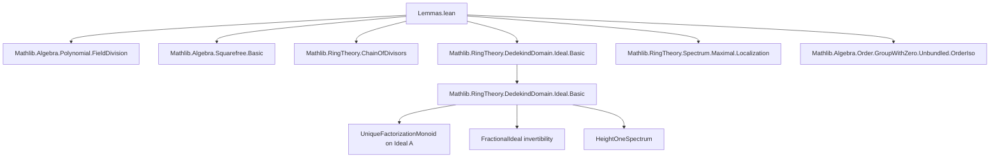
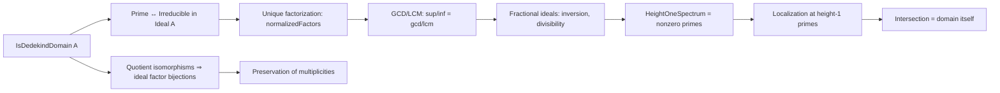

Here is the structured technical brief extracted from `Lemmas.lean`:

---

### **1. Key Definitions & Theorems**

| Name | Type / Signature | Purpose |
|------|------------------|---------|
| `IsDedekindDomain.HeightOneSpectrum` | `Type u` | Type of nonzero prime ideals of a Dedekind domain `R`. |
| `Ideal.prime_iff_isPrime` | `P ≠ ⊥ → (Prime P ↔ IsPrime P)` | In a Dedekind domain, nonzero prime ideals are exactly the prime elements of `Ideal A` (as a monoid with zero). |
| `Ideal.isPrime_iff_bot_or_prime` | `IsPrime P ↔ P = ⊥ ∨ Prime P` | Characterizes prime ideals as either zero or prime elements. |
| `Ideal.mem_normalizedFactors_iff` | `p ∈ normalizedFactors I ↔ p.IsPrime ∧ I ≤ p` | Membership in normalized factors ↔ prime and divides `I`. |
| `Ideal.eq_prime_pow_mul_coprime` | `∃ Q, P ⊔ Q = ⊤ ∧ I = P^count * Q` | Decomposition of an ideal into a prime power times a coprimal factor. |
| `Ideal.sup_mul_inf` | `(I ⊔ J) * (I ⊓ J) = I * J` | GCD-LCM identity for ideals: `gcd * lcm = product`. |
| `Ideal.normalizedFactorsEquivOfQuotEquiv` | `{L ∈ normalizedFactors I} ≃ {M ∈ normalizedFactors J}` | Bijection between normalized factors induced by `R/I ≅ A/J`. |
| `FractionalIdeal.le_inv_comm` | `I ≤ J⁻¹ ↔ J ≤ I⁻¹` | Monotonicity of inversion on fractional ideals. |
| `Ideal.pow_right_strictAnti` | `StrictAnti (I ^ ·)` for `I ≠ ⊥, ⊤` | Strict antitonicity of powers of a nontrivial ideal. |
| `Ideal.exists_mem_pow_notMem_pow_succ` | `∃ x ∈ I^e, x ∉ I^(e+1)` | Strictness of ideal powers implies strict containment. |
| `Ideal.eq_prime_pow_of_succ_lt_of_le` | `P^(i+1) < I ≤ P^i ⇒ I = P^i` | Uniqueness of prime power decomposition in Dedekind domains. |
| `Ideal.iInf_localization_eq_bot` | `⨅_{v : HeightOneSpectrum} R_{v.asIdeal} = ⊥` | Dedekind domain equals intersection of its localizations at height-1 primes. |

---

### **2. Naming Conventions**

- **Prefixes**:
  - `is_`: e.g., `isPrime`, `isMaximal`, `isCoprime`, `isUnit`.
  - `mem_`: e.g., `mem_normalizedFactors`, `mem_primesOver`.
  - `pow_`: e.g., `pow_right_strictAnti`, `pow_lt_self`, `pow_succ_lt_pow`.
  - `inv_`: e.g., `inv_le_comm`, `inv_le_inv_iff`.
  - `mul_`: e.g., `mul_iInf`, `mul_inf`, `mul_left_injective₀`.
  - `sup_`, `inf_`: e.g., `sup_mul_inf`, `inf_mul`, `sup_eq_prod_inf_factors`.
  - `normalizedFactors_`: e.g., `normalizedFactors_eq`, `normalizedFactors_irreducible`, `normalizedFactorsEquivOfQuotEquiv`.

- **Suffixes**:
  - `_iff_`: e.g., `prime_span_singleton_iff`, `isCoprime_iff_gcd`.
  - `_of_`: e.g., `prime_of_isPrime`, `ofPrime`, `of_mem_filter`.
  - `_comm`: e.g., `le_inv_comm`, `inv_le_comm`.
  - `_mono`/`_anti`: e.g., `pow_right_strictAnti`.

- **Structure fields**:
  - `asIdeal`, `isPrime`, `ne_bot` (for `HeightOneSpectrum`).

---

### **3. Tactic Stack**

Frequent tactics used in proofs:
- `simp`, `rw`, `exact`, `refine`, `apply`, `intro`, `cases`, `contrapose!`, `by_cases`
- `aesop` (for automated reasoning in simple goals)
- `ring` (for polynomial/ideal arithmetic)
- `ext` (extensionality for ideals/fractional ideals)
- `apply_ideal` / `apply_submodule` patterns (implicit via `Submodule` lemmas)
- `multiset`/`finset` simplifications: `prod_map`, `count_inter`, `replicate_inter`
- `monotonicity` tactics: `monotonicity`, `exact_mod_cast`, `linarith`
- `algebra`-specific: `coeIdeal_inj`, `coeIdeal_le_coeIdeal`, `mem_div_iff_of_ne_zero`

---

### **4. Proof Logic**

- **Induction & case analysis**:
  - Induction on `n : ℕ` for powers of ideals.
  - Cases on `a = 0` or `I = ⊥, ⊤` to split degenerate cases.
- **Equational reasoning**:
  - Use of `le_antisymm` to prove equality of ideals.
  - `dvd_iff_le` to translate divisibility to inclusion.
- **Factorization arguments**:
  - Use of `normalizedFactors`, `Multiset.count`, `emultiplicity`.
  - Prime factor uniqueness via `normalizedFactors_prod_of_prime`.
- **Localization & fractional ideals**:
  - Reduction to ideal-theoretic statements via `coeIdeal_inj`, `coeIdeal_le_coeIdeal`.
  - Use of `inv_eq`, `le_div_iff_mul_le`, `mem_inv_iff`.
- **Equivalence & bijection arguments**:
  - `OrderIso.ofHomInv`, `Equiv.ext`, `OrderHom.ext`.
  - `idealFactorsEquivOfQuotEquiv` leverages isomorphism of quotients to induce bijections on divisor lattices.

---

### **5. Imports**

- `Mathlib.Algebra.Polynomial.FieldDivision`
- `Mathlib.Algebra.Squarefree.Basic`
- `Mathlib.RingTheory.ChainOfDivisors`
- `Mathlib.RingTheory.DedekindDomain.Ideal.Basic` *(not directly imported, but referenced)*
- `Mathlib.RingTheory.Spectrum.Maximal.Localization`
- `Mathlib.Algebra.Order.GroupWithZero.Unbundled.OrderIso`

> **Note**: The file builds on `IsDedekindDomain`, `FractionalIdeal`, and `HeightOneSpectrum` structures defined elsewhere (e.g., in `DedekindDomain/Ideal/Basic.lean`).

---

### **6. Mermaid Diagrams**

#### **Dependency Graph (Module-Level)**

#### **Overview of Theoretical Flow**

---

Let me know if you'd like a formalized dependency graph (e.g., `.lean` file-level) or a proof strategy catalog for specific theorems.
