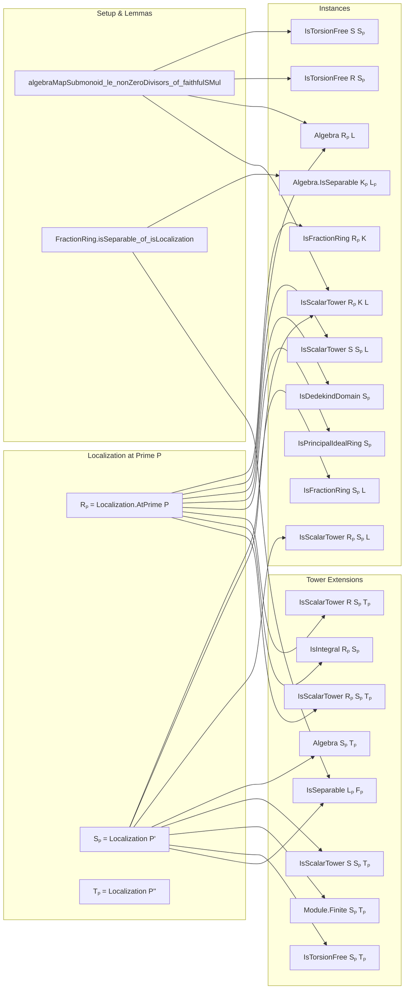

### Technical Brief: `Instances.lean` — Localization Instances for Dedekind Domains

---

#### **1. Key Definitions & Theorems**

| Name | Type / Signature | Purpose |
|------|------------------|---------|
| `algebraMapSubmonoid_le_nonZeroDivisors_of_faithfulSMul` | `{A B : Type*} [CommSemiring A] [CommSemiring B] [Algebra A B] [NoZeroDivisors B] [FaithfulSMul A B] {S : Submonoid A} → S ≤ A⁰ → algebraMapSubmonoid B S ≤ B⁰` | Ensures that the image of a submonoid under the algebra map lands in non-zero-divisors when the action is faithful. |
| `FractionRing.isSeparable_of_isLocalization` | `(hM : M ≤ R⁰) → Algebra.IsSeparable (FractionRing Rₘ) (FractionRing Sₘ)` | Proves separability of fraction field extensions under localization assumptions. |
| `Localization.AtPrime.liftAlgebra` | `Algebra Sₚ L` | Non-instance algebra structure of `Sₚ` over `L = Frac(S)`, used to lift scalars. |
| `isDedekindDomain_localization` | `[IsDedekindDomain S] → IsDedekindDomain Sₚ` | Localization of a Dedekind domain at a prime is again Dedekind. |
| `isPrincipalIdealRing_localization_over_prime` | `[IsDedekindDomain R] [IsDedekindDomain S] [Module.Finite R S] [NeZero P] → IsPrincipalIdealRing Sₚ` | Localization of a finite extension of Dedekind domains at a nonzero prime is a PID. |
| `Algebra.IsSeparable.of_equiv_equiv` | Used in `FractionRing.isSeparable_of_isLocalization` | Allows transport of separability along equivalences. |
| `isFractionRing_of_isDomain_of_isLocalization` | `[IsDomain R] [IsLocalization M Rₘ] → IsFractionRing Rₘ (FractionRing R)` | Shows localization at a submonoid of non-zero-divisors yields the fraction field. |
| `algebra_localization_localization` | `Algebra Sₚ Tₚ` | Algebra structure on `Tₚ` over `Sₚ` in a tower `R ⊆ S ⊆ T`. |

---

#### **2. Naming Conventions**

- **Prefixes**:
  - `algebraMapSubmonoid _ _`: Image of a submonoid under algebra map.
  - `primeCompl`: Complement of a prime ideal (a multiplicative set).
  - `isLocalization`, `isFractionRing`, `isDedekindDomain`, `IsSeparable`, `IsTorsionFree`, `IsScalarTower`: Property classes.
  - `inst`, `instance`: For typeclass instances.
  - `liftAlgebra`, `algebra_localization_localization`: Non-instance abbreviations for algebra structures.

- **Suffixes**:
  - `_le_nonZeroDivisors`: Submonoid inclusion into non-zero-divisors.
  - `_of_isLocalization`: Derived from localization assumptions.
  - `_iff_`: Characterizations (e.g., `isTorsionFree_iff_algebraMap_injective`).

- **Notation**:
  - `K`, `L`, `F`: Fraction fields of `R`, `S`, `T`.
  - `Rₚ`, `Sₚ`, `Tₚ`: Localizations at prime `P`.
  - `P'`, `P''`: `algebraMapSubmonoid S P.primeCompl`, `algebraMapSubmonoid T P.primeCompl`.

---

#### **3. Tactic Stack**

Frequently used tactics in proofs:

| Tactic | Usage |
|--------|-------|
| `simp only [...]` | Simplify using precise lemmas, especially about `algebraMap`, `mk'`, `smul`. |
| `rw [...]` | Rewrite using equalities from `IsLocalization`, `IsScalarTower`, `algebraMap`. |
| `ext` + `funext` | Extensionality for ring homomorphisms. |
| `with_reducible_and_instances rfl` | Resolve definitional equalities in complex instance graphs. |
| `apply ...` + `exact ...` | Standard proof structure for typeclass goals. |
| `algebraize [...]` | Introduce algebra structures via `map` and `RingHom`. |
| `of_algebraMap_eq'` | Prove `IsScalarTower` by showing algebra maps agree. |
| `IsLocalization.ringHom_ext` | Prove ring homomorphism equality on localization by checking denominators. |
| `ne_of_mem_of_not_mem` | Show nonzero by membership/non-membership in prime complement. |
| `fun h ↦ hx <| ...` | Use contradiction to prove nonzero. |

---

#### **4. Proof Logic**

The logical flow across most proofs follows this pattern:

1. **Setup**:
   - Introduce submonoids (`M`, `P.primeCompl`, `algebraMapSubmonoid S M`, etc.).
   - Prove inclusion into non-zero-divisors (e.g., `P.primeCompl_le_nonZeroDivisors`).
   - Use `algebraMapSubmonoid_le_nonZeroDivisors_of_faithfulSMul` to lift this to `S`.

2. **Construct algebra maps**:
   - Use `map` to construct ring homomorphisms from `Rₘ → K`, `Sₘ → L`, etc.
   - Convert to algebras via `.toAlgebra`.

3. **Verify scalar tower properties**:
   - Use `IsScalarTower.of_algebraMap_eq'` or `ringHom_ext` to show algebra maps commute.

4. **Transport properties**:
   - Use `isFractionRing_of_isDomain_of_isLocalization` to get fraction ring structure.
   - Use `isDedekindDomain` or `isPrincipalIdealRing_localization_over_prime` to inherit ring-theoretic properties.

5. **Separability & integrality**:
   - For separability: reduce to known case via `of_equiv_equiv`, or apply `FractionRing.isSeparable_of_isLocalization`.
   - For integrality: use `isIntegral_localization` and `algebraMap_eq_map_map_submonoid`.

6. **Avoid diamonds**:
   - Use `noncomputable abbrev` + `attribute [local instance]` to prevent global conflicts.
   - Explicit `example` to resolve definitional equalities (e.g., `R = S` case).

---

#### **5. Imports & Dependencies**

| Import | Purpose |
|--------|---------|
| `Mathlib.RingTheory.DedekindDomain.PID` | Definitions and theorems about Dedekind domains, PIDs, and their localizations. |
| `Mathlib.FieldTheory.Separable` | Theory of separable algebra extensions and fraction field separability. |
| `Mathlib.RingTheory.RingHom.Finite` | Tools for finite algebras and module-finiteness. |

**Core Lean/Mathlib concepts used**:
- `IsLocalization`, `IsFractionRing`, `IsScalarTower`, `IsTorsionFree`, `IsSeparable`, `IsDedekindDomain`, `NonZeroDivisors`, `Localization.AtPrime`.

---

#### **6. Mermaid Diagrams**

##### **Dependency Graph (High-Level)**

```mermaid
graph TD
  A[CommRing R, S, T] --> B[IsDomain R, S, T]
  A --> C[Algebra R S]
  C --> D[Localization Rₚ = Localization.AtPrime P]
  C --> E[Localization Sₚ = Localization P']
  D --> F[FractionRing R = K]
  E --> G[FractionRing S = L]
  G --> H[IsFractionRing Sₚ L]
  F --> I[IsFractionRing Rₚ K]
  D --> J[Algebra Rₚ L]
  E --> K[Algebra Sₚ L]
  J --> L[IsScalarTower Rₚ K L]
  K --> M[IsScalarTower S Sₚ L]
  D --> N[IsDedekindDomain Sₚ]
  N --> O[IsPrincipalIdealRing Sₚ (if finite & Dedekind R)]
  C --> P[Algebra.IsSeparable K L]
  P --> Q[Algebra.IsSeparable Kₚ Lₚ]
```

##### **Overview of File Structure**



---

#### **7. Summary**

This file provides a rich set of typeclass instances and lemmas for working with localizations of rings (especially Dedekind domains) at prime ideals. It ensures compatibility of algebra structures across towers `R ⊆ S ⊆ T`, their localizations `Rₚ ⊆ Sₚ ⊆ Tₚ`, and their fraction fields. The design carefully avoids diamonds and timeouts by using local instances and non-instance abbreviations where needed. The proofs rely heavily on properties of `IsLocalization`, `IsFractionRing`, and `IsScalarTower`, with heavy use of `simp`, `rw`, and extensionality arguments.

Let me know if you'd like a dependency graph for specific theorems or a visualization of the instance graph for `IsDedekindDomain Sₚ`.
