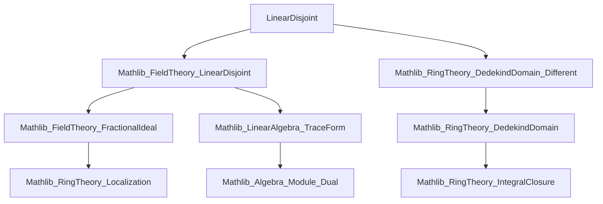

### Technical Brief: `LinearDisjoint.lean`

---

#### **1. Key Definitions & Theorems**

| Name | Type / Signature | Purpose |
|------|------------------|---------|
| `differentIdeal R A` | `Ideal R` | The *different ideal* of an extension $ R/A $, measuring ramification. |
| `traceDual R F (M : Submodule B L)` | `Submodule B L` | Dual of a submodule w.r.t. trace form over $ R \subseteq F $. |
| `LinearDisjoint F₁ F₂` | `Prop` | $ F_1, F_2 $ are linearly disjoint over the base field (here $ \mathrm{Frac}(A) $). |
| `IsCoprime I J` | `Prop` | Ideals $ I, J $ are coprime: $ I + J = \top $. |
| `differentIdeal_eq_map_differentIdeal` | `differentIdeal R₁ B = Ideal.map (algebraMap R₂ B) (differentIdeal A R₂)` | Under hypotheses, the different of $ R_1 \subseteq B $ equals the extension of the different of $ A \subseteq R_2 $. |
| `differentIdeal_eq_differentIdeal_mul_differentIdeal_of_isCoprime` | `differentIdeal A B = differentIdeal R₁ B * differentIdeal R₂ B` | Main multiplicativity result: total different factors as product under coprimality. |
| `Module.Basis.ofIsCoprimeDifferentIdeal` | `Basis ι R₁ B` | Constructs an $ R_1 $-basis of $ B $ from an $ A $-basis of $ R_2 $, using linear disjointness and coprimality. |
| `IsDedekindDomain.range_sup_range_eq_top_of_isCoprime_differentIdeal` | `(range A→R₁ B) ⊔ (range A→R₂ B) = ⊤` | $ B $ is generated as an $ A $-algebra by $ R_1 $ and $ R_2 $. |
| `IsDedekindDomain.adjoin_union_eq_top_of_isCoprime_differentialIdeal` | `adjoin A (s ∪ t) = ⊤` | If $ s \subseteq R_1 $, $ t \subseteq R_2 $ generate $ B $ individually, their union does too. |

---

#### **2. Naming Conventions**

- **`differentIdeal_…`**: Always refers to the *different ideal* of an algebra extension.
- **`traceDual_…`**: Refers to dual submodules under the trace pairing.
- **`map_differentIdeal_…` / `differentIdeal_eq_map_…`**: Relates different ideals across base change / extension.
- **`ofIsCoprimeDifferentIdeal`**: Constructs objects (bases) under the *coprime different* hypothesis.
- **`range_sup_range_eq_top_…`**: Concerns generation of algebras via suprema of ranges.
- **`isCoprime_differentIdeal`**: Predicate on pairs of ideals being coprime.
- **`linearDisjoint`**: Used in hypotheses and constructions involving linear disjointness.

Prefixes/suffixes:
- `isCoprime_`, `linearDisjoint_`, `differentIdeal_`, `traceDual_`, `ofIsCoprime_`, `range_sup_range_`.

---

#### **3. Tactic Stack**

Frequent tactics used in proofs:
- `rw`, `rwa`, `convert`, `refine`, `exact`
- `simp` / `simp_rw` (especially for algebra maps, localization, trace)
- `apply`, `intro`, `intro i`, `intro x hx`
- `congr_arg`, `ext`, `subset_trans`, `le_antisymm`, `dvd_antisymm`
- `have`, `suffices`, `by_cases`
- `rwa`, `rw [← …]`, `rwa [← …]`
- `module_finite`, `finite_basis`, `Free.of_basis`
- `map_span`, `span_span_of_tower`, `traceDual_span_of_basis`
- `inv_le_comm`, `inv_inv`, `map_inv₀`, `map_mul`, `map_ite_one_zero`
- `algebraMap_injective`, `FaithfulSMul.algebraMap_injective`, `linearIndependent_iff`, `linearIndependent_right`

---

#### **4. Proof Logic**

The logical flow is highly structured and modular:

1. **Setup & Hypotheses**  
   - Assume $ A \subseteq B $ finite extension of Dedekind domains.
   - Subrings $ R_1, R_2 \subseteq B $ such that:
     - $ \mathrm{Frac}(R_1) \vee \mathrm{Frac}(R_2) = \mathrm{Frac}(B) $
     - $ \mathrm{Frac}(R_1), \mathrm{Frac}(R_2) $ linearly disjoint over $ \mathrm{Frac}(A) $
     - $ \mathcal{D}(R_1/A), \mathcal{D}(R_2/A) $ coprime.

2. **Trace Dual Inclusion**  
   - Prove $ \mathrm{traceDual}_{R_1}(F_1) \subseteq \mathrm{span}_{R_1}(\mathrm{traceDual}_A(R_2)) $ using basis constructions (`basisOfBasisRight`) and localization.

3. **Divisibility Results**  
   - Show $ \mathcal{D}(R_1/B) \mid \mathcal{D}(A/R_2) $ and vice versa under coprimality.
   - Use `dvd_antisymm` to get equality.

4. **Multiplicativity of Different**  
   - Combine previous divisibility with known factorization $ \mathcal{D}(B/A) = \mathcal{D}(R_1/A)\mathcal{D}(R_2/A) $.

5. **Basis Construction**  
   - Lift $ A $-basis of $ R_2 $ to $ R_1 $-basis of $ B $ using trace dual and coprimality.
   - Prove linear independence and spanning via restriction of scalars and trace form properties.

6. **Algebra Generation**  
   - Use basis to show $ B = \langle R_1, R_2 \rangle_A $.
   - Extend to adjoin statements: if $ s \subseteq R_1 $, $ t \subseteq R_2 $ generate $ B $, so does $ s \cup t $.

Induction is not used; instead, the proofs rely on:
- Localization and extension of scalars,
- Properties of trace forms and duals,
- Ideal arithmetic in Dedekind domains (coprimality, factorization),
- Basis manipulation via linear disjointness.

---

#### **5. Imports**

| Module | Purpose |
|--------|---------|
| `Mathlib.FieldTheory.LinearDisjoint` | Core theory of linear disjointness, trace duals, basis constructions. |
| `Mathlib.RingTheory.DedekindDomain.Different` | Different ideal, its properties, behavior under extension. |

Additional dependencies (implicit via `IsDedekindDomain`, `FractionalIdeal`, etc.):
- `Mathlib.FieldTheory.FractionalIdeal`
- `Mathlib.RingTheory.DedekindDomain`
- `Mathlib.RingTheory.IntegralClosure`
- `Mathlib.LinearAlgebra.TraceForm`
- `Mathlib.Algebra.Algebra.Dual`
- `Mathlib.Module.Free`
- `Mathlib.Algebra.Module.Basis`

---

#### **6. Mermaid Diagrams**

##### **Dependency Graph (Module-Level)**



##### **Overview of Theoretical Flow**

```mermaid
flowchart LR
  A[B : Dedekind domain] --> R1[R₁ ⊆ B]
  A --> R2[R₂ ⊆ B]
  R1 --> FracR1[Frac(R₁)]
  R2 --> FracR2[Frac(R₂)]
  FracR1 & FracR2 --> LD[Linear Disjointness over Frac(A)]
  FracR1 & FracR2 --> Sup[Frac(R₁) ⊔ Frac(R₂) = Frac(B)]
  R1 & R2 --> Diff1[𝓓(R₁/A)]
  R1 & R2 --> Diff2[𝓓(R₂/A)]
  Diff1 & Diff2 --> Coprime[IsCoprime(Diff1, Diff2)]
  LD & Sup & Coprime --> MainThms[Main Theorems]
  MainThms --> DiffMult[𝓓(B/A) = 𝓓(R₁/A)·𝓓(R₂/A)]
  MainThms --> Basis[Construct R₁-basis of B]
  MainThms --> Gen[B = ⟨R₁, R₂⟩_A]
```

---

#### **7. Summary**

This file formalizes a *factorization theorem for different ideals* in the context of two linearly disjoint subextensions with coprime different ideals. It bridges local (different) and global (basis, generation) properties of extensions of Dedekind domains. The key insight is that *coprimality of different ideals* compensates for lack of separability or freeness, enabling strong structural results like basis construction and algebra generation.

The formalization is highly polished, leveraging:
- `FractionalIdeal` for ideal arithmetic,
- `traceDual` and trace form nondegeneracy,
- `LinearDisjoint` machinery for basis lifting,
- `IsDedekindDomain` properties for ideal factorization.

It exemplifies modern Lean’s ability to handle sophisticated algebraic number theory.
