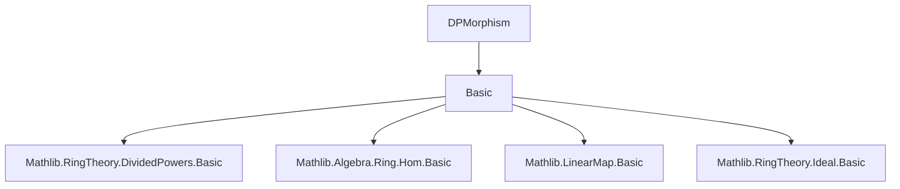
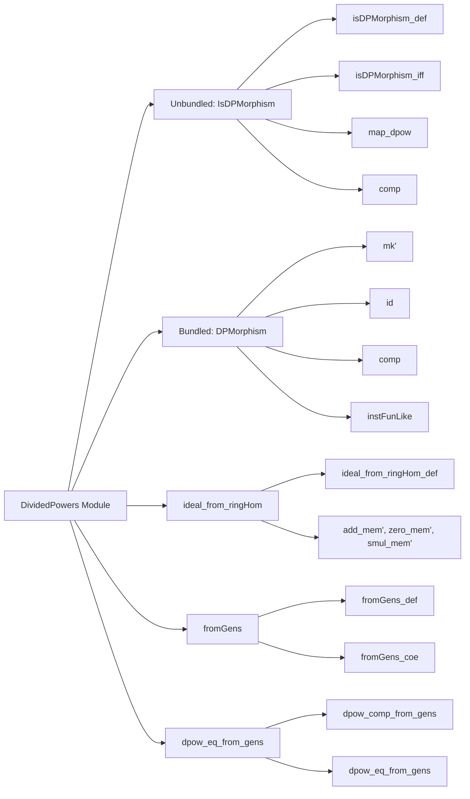
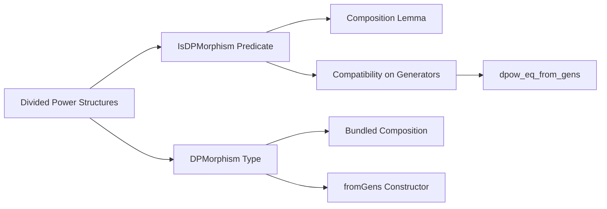

### Technical Brief: `DPMorphism.lean`

---

#### **1. Key Definitions & Theorems**

| Name | Type / Signature | Purpose |
|------|------------------|---------|
| `IsDPMorphism` | `structure` | Unbundled predicate: a ring homomorphism `f : A →+* B` is a *divided power morphism* w.r.t. divided power structures `hI` on ideal `I ⊆ A` and `hJ` on ideal `J ⊆ B` if `I.map f ≤ J` and `f ∘ hI.dpow n = hJ.dpow n ∘ f` on `I`. |
| `DPMorphism` | `structure` (bundled) | A ring homomorphism `A →+* B` equipped with proofs of compatibility with divided powers; extends `RingHom A B`. |
| `ideal_from_ringHom` | `def` | Given `f : A →+* B`, `I ⊆ A`, `J ⊆ B`, and `I.map f ≤ J`, this is the largest sub-ideal of `I` on which `f` commutes with all divided powers. |
| `fromGens` | `def` | Constructs a `DPMorphism` from a ring homomorphism `f` that is compatible with divided powers on a generating set `S` of `I`. |
| `dpow_eq_from_gens` | `theorem` | If two divided power structures on `I` agree on a generating set, they are equal. |
| `isDPMorphism_def` | `lemma` | Equivalence between `IsDPMorphism` and its defining conditions. |
| `isDPMorphism_iff` | `lemma` | Simplified version: compatibility only needs to be checked for `n ≠ 0`. |
| `IsDPMorphism.map_dpow` | `lemma` | Direct statement of compatibility: `f(hI.dpow n a) = hJ.dpow n (f a)` for `a ∈ I`. |
| `IsDPMorphism.comp` | `lemma` | Composition of `IsDPMorphism`s is again an `IsDPMorphism`. |
| `DPMorphism.comp` | `def` | Composition of bundled `DPMorphism`s. |
| `DPMorphism.id` | `def` | Identity map as a `DPMorphism`. |
| `DPMorphism.mk'` | `def` | Constructor from an `IsDPMorphism`. |
| `IsDPMorphism.on_span` | `theorem` | Sufficient condition for `f` to be an `IsDPMorphism`: compatibility on a generating set + image in `J`. |
| `IsDPMorphism.of_comp` | `theorem` | If `g ∘ f` and `f` are `DPMorphism`s and `J = I.map f`, then `g` is a `DPMorphism`. |

---

#### **2. Naming Conventions**

- **Prefixes**:
  - `isDPMorphism`: predicate-style (unbundled).
  - `dpow_`: related to divided powers (`dpow_comp`, `dpow_eq_from_gens`, `dpow_comp_from_gens`).
  - `ideal_from_`: construction of ideals from ring maps.
  - `fromGens`: construction from generators.

- **Suffixes**:
  - `_def`: definition equivalence.
  - `_iff`: logical equivalence.
  - `_from_gens`: constructions relying on generating sets.
  - `comp`: composition-related.

- **Structure fields**:
  - `ideal_comp`: image condition.
  - `dpow_comp`: divided power compatibility.

---

#### **3. Tactic Stack**

Frequently used tactics:
- `rw`, `simp`, `simp only`, `dsimp`
- `exact`, `refine`, `intro`, `cases`
- `apply congr_arg`, `ext`, `funext`
- `induction n with | zero | succ`
- `by_cases`, `by_contra` (implicit via `by_cases hn : n = 0`)
- `le_trans`, `map_mono`, `map_map`, `map_add`, `map_mul`, `map_pow`, `map_zero`, `map_one`
- `span_le`, `subset_span`, `mem_map_of_mem`, `mem_setOf_eq`, `Submodule.mem_mk`

---

#### **4. Proof Logic**

- **Induction on `n`** for base cases (`n = 0`, `n > 0`) in `ideal_from_ringHom.zero_mem'`, `isDPMorphism_iff`.
- **Case analysis on `n = 0`** to reduce to trivial divided powers.
- **Span-based arguments** using `span_le`, `subset_span`, and `mem_span` for `fromGens`, `on_span`, `dpow_eq_from_gens`.
- **Submodule ideal membership reasoning** via `mem_setOf_eq`, `add_mem'`, `smul_mem'`, `zero_mem'`.
- **Diagram chasing** for composition: `comp` uses `le_trans` and `map_map`.
- **Uniqueness via generating sets**: `dpow_eq_from_gens` reduces to identity map and applies `dpow_comp_from_gens`.

---

#### **5. Imports**

- `Mathlib.RingTheory.DividedPowers.Basic`: core divided power theory (ideals, `dpow`, axioms).

---

#### **6. Dependencies & Theory Scope**

- **Core theory**: Divided power structures on ideals in commutative (semi)rings.
- **Categorical flavor**: Bundled morphisms (`DPMorphism`) for future crystalline cohomology development.
- **Foundational lemmas**: Compatibility on generators ⇒ global compatibility (Roby’s Proposition 3).
- **Uniqueness**: Roby’s Corollary to Proposition 3.

---

#### **7. Mermaid Diagrams**

##### **Dependency Graph (Module Level)**

##### **Overview of File Structure**

##### **Conceptual Flow (Theory Development)**

---

#### **8. References Embedded**

- **Berthelot 1974**: *Cohomologie cristalline* — foundational for crystalline cohomology.
- **Berthelot–Ogus 1978**: *Notes on crystalline cohomology* — follow-up technicalities.
- **Roby 1963, 1965**: *Lois polynomes*, *Les algèbres à puissances dividées* — key propositions (2, 3) and corollaries used.

--- 

This file formalizes the morphism theory for divided power structures, with an eye toward categorical and cohomological applications. It balances practical unbundled reasoning (`IsDPMorphism`) with future-proof bundled structures (`DPMorphism`).
