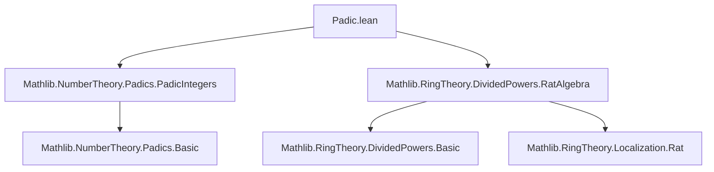

### Technical Brief: `Padic.lean` — Divided Powers on the Ideal $(p) \subseteq \mathbb{Z}_p$

---

#### **1. Key Definitions & Theorems**

| Name | Type / Signature | Purpose |
|------|------------------|---------|
| `DividedPowers.ofInjective` | `{A B : Type*} [CommSemiring A] [CommSemiring B] → (I : Ideal A) → (J : Ideal B) → (f : A →+* B) → Injective f → DividedPowers J → I.map f = J → (∀ n {x} (_ : x ∈ I), ∃ y, f y = hJ.dpow n (f x)) → DividedPowers I` | Constructs a divided power structure on an ideal $I \subseteq A$ via an injective morphism $f : A \to B$ lifting divided powers from $J = I \cdot f$ in $B$. |
| `dpow'` | `ℕ → ℚ_[p] → ℚ_[p]` | Candidate divided power maps: $x \mapsto x^n / n!$ in $\mathbb{Q}_p$. |
| `dpow'_norm_le_of_ne_zero` | `n ≠ 0 → x ∈ (p)ℤ_p ⇒ ‖x^n / n!‖ ≤ p^{-1}` | Norm estimate showing that divided powers land in the maximal ideal (up to scaling). |
| `dpow'_int` | `x ∈ (p)ℤ_p ⇒ ‖x^n / n!‖ ≤ 1` | Shows that divided powers of elements in $(p)\mathbb{Z}_p$ remain integral (i.e., in $\mathbb{Z}_p$). |
| `dpow'_mem` | `n ≠ 0 ∧ x ∈ (p)ℤ_p ⇒ x^n / n! ∈ (p)ℤ_p$` | Ensures that the divided power maps actually land in the ideal $(p)\mathbb{Z}_p$, not just $\mathbb{Z}_p$. |
| `dividedPowers` | `DividedPowers (Ideal.span {(p : ℤ_[p])})` | Main theorem: $(p) \subseteq \mathbb{Z}_p$ carries a divided power structure given by $x \mapsto x^n / n!$, provided $p$ is prime. |
| `dividedPowers_eq` | `(dividedPowers p).dpow n x = if x ∈ (p) then ⟨x^n / n!, ...⟩ else 0` | Explicit description of the divided power maps on $(p) \subseteq \mathbb{Z}_p$. |
| `coe_dpow_eq` | `((dividedPowers p).dpow n x : ℚ_p) = if x ∈ (p) then x^n / n! else 0` | Embedding into $\mathbb{Q}_p$ matches the naive formula. |

---

#### **2. Naming Conventions**

- **Prefixes**:
  - `dpow'`: auxiliary definition (prime notation for "candidate" divided power).
  - `dpow_mem`, `dpow_add`, `dpow_mul`, `dpow_comp`, `mul_dpow`, `dpow_zero`, `dpow_one`: standard divided power axioms.
  - `ofInjective`: construction via injective map.
- **Suffixes**:
  - `_int`: integrality claim (value lies in $\mathbb{Z}_p$).
  - `_mem`: membership in the ideal $(p)$.
  - `_norm_le_of_ne_zero`: norm bound under nonzero index.
- **General**:
  - `padicValNat`, `padic_norm_e_of_padicInt`, `norm_eq_zpow_neg_valuation`: standard $p$-adic analysis lemmas.
  - `RatAlgebra.dpow_apply`: uses divided powers on $\mathbb{Q}_p$ (as a localization).

---

#### **3. Tactic Stack**

| Tactic | Usage Frequency | Purpose |
|--------|-----------------|---------|
| `simp` / `simp only` | Very High | Simplify using definitions, especially of `dpow'`, `Ideal.span`, `norm`, `valuation`. |
| `rw` | High | Rewrite using lemmas like `norm_eq_zpow_neg_valuation`, `dpow'_int`, etc. |
| `gcongr` | Medium | Handle inequalities involving valuations and norms (e.g., $v_p(n!) < n$). |
| `by_cases` | Medium | Split on $x = 0$, $n = 0$, or $x \in I$. |
| `exact` / `apply` | Medium | Apply lemmas like `dpow'_mem`, `dpow'_int`. |
| `conv_lhs` | Low | Local rewriting in left-hand side of equations. |
| `aesop` | Not used | No high-level automation needed; proofs are structural. |
| `ring` | Not used | Arithmetic is handled via norm/valuation lemmas. |

---

#### **4. Proof Logic**

- **High-level strategy**:
  1. **Abstract Setup**: Use `DividedPowers.ofInjective` to reduce constructing divided powers on $(p) \subseteq \mathbb{Z}_p$ to verifying:
     - The inclusion $\mathbb{Z}_p \hookrightarrow \mathbb{Q}_p$ is injective.
     - The ideal $(p)\mathbb{Z}_p$ maps to the unit ideal $(1) = \mathbb{Q}_p$ (true since $p \ne 0$).
     - For $x \in (p)\mathbb{Z}_p$, $x^n / n! \in \mathbb{Z}_p$ and lies again in $(p)\mathbb{Z}_p$ for $n > 0$.
  2. **Norm Estimates**:
     - Use $v_p(n!) < n$ (for $n > 0$) to bound $v_p(x^n / n!) \ge v_p(x)n - v_p(n!) \ge 1$, hence $x^n / n! \in (p)\mathbb{Z}_p$.
     - Prove integrality via $v_p(x^n / n!) \ge 0$.
  3. **Verification of Axioms**:
     - All divided power axioms (e.g., $\delta_n(x+y)$, $\delta_n(ax)$, $\delta_n(x)^m = \binom{nm}{n} \delta_{nm}(x)$) follow by embedding into $\mathbb{Q}_p$, where they hold (via `RatAlgebra.dividedPowers`), and using injectivity to pull back.

- **Inductive structure**: Not used. Proofs are direct, leveraging:
  - Valuation additivity: $v_p(xy) = v_p(x) + v_p(y)$,
  - Factorial valuation bound: $v_p(n!) = \sum_{k=1}^\infty \lfloor n/p^k \rfloor < n$,
  - Norm-valuation relation: $\|x\| = p^{-v_p(x)}$.

---

#### **5. Imports & Dependencies**

| Module | Role |
|--------|------|
| `Mathlib.NumberTheory.Padics.PadicIntegers` | Defines $\mathbb{Z}_p$, its norm, valuation, and basic properties. |
| `Mathlib.RingTheory.DividedPowers.RatAlgebra` | Provides divided power structure on $\mathbb{Q}_p$ (as a localization of $\mathbb{Z}$), used as ambient target. |
| `DividedPowers`, `DividedPowers.OfInvertibleFactorial`, `Nat`, `Ring` | Core divided power theory and arithmetic utilities. |

---

#### **6. Mermaid Diagrams**

##### **Dependency Graph (Module-Level)**



##### **Overview of Theory Flow**

```mermaid
flowchart LR
  A[Divided Power Axioms] --> B[Abstract Lifting Lemma<br>`ofInjective`]
  B --> C[Inclusion ℤ_p ↪ ℚ_p]
  C --> D[Target: RatAlgebra.dividedPowers on ℚ_p]
  C --> E[Source: Ideal (p) ⊆ ℤ_p]
  E --> F[dpow' n x = x^n / n!]
  F --> G[Norm Estimates<br>`dpow'_norm_le_of_ne_zero`, `dpow'_int`]
  G --> H[Membership in (p)<br>`dpow'_mem`]
  H --> I[Construct dividedPowers on (p)]
  I --> J[Explicit formula `dividedPowers_eq`, `coe_dpow_eq`]
```

##### **Proof Structure (for `dividedPowers`)**

```mermaid
flowchart LR
  Start[Construct dividedPowers] --> Apply[ofInjective]
  Apply --> Injective[Injectivity of ℤ_p → ℚ_p]
  Apply --> MapIdeal[Map of (p) is ⊤]
  Apply --> Preimage[Preimage condition: x^n/n! ∈ ℤ_p & (p)]
  Preimage --> NormEst[dpow'_norm_le_of_ne_zero]
  Preimage --> Int[dpow'_int]
  Preimage --> Mem[dpow'_mem]
  NormEst --> Valuation[Use v_p(n!) < n]
  Int --> Valuation
  Mem --> Valuation
  Valuation --> Finish[DividedPowers (p)]
```

---

#### **7. Future Work (from TODO)**

- Generalize to arbitrary $p$-adic local fields $K$ with ring of integers $R$, uniformizer $\pi$, and ramification index $e$.
- Condition: $(\pi) \subseteq R$ has divided powers **iff** $e \le p - 1$.
- This reflects the failure of $v_\pi(p) = e > p-1$ to ensure $v_\pi(x^n / n!) \ge v_\pi(x)$ for $x \in (\pi)$.

--- 

Let me know if you'd like a formalized summary in Lean syntax or a diagram export (e.g., SVG/PNG).
