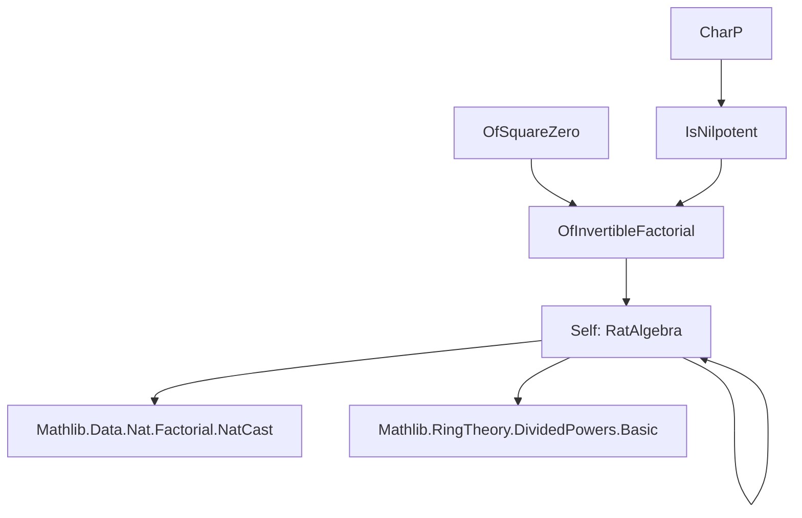
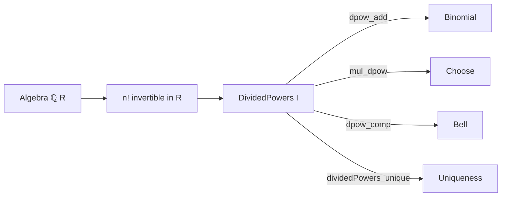

### Technical Brief: `RatAlgebra.lean`

---

#### **1. Key Definitions & Theorems**

| Name | Type / Signature | Purpose |
|------|------------------|---------|
| `dpow` (in `OfInvertibleFactorial`) | `ℕ → A → A` | Defines $x \mapsto x^n / n!$ piecewise (0 outside ideal $I$) |
| `dividedPowers` (in `OfInvertibleFactorial`) | `DividedPowers I` | Constructs a divided power structure on $I$ assuming $(n-1)!$ invertible and $I^n = 0$ |
| `dividedPowers` (in `OfSquareZero`) | `DividedPowers I` | Special case when $I^2 = 0$ (uses `OfInvertibleFactorial.dividedPowers` with $n=2$) |
| `dividedPowers` (in `IsNilpotent`) | `DividedPowers I` | When $p$ is prime, $p$ is nilpotent in $A$, and $I^p = 0$ |
| `dividedPowers` (in `CharP`) | `DividedPowers I` | When $A$ has characteristic $p > 0$ and $I^p = 0$ |
| `dpow` (in `RatAlgebra`) | `ℕ → R → R` | Same as `OfInvertibleFactorial.dpow`, specialized to $\mathbb{Q}$-algebras |
| `dividedPowers` (in `RatAlgebra`) | `DividedPowers I` | Unique divided power structure on any ideal $I$ of a $\mathbb{Q}$-algebra |
| `dpow_eq_inv_fact_smul` | `hI.dpow n x = (n!^{-1}) • x^n` | Shows any divided power structure on $I$ must be $x^n / n!$ |
| `dividedPowers_unique` | `hI = dividedPowers I` | Uniqueness of divided power structure on ideals of $\mathbb{Q}$-algebras |

---

#### **2. Naming Conventions**

- **Prefixes**:
  - `dpow_`: properties of the $n$-th divided power operation.
  - `dividedPowers_`: constructors or lemmas for the full divided power structure.
  - `mul_`, `add_`, `comp_`: refer to multiplicative, additive, or compositional properties.
  - `of_`: indicates dependency on a hypothesis (e.g., `OfInvertibleFactorial`, `OfSquareZero`).
- **Suffixes**:
  - `_of_lt`, `_of_add_lt`, `_of_mul_lt`: conditional versions assuming bounds like $m < n$.
  - `_eq_of_mem`, `_eq_of_not_mem`: case analysis on membership in $I$.
  - `_unique`, `_eq_inv_fact_smul`: uniqueness or explicit formula results.

---

#### **3. Tactic Stack**

Frequently used tactics:
- `simp` / `simp only`: simplification with definitional equalities, especially for `dpow`.
- `rw`: rewriting using lemmas like `dpow_eq_of_mem`, `Ideal.pow_eq_zero_of_mem`, etc.
- `ring`: algebraic simplification in commutative semirings/rings.
- `norm_num`: for numeric goals (e.g., `2 ≤ 2`, `2 < 3`).
- `by_cases!`: case split on inequalities like `m < n`.
- `congr`, `congr_arg`, `congr_arg₂`: for functional extensionality or equality of expressions.
- `apply`, `exact`, `intro`: basic proof scripting.
- `cast_choose_eq`, `uniformBell_*`: specialized lemmas for binomial/uniform Bell identities.
- `nth_rewrite`: for precise rewriting at a specific position.

---

#### **4. Proof Logic**

The logical flow across most proofs follows this pattern:

1. **Case analysis** on whether $x \in I$ or not (via `if_pos`, `if_neg`, `dpow_eq_of_mem`, etc.).
2. **Reduction** to factorial identities using invertibility assumptions (e.g., $(n-1)!$ invertible).
3. **Ideal-theoretic arguments**:
   - Use $I^n = 0$ to deduce $x^n = 0$ for $x \in I$.
   - Use monotonicity of powers: $I^m \subseteq I^n$ for $m \ge n$.
4. **Combinatorial identities**:
   - Binomial theorem (`add_pow'`, `Finset.sum_antidiagonal`).
   - Factorial–binomial relations (`Nat.choose_symm_add`, `Nat.add_choose_mul_factorial_mul_factorial`).
   - Uniform Bell polynomials for composition (`uniformBell_*` lemmas).
5. **Uniqueness arguments**:
   - Show any divided power structure must agree with $x^n / n!$ on $I$.
   - Use `ext` lemma for `DividedPowers` to conclude equality.

For the $\mathbb{Q}$-algebra case:
- Invertibility of all $n!$ in $R$ (since $\mathbb{Q} \hookrightarrow R$) removes the need for nilpotence assumptions.
- Uniqueness is proven by showing any divided power structure satisfies $hI.dpow\ n\ x = x^n / n!$ using factorial–divided power identities.

---

#### **5. Imports**

- `Mathlib.Data.Nat.Factorial.NatCast`: for factorial, cast, and invertibility lemmas.
- `Mathlib.RingTheory.DividedPowers.Basic`: core definitions and axioms of `DividedPowers`.

---

#### **8. Mermaid Diagrams**

##### **Dependency Graph (Module-Level)**



##### **Overview of Theory Flow**

```mermaid
flowchart LR
  A[CommSemiring A] --> I[Ideal I]
  I -->|I^n = 0, (n-1)! invertible| DP1[DividedPowers I]
  I -->|I^2 = 0| DP2[DividedPowers I]
  I -->|I^p = 0, char p| DP3[DividedPowers I]
  I -->|R is ℚ-algebra| DP4[Unique DividedPowers I]
  DP1 -->|specialize| DP2
  DP1 -->|specialize| DP3
  DP4 -->|dpow_eq_inv_fact_smul| DP1
  DP4 -->|dividedPowers_unique| DP4
```

##### **Structure of `RatAlgebra.dividedPowers`**



---

This module formalizes foundational examples of divided power structures, culminating in the uniqueness of divided powers over $\mathbb{Q}$-algebras — a key ingredient in crystalline cohomology and deformation theory.
