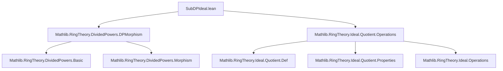
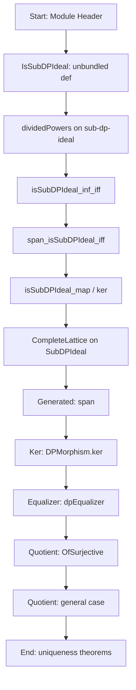
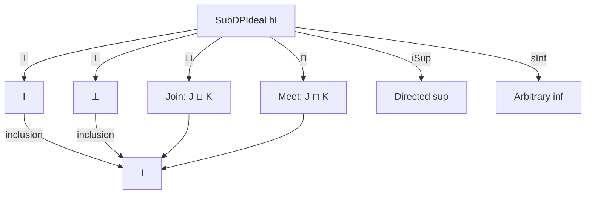

### Technical Brief: `SubDPIdeal.lean`

---

#### **1. Key Definitions & Theorems**

| Name | Type / Signature | Purpose |
|------|------------------|---------|
| `IsSubDPIdeal` | `structure` | Unbundled definition: a subideal `J ≤ I` such that `hI.dpow n x ∈ J` for all `n > 0`, `x ∈ J`. |
| `SubDPIdeal` | `structure` | Bundled version: a subideal equipped with the `IsSubDPIdeal` property. Enables lattice structure. |
| `dividedPowers` (for `IsSubDPIdeal`) | `def` | Induces a divided power structure on a sub-dp-ideal `J` using restriction of `hI`. |
| `prod` | `def` | For any ideal `J`, `I • J` is a sub-dp-ideal of `I`. |
| `span` | `def` | Sub-dp-ideal generated by a set `S ⊆ I`. |
| `subDPIdeal_inf_of_quot` | `def` | If quotient map `A → A/J` lifts to a dp-morphism on `I`, then `J ⊓ I` is a sub-dp-ideal. |
| `Quotient.OfSurjective.dividedPowers` | `def` | Induced dp-structure on `I.map f` when `f: A → B` is surjective and `ker f ⊓ I` is a sub-dp-ideal. |
| `Quotient.dividedPowers` | `def` | Induced dp-structure on `I(A⧸J)` when `J ⊓ I` is a sub-dp-ideal. |
| `isSubDPIdeal_inf_iff` | `theorem` | Characterizes when `J ⊓ I` is a sub-dp-ideal: compatibility of dpowers modulo `J`. |
| `span_isSubDPIdeal_iff` | `theorem` | `span S` is a sub-dp-ideal iff `hI.dpow n s ∈ span S` for all `s ∈ S`, `n > 0`. |
| `isSubDPIdeal_ker` | `theorem` | Kernel of a dp-morphism `I → J` is a sub-dp-ideal of `I`. |
| `isSubDPIdeal_map` | `theorem` | Image of a dp-morphism `I → J` is a sub-dp-ideal of `J`. |
| `SubDPIdeal.instCompleteLattice` | `instance` | Sub-dp-ideals of `I` form a complete lattice under inclusion. |
| `span_carrier_eq_dpow_span` | `theorem` | Underlying ideal of `SubDPIdeal.span hI S` is generated by `{ hI.dpow n x | x ∈ S, n > 0 }`. |
| `Quotient.OfSurjective.dividedPowers_unique` | `theorem` | Uniqueness of induced dp-structure on `I.map f` for surjective `f`. |
| `Quotient.dividedPowers_unique` | `theorem` | Uniqueness of induced dp-structure on `I(A⧸J)`. |

---

#### **2. Naming Conventions**

- **Prefixes**:
  - `isSubDPIdeal_`: properties of the *unbundled* predicate.
  - `dpow_`: operations involving divided powers (e.g., `dpow_mem`, `dpow_eq`, `dpow_apply`).
  - `subDPIdeal_`: bundled constructions (e.g., `subDPIdeal_inf_of_quot`).
  - `quotient_` / `Quotient.`: constructions on quotients.
  - `DPMorphism.`: morphism-related (e.g., `DPMorphism.ker`).
- **Suffixes**:
  - `_iff`: equivalence characterizations.
  - `_unique`: uniqueness of constructions.
  - `_carrier`: underlying ideal (e.g., `inf_carrier_def`, `span_carrier_eq_dpow_span`).
- **Operators**:
  - `dpow`: divided power operation.
  - `prod`: ideal product `I • J`.
  - `span`: dp-ideal generation.
  - `inf`, `sup`, `iInf`, `iSup`: lattice operations.

---

#### **3. Tactic Stack**

Frequently used tactics in proofs:

| Tactic | Usage |
|--------|-------|
| `simp` / `simp_rw` | Simplifying definitions (e.g., `if_pos`, `mem_inf`, `dpow_eq`). |
| `rw` | Rewriting using lemmas like `dpow_add`, `dpow_mul`, `mem_map_iff_of_surjective`. |
| `induction` | Structural induction on `Submodule.span_induction`, `Submodule.smul_induction_on'`. |
| `exact` / `apply` | Closing goals with known lemmas (e.g., `hI.dpow_mem`, `mem_map_of_mem`). |
| `by_cases` | Splitting on `n = 0`, `k = 0`, membership in sets. |
| `ext` | Proving equality of dp-structures or ideals. |
| `apply_..._using` | Induction principles for submodules/ideals. |
| `congr_arg` | Equality of functions/values (e.g., in `isSubDPIdeal_ker`). |
| `convert` / `congr` | Matching structures with shared components. |
| `aesop` | Not used heavily — proofs are mostly manual and structure-driven. |

---

#### **4. Proof Logic**

- **Induction on ideal membership**: Most proofs about `span S` or `I • J` use `Submodule.span_induction` or `smul_induction_on'`.
- **Case analysis on `n = 0`**: Divided powers behave differently at `n = 0`; many proofs split on this.
- **Compatibility via quotient**: For quotient constructions, the key step is verifying that dpowers descend modulo `J`, using `isSubDPIdeal_inf_iff`.
- **Uniqueness via surjectivity**: For `dividedPowers_unique`, surjectivity lets one lift elements to `A`, then use the dp-morphism condition.
- **Lattice construction**: Uses `Function.Injective.completeLattice` to transfer the complete lattice structure from `Set.Iic I` to `SubDPIdeal hI`.

---

#### **5. Imports**

| Module | Purpose |
|--------|---------|
| `Mathlib.RingTheory.DividedPowers.DPMorphism` | Core theory of divided power morphisms (`IsDPMorphism`, `DPMorphism`). |
| `Mathlib.RingTheory.Ideal.Quotient.Operations` | Operations on quotients, maps, kernels, and ideal arithmetic. |

---

#### **8. Mermaid Diagrams**

##### **Dependency Graph (Top-Level)**

##### **Overview of File Structure**

##### **Lattice of Sub-dp-Ideals**

---

This file formalizes the foundational theory of *sub-divided power ideals*, enabling constructions and reasoning about quotient dp-structures, generated dp-ideals, and lattice-theoretic properties. It bridges ideal theory with divided power algebra, crucial for crystalline cohomology and deformation theory.
