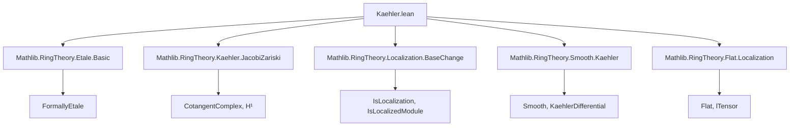
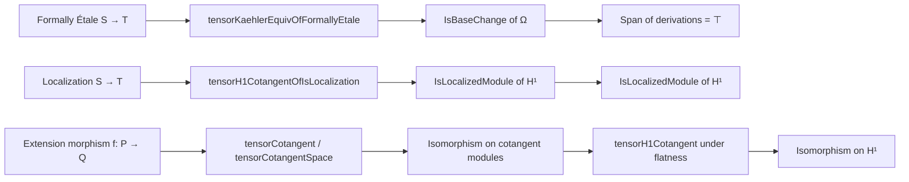

**Technical Brief: `Kaehler.lean` — Differential Modules and Étale Algebras in Lean 4**

---

### **1. Key Definitions & Theorems**

| Name | Type / Signature | Purpose |
|------|------------------|---------|
| `KaehlerDifferential.tensorKaehlerEquivOfFormallyEtale` | `[Algebra.FormallyEtale S T] → T ⊗[S] Ω[S⁄R] ≃ₗ[T] Ω[T⁄R]` | Canonical isomorphism of Kähler differentials under formal étaleness; base change compatibility. |
| `Algebra.tensorH1CotangentOfIsLocalization` | `[IsLocalization M T] → T ⊗[S] H¹(L_{S/R}) ≃ₗ[T] H¹(L_{T/R})` | Canonical isomorphism on first cohomology of cotangent complex under localization. |
| `Algebra.Extension.tensorCotangent` | `[alg : Algebra P.Ring Q.Ring] → (halg : algebraMap P.Ring Q.Ring = f.toRingHom) → (H : Function.Bijective ((f.mapKer halg).liftBaseChange Q.Ring)) → T ⊗[S] P.Cotangent ≃ₗ[T] Q.Cotangent` | Isomorphism of cotangent spaces under base change + bijectivity condition (e.g., flat + formally étale). |
| `Algebra.Extension.tensorCotangentSpace` | `[f.toRingHom.FormallyEtale] → T ⊗[S] P.Cotangent ≃ₗ[T] Q.Cotangent` | Special case of `tensorCotangent` when `f` is formally étale (no extra kernel condition needed). |
| `Algebra.Extension.tensorH1Cotangent` | `[Module.Flat S T] → [f.toRingHom.FormallyEtale] → Function.Bijective ((f.mapKer halg).liftBaseChange Q.Ring) → T ⊗[S] P.H1Cotangent ≃ₗ[T] Q.H1Cotangent` | Isomorphism on $H^1$ of cotangent complex under flatness + formal étaleness + kernel condition. |
| `KaehlerDifferential.isBaseChange_of_formallyEtale` | `[Algebra.FormallyEtale S T] → IsBaseChange T (map R R S T)` | Formal étaleness implies the map on Kähler differentials is a base change (i.e., bijective). |
| `KaehlerDifferential.isLocalizedModule_map` | `[IsLocalization M T] → IsLocalizedModule M (map R R S T)` | The map on Kähler differentials along a localization is a localized module. |
| `KaehlerDifferential.span_range_map_derivation_of_isLocalization` | `[IsLocalization M T] → Submodule.span T (Set.range (map R R S T ∘ D R S)) = ⊤` | Derivations generate the full module after localization. |
| `Algebra.H1Cotangent.isLocalizedModule` | `[IsLocalization M T] → IsLocalizedModule M (Algebra.H1Cotangent.map R R S T)` | $H^1(L_{S/R})$ localizes correctly. |

---

### **2. Naming Conventions**

- **Prefixes**:
  - `tensorKaehlerEquiv*`: Isomorphisms involving tensoring with Kähler differentials.
  - `tensorCotangent*`: Isomorphisms on cotangent spaces or complexes.
  - `isBaseChange`, `isLocalizedModule`: Properties of module maps under localization/base change.
  - `map*`: Maps induced by algebra homomorphisms (e.g., `map R R S T`).
  - `deriv*`, `D R S`: Kähler differential derivation map $S \to \Omega_{S/R}$.

- **Suffixes**:
  - `*OfFormallyEtale`: Assumes formal étaleness.
  - `*OfIsLocalization`: Assumes localization.
  - `*Symm_*`: Lemmas about inverses of equivalences.
  - `*toLinearMap`: Identifies linear maps underlying linear equivalences.

- **Notable abbreviations**:
  - `Ω[S⁄R]`: Kähler differentials $\Omega_{S/R}$.
  - `H¹(L_{S/R})`: First cohomology of cotangent complex $L_{S/R}$, denoted `H1Cotangent R S`.
  - `P.Cotangent`, `Q.Cotangent`: Cotangent modules of extensions $P, Q$.

---

### **3. Tactic Stack**

| Tactic | Usage Frequency | Purpose |
|--------|-----------------|---------|
| `simp` / `simp only` | Very High | Simplify using definitional equalities, `@[simps!]`, and module/algebra laws. |
| `congr` / `congr!` | High | Prove equality of structures (e.g., linear maps, extensions). |
| `ext` | High | Extensionality for functions, linear maps, derivations. |
| `rw` | High | Rewrite using lemmas, equivalences, and algebra laws. |
| `induction` | Medium | Structural induction on elements of modules (e.g., `tmul`, `add`). |
| `obtain ⟨x, hx⟩` / `⟨x, rfl⟩` | High | Use surjectivity/injectivity/bijectivity lemmas. |
| `convert` | Medium | Match goals up to definitional equality or propositional truncation. |
| `change` | Medium | Adjust goal to match a known lemma. |
| `refine` | Medium | Partial proof construction with holes. |
| `aesop` / `ring` | Low | Not used here — this is a highly structured algebraic file. |

---

### **4. Proof Logic**

- **Inductive structure on module elements**: Proofs often reduce to checking generators (e.g., `tmul`, `mk`, `D s`) using induction on `Cotangent`, `H1Cotangent`, or `Submodule.span`.
- **Leverage universal properties**:
  - Localization: `IsLocalization.liftAlgHom`, `exists_mk'_eq`.
  - Kähler differentials: `Derivation.liftKaehlerDifferential_unique`.
  - Cotangent complex: `h1Cotangentι`, `cotangentComplex_mk`.
- **Factor through equivalences**:
  - Use `LinearEquiv.ofBijective` to construct isomorphisms from bijective maps.
  - Prove bijectivity via `tensorKaehlerEquivOfFormallyEtale.bijective`.
- **Base change & flatness**:
  - `Module.Flat.lTensor_preserves_injective_linearMap` for injectivity.
  - `lTensor_exact` for exactness propagation.
- **Kernel analysis**:
  - `mapKer`, `ker`, `localized'`, `isLocalizedModule_iff_isBaseChange` used to relate kernels before/after localization.

---

### **5. Imports & Scope**

| Import | Role |
|--------|------|
| `Mathlib.RingTheory.Etale.Basic` | Formal étaleness, smoothness, lifting properties. |
| `Mathlib.RingTheory.Kaehler.JacobiZariski` | Jacobi–Zariski sequences, cotangent complexes. |
| `Mathlib.RingTheory.Localization.BaseChange` | Base change for localizations, `IsLocalization`, `IsLocalizedModule`. |
| `Mathlib.RingTheory.Smooth.Kaehler` | Smoothness and Kähler differentials (e.g., `tensorKaehlerEquiv`). |
| `Mathlib.RingTheory.Flat.Localization` | Flatness of localization, `Module.Flat`. |

**Scope**: This file sits at the intersection of:
- **Derived algebraic geometry** (cotangent complex $L_{S/R}$),
- **Étale cohomology / descent** (localization, formal étaleness),
- **Differential calculus in algebra** (Kähler differentials, derivations).

---

### **6. Mermaid Diagrams**

#### **Dependency Graph (Top-Level)**

#### **Overview of Main Logical Flow**

---

### **7. Summary**

This file formalizes foundational results in *derived commutative algebra*, especially:
- **Base change for Kähler differentials** under formal étaleness,
- **Localization compatibility** for cotangent complexes,
- **Descent properties** of $H^1(L_{-})$.

It demonstrates Lean’s capacity to handle sophisticated homological algebra with explicit constructions of isomorphisms, inverses, and coherence lemmas — all verified with `@[simps!]`, `ext`, and `induction`-based proofs.

Let me know if you'd like a **dependency tree of definitions** or a **proof sketch of `tensorH1CotangentOfIsLocalization`**.
