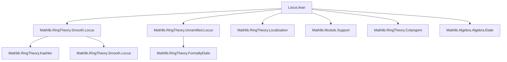
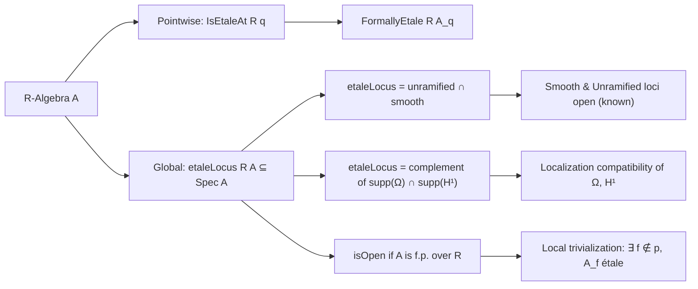

**Technical Brief: `Locus.lean` — Etale Locus of an Algebra**

---

### 1. **Key Definitions & Theorems**

| Name | Type / Signature | Purpose |
|------|------------------|---------|
| `IsEtaleAt R q` | `q : Ideal A → [q.IsPrime] → Prop` | Says $A_q$ is formally étale over $R$; local condition at prime $q$. |
| `etaleLocus R A` | `Set (PrimeSpectrum A)` | Global locus: primes of $A$ where $A$ is étale over $R$. |
| `mem_etaleLocus_iff` | `p ∈ etaleLocus R A ↔ IsEtaleAt R p.asIdeal` | Membership characterization. |
| `IsEtaleAt.comp` | `IsEtaleAt R p → IsEtaleAt A P → IsEtaleAt R P` | Transitivity of étaleness along a tower of primes. |
| `etaleLocus_eq_unramfiedLocus_inter_smoothLocus` | Equality of sets | Étale locus = unramified locus ∩ smooth locus (via formal characterization). |
| `etaleLocus_eq_compl_support` | Equality of sets | Étale locus = complement of supports of Kaehler differentials and first cotangent homology. |
| `basicOpen_subset_etaleLocus_iff` | `↑(D(f)) ⊆ etaleLocus R A ↔ FormallyEtale R A_f` | Local criterion: basic open $D(f)$ lies in étale locus iff localization $A_f$ is formally étale. |
| `etaleLocus_eq_univ_iff` | `etaleLocus R A = ⊤ ↔ FormallyEtale R A` | Global criterion: étale locus is whole spectrum iff algebra is formally étale. |
| `isOpen_etaleLocus` | `IsOpen (etaleLocus R A)` | Under finite presentation, étale locus is open (uses openness of smooth/unramified loci). |
| `basicOpen_subset_etaleLocus_iff_etale` | `↑D(f) ⊆ etaleLocus R A ↔ Etale R A_f` | Refined version using *étale* (not just formally étale) under finite presentation. |
| `etaleLocus_eq_univ_iff_etale` | `etaleLocus R A = ⊤ ↔ Etale R A` | Global étaleness criterion under finite presentation. |
| `exists_etale_of_isEtaleAt` | `IsEtaleAt R P ⇒ ∃ f ∉ P, Etale R A_f` | Local-to-global: étale at a point implies étale on some basic open neighborhood. |

---

### 2. **Naming Conventions**

- **Prefixes**:
  - `etaleLocus_`, `unramifiedLocus_`, `smoothLocus_`: denote locus-related definitions.
  - `isEtaleAt`, `isSmoothAt`, `isUnramifiedAt`: pointwise properties.
- **Suffixes**:
  - `_iff`: equivalence lemmas (↔).
  - `_subset_iff`: subset-characterizing lemmas.
  - `_iff_etale`: variants using `Etale` (i.e., formally étale + finite presentation).
- **Module/Localization notation**:
  - `Ω[A⁄R]`: Kaehler differentials.
  - `H1Cotangent R A`: first cotangent complex (degree 1).
  - `Localization.Away f`, `Localization.AtPrime q`: standard localizations.

---

### 3. **Tactic Stack**

- `simp only [...]`: heavy use of `simp` with explicit lemmas (e.g., `Set.mem_inter_iff`, `Module.notMem_support_iff`, `IsLocalizedModule.iso`).
- `rw [...]`: rewriting using definitions and equivalences (e.g., `etaleLocus_eq_compl_support`, `formallyEtale_iff`).
- `exact ...`, `refine ...`: for concise proof construction.
- `and_congr ...`: congruence for conjunctions (used to match two subsingleton equivalences).
- `Set.ext fun _ ↦ ...`: extensionality for sets.
- `have h := ...`: intermediate isomorphisms (e.g., localization compatibility of Kaehler differentials).
- `intros`/`assumption`: implicit in `by` proofs.

No heavy automation like `aesop` or `ring`; relies on algebraic simplifications and known equivalences.

---

### 4. **Proof Logic**

- **Structure**: Most proofs follow a *localization + support* pattern:
  1. Rewrite `etaleLocus` using known characterizations (`etaleLocus_eq_compl_support`, `etaleLocus_eq_unramfiedLocus_inter_smoothLocus`).
  2. Use `IsLocalizedModule.iso` to identify localized Kaehler differentials/cotangent complex with those of localized algebras.
  3. Apply `formallyEtale_iff` (or its variants) to reduce to subsingleton conditions on supports.
  4. Translate set-theoretic inclusions (e.g., `D(f) ⊆ ...`) via support vanishing over localizations.

- **Induction**: Not used directly; relies on algebraic properties (e.g., localization exactness, finite presentation for openness).

- **Key logical flow**:
  > *Pointwise étaleness* ⇔ *vanishing of Ω and H¹ at the point* ⇔ *formal étaleness of localization* ⇔ *openness under finite presentation*.

---

### 5. **Imports**

- `Mathlib.RingTheory.Smooth.Locus`: defines `smoothLocus`, `isSmoothAt`, openness results.
- `Mathlib.RingTheory.Unramified.Locus`: defines `unramifiedLocus`, `isUnramifiedAt`.
- Implicitly uses:
  - `Mathlib.RingTheory.Kaehler` (Kaehler differentials).
  - `Mathlib.RingTheory.Cotangent` (cotangent complex).
  - `Mathlib.RingTheory.FormallyEtale` (formal étaleness).
  - `Mathlib.RingTheory.Localization` (localization at primes, away elements).
  - `Mathlib.Module.Support` (support of modules).
  - `Mathlib.Algebra.Algebra.Etale` (global étaleness).

---

### 6. **Mermaid Diagrams**

#### **Dependency Graph (Module-Level)**

#### **Overview of Theory Flow**

---

### 7. **Summary**

This file formalizes the *étale locus* of an algebra $A/R$, establishing its foundational properties:
- Local characterization via formal étaleness of localizations.
- Global description via vanishing of Kaehler differentials and cotangent homology.
- Openness under finite presentation.
- Equivalence between global étaleness and the étale locus being the whole spectrum.

It synthesizes results from smooth/unramified locus theory, Kaehler differentials, and formal étaleness, providing a robust bridge between pointwise and global étaleness conditions.

--- 

*End of Technical Brief.*
