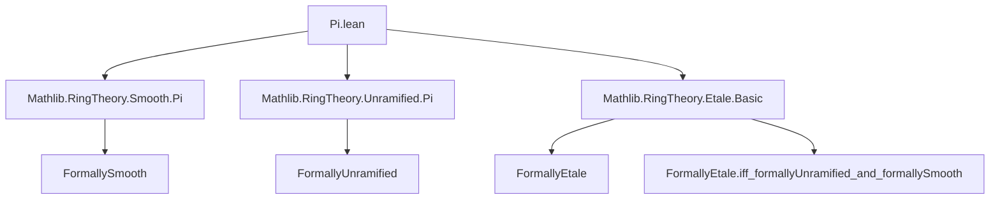

**Technical Brief: Formal-Étaleness of Finite Products of Rings (Pi.lean)**

---

### 1. Key Definitions & Theorems

| Name | Type / Signature | Purpose |
|------|------------------|---------|
| `FormallyEtale R A` | `Prop` | States that the `R`-algebra `A` is *formally étale*: for any square-zero extension `B → C`, the induced map `Hom_R(A, B) → Hom_R(A, C)` is a bijection. |
| `FormallyUnramified R A` | `Prop` | `A` is *formally unramified*: the above map is *injective* for all square-zero extensions. |
| `FormallySmooth R A` | `Prop` | `A` is *formally smooth*: the map is *surjective* for all square-zero extensions. |
| `pi_iff` | `FormallyEtale R (Π i, A i) ↔ ∀ i, FormallyEtale R (A i)` | Main theorem: finite product is formally étale iff each factor is. |
| `of_formallyUnramified_and_formallySmooth` | `FormallyUnramified R A → FormallySmooth R A → FormallyEtale R A` | Constructor: formally étale ⇔ formally unramified + formally smooth. |

---

### 2. Naming Conventions

- **Prefixes**:
  - `FormallyEtale.`, `FormallyUnramified.`, `FormallySmooth.` — module prefixes for properties of algebras.
  - `pi_` — used for product-related lemmas (e.g., `pi_iff`, `pi_iff` for unramified/smooth).
- **Suffixes**:
  - `_iff` — biconditional characterizations (e.g., `pi_iff`).
  - `_and_` — conjunction-based constructors (e.g., `of_formallyUnramified_and_formallySmooth`).
- **Quantifier patterns**:
  - `∀ i,` — used for family-wise assumptions (e.g., `∀ i, CommRing (A i)`).

---

### 3. Tactic Stack

| Tactic | Usage |
|--------|-------|
| `simp_rw` | Rewriting using definitional equivalences (`FormallyEtale.iff_formallyUnramified_and_formallySmooth`). |
| `rw` | Applying known lemmas (`FormallyUnramified.pi_iff`, `FormallySmooth.pi_iff`). |
| `intros` / `intro` | Implicitly via `by`-tactic mode. |
| `constructor` / `intro` | Implicit in `of_formallyUnramified_and_formallySmooth` usage. |
| `aesop` / `ring` / `simp` | Not used in this snippet — suggests reliance on algebraic structure lemmas rather than automation. |

---

### 4. Proof Logic

- **Structure of `pi_iff`**:
  1. Expand definition of `FormallyEtale` using `iff_formallyUnramified_and_formallySmooth`.
  2. Distribute `∀` over `∧` (logical equivalence).
  3. Apply known product lemmas:
     - `FormallyUnramified.pi_iff A`
     - `FormallySmooth.pi_iff A`
  4. Conclude equivalence via transitivity of `↔`.

- **Structure of `instance`**:
  - Uses `of_formallyUnramified_and_formallySmooth`.
  - Relies on typeclass inference to supply:
    - `FormallyUnramified R (Π i, A i)` (from `FormallyUnramified.pi_iff` + assumption).
    - `FormallySmooth R (Π i, A i)` (from `FormallySmooth.pi_iff` + assumption).

- **Key logical flow**:  
  *Reduction to component-wise properties via product lemmas for unramified/smooth, then recombination.*

---

### 5. Imports & Dependencies

| Import | Role |
|--------|------|
| `Mathlib.RingTheory.Smooth.Pi` | Provides `FormallySmooth.pi_iff` (product characterization for smoothness). |
| `Mathlib.RingTheory.Unramified.Pi` | Provides `FormallyUnramified.pi_iff`. |
| `Mathlib.RingTheory.Etale.Basic` | Defines `FormallyEtale`, its basic properties, and `FormallyEtale.iff_formallyUnramified_and_formallySmooth`. |

**Scope**: Commutative algebra in the context of *formal* properties of algebra morphisms; specifically, formal étaleness, unramifiedness, and smoothness.

---

### 6. Mermaid Diagrams

#### Dependency Graph (Module-Level)



#### Theorem Proof Flow (`pi_iff`)

```mermaid
graph LR
  Start[FormallyEtale R (∏ i, A i)] --> Expand[Expand via iff_formallyUnramified_and_formallySmooth]
  Expand --> Split[∀ i, FormallyUnramified R (A i) ∧ FormallySmooth R (A i)]
  Split --> ApplyUnram[Apply FormallyUnramified.pi_iff]
  Split --> ApplySmooth[Apply FormallySmooth.pi_iff]
  ApplyUnram --> UnramProd[∀ i, FormallyUnramified R (A i)]
  ApplySmooth --> SmoothProd[∀ i, FormallySmooth R (A i)]
  UnramProd & SmoothProd --> Final[∀ i, FormallyEtale R (A i)]
```

#### Instance Construction Flow

```mermaid
graph LR
  Assumption[∀ i, FormallyEtale R (A i)] --> Decompose[Decompose to ∀ i, FormallyUnramified & FormallySmooth]
  Decompose --> ProductUnram[FormallyUnramified R (∏ i, A i)] 
  Decompose --> ProductSmooth[FormallySmooth R (∏ i, A i)]
  ProductUnram & ProductSmooth --> Constructor[of_formallyUnramified_and_formallySmooth]
  Constructor --> Conclusion[FormallyEtale R (∏ i, A i)]
```

---

### 7. Summary

This file establishes a foundational stability property of formal étaleness under finite products:  
$$
R \to \prod_{i \in I} A_i \text{ is formally étale } \iff \forall i \in I,\ R \to A_i \text{ is formally étale},
$$  
for finite index sets $I$. It leverages the decomposition of formal étaleness into formal unramifiedness and smoothness, and uses existing product lemmas for those two properties. The proof is concise and highly structured, relying on algebraic lemmas rather than ad-hoc arguments — a hallmark of Lean’s library design.
