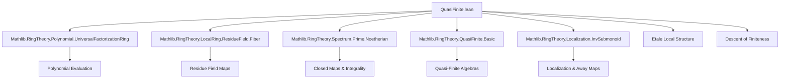

**Technical Brief: `QuasiFinite.lean`**

---

### 1. KEY DEFINITIONS & THEOREMS

| Name | Type / Signature | Purpose |
|------|------------------|---------|
| `Ideal.fiberIsoOfBijectiveResidueField` | `(H : Function.Bijective …) → q.primesOver (R' ⊗[R] S) ≃o p.primesOver S` | Constructs an order-isomorphism between prime fibers over `q` and `p`, assuming the residue field extension `κ(q)/κ(p)` is bijective (i.e., an isomorphism). |
| `Ideal.comap_fiberIsoOfBijectiveResidueField_symm` | Lemma about preimage under the inverse isomorphism | Describes how the contraction of primes behaves under the inverse isomorphism. |
| `Ideal.comap_fiberIsoOfBijectiveResidueField_apply` | Lemma about image under the isomorphism | Describes how contraction behaves under the forward isomorphism. |
| `Ideal.eq_of_comap_eq_comap_of_bijective_residueFieldMap` | `(P₁, P₂ : Ideal (R' ⊗[R] S)) → … → P₁ = P₂` | Uniqueness criterion: if two primes over `q` have same contraction to `S`, and residue field map is bijective, then they are equal. |
| `Algebra.exists_etale_isIdempotentElem_forall_liesOver_eq` | `∃ … e … P' …` | Main structural lemma: for finite algebra `S/R`, prime `q ⊆ S` over `p ⊆ R`, construct an étale cover `R'` where the base change splits as `A × B`, with a distinguished idempotent `e = (1,0)`, and a unique prime `P'` in the `A`-factor lying over a lift of `q`. |
| `Localization.exists_finite_awayMapₐ_of_surjective_awayMapₐ` | `∃ r ∉ p, …` | Descent result: under integrality and finite type assumptions, surjectivity of a localization map implies finiteness after inverting some `r ∉ p`. |

---

### 2. NAMING CONVENTIONS

- **Prefixes**:
  - `fiberIso_`: for isomorphisms between fibers (prime spectra over a base prime).
  - `comap_`: for lemmas about contraction of ideals along ring maps.
  - `exists_…_forall_…`: existential-plus-universal structural lemmas (e.g., étale local structure).
  - `awayMapₐ`: for localization of algebras (e.g., `awayMapₐ f g` is localization at `g` in the target of `f`).
- **Suffixes**:
  - `_symm`: for lemmas involving inverses of equivalences/isomorphisms.
  - `_apply`: for lemmas describing action on elements/points.
  - `_of_…`: for parameterized variants (e.g., `of_bijective_residueFieldMap`, `of_surjective_awayMapₐ`).
- **Variables**:
  - `R, R', S, T`: rings/algebras.
  - `p, q, P, P'`: primes, often with `q.LiesOver p`, `P'.LiesOver P`, etc.
  - `e`: idempotent element.
  - `s, f, b, c, d`: elements/polynomial data used in construction.

---

### 3. TACTIC STACK

Frequently used tactics in this file:

| Tactic | Usage |
|--------|-------|
| `simp` / `simp only` | Simplifying goals using algebraic identities, especially about tensor products, residue fields, and localization. |
| `rw` / `rwa` | Rewriting using lemmas like `map_mul`, `aeval_map_algebraMap`, `Ideal.over_def`, etc. |
| `ext` / `ext1` | Extensionality for ideals, primes, ring homomorphisms. |
| `simpa` | Simplify and discharge goal using a hypothesis. |
| `contrapose!` | Turn implication into contrapositive with negated assumptions. |
| `exact` / `refine` | Construct proofs with missing fields filled by `inferInstance` or `‹_›`. |
| `intro` / `intro h` | Introduce hypotheses for implications or negations. |
| `have` / `suffices` | Intermediate claims, especially for idempotency, non-membership, or uniqueness. |
| `convert` / `apply` | Use transitivity of properties like integrality/finiteness. |
| `algebraize` | Convert ring-theoretic finiteness to algebraic finiteness. |
| `aesop` (not present) | Not used here — heavy reliance on manual simplification and algebraic reasoning. |

---

### 4. PROOF LOGIC

**General proof strategy**:

- **Step 1 (Setup)**: Work in a local setting: fix primes `p ⊆ R`, `q ⊆ S` with `q.LiesOver p`, and assume module-finiteness of `S/R`.
- **Step 2 (Construct data)**:
  - Use integrality to get minimal polynomial `minpoly R s`.
  - Factor its image in `κ(p)[X]` as `X^{m+1}·b` with `b` coprime to `X^{m+1}`.
  - Apply `exists_etale_bijective_residueFieldMap_and_map_eq_mul_and_isCoprime` to lift this factorization to an étale neighborhood `R'`.
- **Step 3 (Define idempotent)**:
  - Use Bézout identity `c·X^{m+1} + d·b = 1` to define `e = aeval s' (c·X^{m+1})`, which is idempotent.
- **Step 4 (Define distinguished prime)**:
  - Use `fiberIsoOfBijectiveResidueField` to pull back `q` to a prime `P'` in the tensor product.
- **Step 5 (Verify properties)**:
  - Show `e ∉ P'`, uniqueness of primes over `P` not containing `e`, and bijectivity of residue field map.
- **Step 6 (Descent)**:
  - For the second lemma, use topological arguments (closedness of `Spec S → Spec R` under integrality) and localization properties to descend finiteness.

**Induction / recursion**: Not used directly. Proofs rely on algebraic constructions and universal properties.

---

### 5. IMPORTS

| Module | Purpose |
|--------|---------|
| `Mathlib.RingTheory.Polynomial.UniversalFactorizationRing` | For universal properties of polynomial rings and evaluation maps (`aeval`). |
| `Mathlib.RingTheory.LocalRing.ResidueField.Fiber` | For residue field maps, fiber constructions, and `Ideal.ResidueField.mapₐ`. |
| `Mathlib.RingTheory.Spectrum.Prime.Noetherian` | For topological properties of `PrimeSpectrum`, e.g., closed maps under integrality. |
| `Mathlib.RingTheory.QuasiFinite.Basic` | Core definitions: quasi-finite algebras, fibers, etc. |
| `Mathlib.RingTheory.Localization.InvSubmonoid` | For localization at multiplicative subsets (e.g., powers of an element). |

---

### 6. MERMAID DIAGRAMS

#### Dependency Graph (High-Level)



#### Overview of File Structure

```mermaid
flowchart LR
  subgraph Theory
    A[Algebra.exists_etale_isIdempotentElem_forall_liesOver_eq] --> B[Etale neighborhood R']
    B --> C[Splitting R' ⊗ S = A × B]
    C --> D[Idempotent e = (1,0)]
    D --> E[Unique prime P' in A over q]

    F[Localization.exists_finite_awayMapₐ_of_surjective_awayMapₐ] --> G[Surjective away map]
    G --> H[Finite type over R[1/r]]
    H --> I[Integrality + closedness of Spec]
  end

  subgraph Tools
    J[Ideal.fiberIsoOfBijectiveResidueField] --> K[Bijection of prime fibers]
    L[Ideal.eq_of_comap_eq_comap_of_bijective_residueFieldMap] --> K
  end

  A --> J
  F --> L
```

---

### 7. CONTEXTUAL SUMMARY

This file is part of the **étale local structure theory** for finite algebras, aiming to construct étale neighborhoods where fibers split and primes behave predictably. It builds on:

- **Residue field bijections** to control prime lifting.
- **Polynomial factorization modulo primes** to construct idempotents.
- **Localization techniques** to descend finiteness properties.

The results are foundational for:
- Proving openness of étale loci.
- Constructing étale cohomological descent.
- Developing local criteria for smoothness/unramifiedness.

The `stacks` tags (`00UJ`, `00UI`) indicate alignment with the Stacks Project’s treatment of étale morphisms and local structure of finite type algebras.

--- 

Let me know if you'd like a formalized dependency graph (e.g., in `.lean` format) or a breakdown of the `stacks` references.
