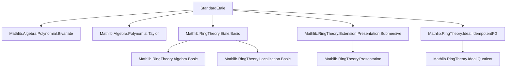

### Technical Brief: `StandardEtale.lean`

---

#### **1. Key Definitions & Theorems**

| Name | Type / Signature | Purpose |
|------|------------------|---------|
| `StandardEtalePair R` | `Type u` | A pair `(f, g)` of polynomials over `R`, with `f` monic and `f'` invertible modulo `g` (i.e., `f'` becomes a unit in `R[X][1/g]/f`). Captured by `∃ p₁ p₂ n, f' * p₁ + f * p₂ = g^n`. |
| `P.Ring` | `CommRing` with `Algebra R` | The standard étale algebra: `R[X][Y] / ⟨f, Y·g - 1⟩`. |
| `P.X` | `P.Ring` | The image of `X` in the quotient; a distinguished element satisfying `f(P.X) = 0` and `g(P.X)` invertible. |
| `P.HasMap x` | `Prop` | Condition for a map from `P.Ring` to `S`: `aeval x f = 0 ∧ IsUnit (aeval x g)`. |
| `P.lift x h` | `P.Ring →ₐ[R] S` | Universal property: the unique `R`-algebra map sending `P.X ↦ x`, given `P.HasMap x`. |
| `P.homEquiv` | `(P.Ring →ₐ[R] S) ≃ {x // P.HasMap x}` | Bijection between algebra maps out of `P.Ring` and elements satisfying the étale condition. |
| `P.equivPolynomialQuotient` | `P.Ring ≃ₐ[R] R[X][Y]/⟨f, Yg-1⟩` | Identity isomorphism (defeq up to naming). |
| `P.equivAwayAdjoinRoot` | `P.Ring ≃ₐ[R] (R[X]/f)[1/g]` | Isomorphism to localization of the root adjoin. |
| `P.equivAwayQuotient` | `P.Ring ≃ₐ[R] R[X][1/g]/f` | Isomorphism to quotient after localization. |
| `P.equivMvPolynomialQuotient` | `P.Ring ≃ₐ[R] MvPolynomial (Fin 2) R / ⟨f, X₀·g - 1⟩` | Identification with bivariate/multivariate presentation. |
| `P.existsUnique_hasMap_of_hasMap_quotient_of_sq_eq_bot` | `∀ I, I² = ⊥, P.HasMap (x mod I) ⇒ ∃! ε ∈ I, P.HasMap (x + ε)` | Hensel-type lifting property for étale maps. |
| `instance : Algebra.FormallyEtale R P.Ring` | `Algebra.FormallyEtale R P.Ring` | Standard étale algebras are formally étale. |
| `instance : Algebra.Etale R P.Ring` | `Algebra.Etale R P.Ring` | Standard étale algebras are étale (finitely presented + formally étale). |
| `StandardEtalePresentation R S` | `Type _` | A presentation of an `R`-algebra `S` as a standard étale algebra: a pair `(P, x)` with `P` a `StandardEtalePair R`, `x ∈ S`, `P.HasMap x`, and `P.lift x` bijective. |
| `P.equivRing` | `S ≃ₐ[R] P.Ring` | Isomorphism from `S` to the standard étale algebra. |
| `P.toPresentation` | `Algebra.Presentation R S (Fin 2) (Fin 2)` | Explicit finite presentation with 2 generators and 2 relations. |
| `P.toSubmersivePresentation` | `Algebra.SubmersivePresentation R S (Fin 2) (Fin 2)` | Refinement using Jacobian condition: `jacobian = f'(x)·g(x)` is a unit. |
| `Algebra.IsStandardEtale R S` | `Class` | `S` is standard étale over `R` iff there exists a `StandardEtalePresentation R S`. |
| `instance [IsStandardEtale R S] : Algebra.Etale R S` | `Algebra.Etale R S` | Standard étale ⇒ étale. |
| `instance : IsStandardEtale R R` | `IsStandardEtale R R` | Identity map is standard étale (via `f = X`, `g = 1`). |
| `lemma IsStandardEtale.of_isLocalizationAway` | `IsStandardEtale R S ⇒ IsStandardEtale R Sₛ` | Localization away from an element preserves standard étaleness. |
| `lemma IsStandardEtale.of_surjective` | `IsStandardEtale R S, Etale R T, surj f ⇒ IsStandardEtale R T` | Quotients of standard étale algebras that are étale remain standard étale. |

---

#### **2. Naming Conventions**

- **Prefixes**:
  - `P.`: fields/methods of a `StandardEtalePair` or `StandardEtalePresentation`.
  - `hasMap_`, `lift_`, `equiv_`, `homEquiv`, `toPresentation`, `toSubmersivePresentation`: descriptive naming for constructions.
  - `isUnit_`, `derivative_`, `aeval_`, `mk_`, `root_`: standard algebraic operations.

- **Suffixes**:
  - `_X`, `_g`, `_f`: refer to specific polynomials or elements.
  - `_left`, `_right`: often for simplification lemmas (e.g., `lift_X_left`).
  - `_mul_pow_eq_aeval`: pattern for existence lemmas involving powers of `g`.

- **Structure fields**:
  - `f`, `g`, `monic_f`, `cond`: minimal data for `StandardEtalePair`.
  - `x`, `hasMap`, `lift_bijective`: data for `StandardEtalePresentation`.

---

#### **3. Tactic Stack**

Frequently used tactics in proofs:

| Tactic | Role |
|--------|------|
| `simp` / `simp_rw` | Simplification using definitional equalities, especially for `aeval`, `Ideal.Quotient.mk`, `algHom`. |
| `rw` / `congr` | Rewriting using lemmas like `aeval_algHom_apply`, `Ideal.Quotient.eq_zero_iff_mem`. |
| `exact` / `refine` | Constructing proofs with minimal boilerplate. |
| `linear_combination` | Solving ideal membership problems (e.g., from `f'·p₁ + f·p₂ = g^n`). |
| `grind` | Custom tactic (likely from Mathlib) for solving linear combinations in rings/ideals. |
| `ext` / `Polynomial.algHom_ext` | Extensionality for ring/algebra homomorphisms. |
| `have`, `obtain`, `set` | Local assumptions and definitions. |
| `convert_to`, `convert` | Adjusting goals to match known lemmas. |
| `simpa`, `change`, `congr'` | Fine-tuning simplifications and congruences. |
| `apply_fun`, `sub_eq_iff_eq_add'` | Manipulating equations in additive contexts. |

---

#### **4. Proof Logic**

- **Structure of proofs**:
  - **Construction**: Define objects via `def`, `instance`, or `structure`.
  - **Verification**: Prove properties (e.g., `HasMap`, `bijective`, `unit`) using:
    - `cond` (the key invertibility condition),
    - `aeval` algebra homomorphism properties,
    - Ideal membership criteria (`Ideal.Quotient.eq_zero_iff_mem`, `Ideal.span_le`).
  - **Universal properties**: Prove `homEquiv` via `lift` and `hom_ext`.
  - **Isomorphisms**: Construct via `ofAlgHom`, `lift`, and `IsLocalization.liftAlgHom`, then verify inverses via `ext` or `hom_ext`.
  - **Étaleness**: Use `FormallyEtale.iff_comp_bijective` + Hensel lifting (`existsUnique_hasMap_of_hasMap_quotient_of_sq_eq_bot`) to prove formal étaleness; finite presentation follows from quotient description.

- **Common pattern**:
  ```text
  1. Use cond to get f'·p₁ + f·p₂ = g^n.
  2. Apply aeval x to get divisibility: f'(x) | g(x)^n.
  3. Use IsUnit.of_dvd_unit if g(x) is a unit.
  4. For lifting: use nilpotent/ideempotent decomposition + cond.
  ```

---

#### **5. Imports & Dependencies**

| Module | Role |
|--------|------|
| `Mathlib.Algebra.Polynomial.Bivariate` | Multivariate polynomial encoding (via `Bivariate.equivMvPolynomial`). |
| `Mathlib.Algebra.Polynomial.Taylor` | Not directly used, but likely for derivative properties. |
| `Mathlib.RingTheory.Etale.Basic` | Core definitions: `Algebra.Etale`, `FormallyEtale`. |
| `Mathlib.RingTheory.Extension.Presentation.Submersive` | `SubmersivePresentation`, Jacobian condition. |
| `Mathlib.RingTheory.Ideal.IdempotentFG` | Idempotent ideals, used in surjective quotient lemma. |

---

#### **6. Mermaid Diagrams**

##### **Dependency Graph (Module Level)**



##### **Overview of `StandardEtale.lean`**

```mermaid
flowchart LR
  A[StandardEtalePair R] --> B[P.Ring = R[X,Y]/⟨f, Yg-1⟩]
  B --> C[Universal Property: homEquiv]
  B --> D[Isomorphisms]
  D --> D1[equivPolynomialQuotient]
  D --> D2[equivAwayAdjoinRoot]
  D --> D3[equivAwayQuotient]
  D --> D4[equivMvPolynomialQuotient]
  C --> E[FormallyEtale R P.Ring]
  E --> F[Etale R P.Ring]
  A --> G[StandardEtalePresentation]
  G --> H[IsStandardEtale R S]
  H --> I[Stability Properties]
  I --> I1[of_equiv]
  I --> I2[of_isLocalizationAway]
  I --> I3[of_surjective]
```

---

#### **7. Theory Scope**

- **Goal**: Formalize the theory of *standard étale algebras* — the building blocks of étale morphisms in algebraic geometry.
- **Key insight**: Étale maps are locally standard étale; standard étale algebras are presented as `R[X,Y]/⟨f, Yg-1⟩` with `f` monic and `f'` invertible modulo `g`.
- **Applications**:
  - Local structure of étale maps.
  - Hensel’s lemma for lifting roots modulo nilpotents.
  - Presentation-theoretic characterizations (finite presentation, submersive).
  - Closure properties (localization, quotients, equivalences).

--- 

This file is a foundational module for étale cohomology and deformation theory in Lean.
