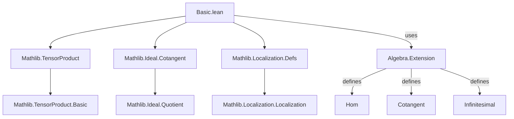
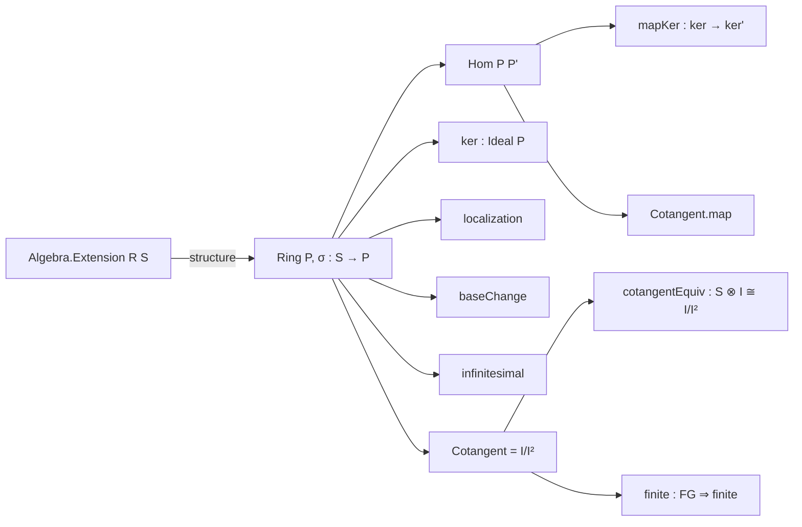

**Technical Brief: `Basic.lean` — Extension of Algebras in Lean 4**

---

### 1. KEY DEFINITIONS & THEOREMS

| Name | Type / Structure | Purpose |
|------|------------------|---------|
| `Algebra.Extension` | `Type u → Type v → Type w → Type w` (structure) | An extension of an $R$-algebra $S$ is a ring $P$ with algebra maps $R \to P \to S$ (scalar tower), together with a *section* $\sigma : S \to P$ (set-theoretic splitting of $P \to S$). |
| `Algebra.Extension.Hom` | `structure` | A morphism between extensions $P \to S$ and $P' \to S'$ is a ring homomorphism $f : P \to P'$ making both squares commute: $f \circ \eta_R = \eta_{R'} \circ f|_R$ and $\eta_{S'} \circ f = \eta_{S'} \circ \eta_S$. |
| `Algebra.Extension.ker` | `Ideal P.Ring` | Kernel of the structure map $P \to S$. |
| `Algebra.Extension.localization` | `Extension R S'` | Given localization $S \to S_M$, induces extension $P_M \to S_M$ via localization of the kernel ideal. |
| `Algebra.Extension.baseChange` | `Extension T (T ⊗[R] S)` | Base change of an extension along $R \to T$: $P \mapsto T \otimes_R P$, yielding extension over tensor product. |
| `Algebra.Extension.infinitesimal` | `Extension R S` | Infinitesimal thickening: $P \mapsto P / \ker^2$. |
| `Algebra.Extension.toInfinitesimal` | `Hom P P.infinitesimal` | Canonical map $P \to P / \ker^2$ as a morphism of extensions. |
| `Algebra.Extension.Cotangent` | `Type _` (type synonym of `P.ker.Cotangent`) | Cotangent space $I / I^2$, where $I = \ker(P \to S)$. Type synonym avoids diamond issues with scalar actions. |
| `Algebra.Extension.Cotangent.mk` | `P.ker →ₗ[P.Ring] P.Cotangent` | Quotient map $I \to I / I^2$. |
| `Algebra.Extension.Cotangent.module` | `Module S P.Cotangent` | $S$-module structure on cotangent space via section $\sigma$: $r \cdot x := \sigma(r) \cdot x$. |
| `Algebra.Extension.Cotangent.map` | `Hom P P' → P.Cotangent →ₗ[S] P'.Cotangent` | Functoriality: a hom of extensions induces an $S$-linear map on cotangent spaces. |
| `Algebra.Extension.cotangentEquiv` | `S ⊗[P.Ring] P.ker ≃ₗ[S] P.Cotangent` | Key isomorphism: cotangent space is isomorphic to $S \otimes_P I$. |
| `Algebra.Extension.Cotangent.finite` | `P.ker.FG → Module.Finite S P.Cotangent` | Finiteness: if kernel is finitely generated over $P$, cotangent is finite over $S$. |

**Theorems (selected):**
- `σ_injective`: Section $\sigma$ is injective.
- `algebraMap_surjective`: Structure map $P \to S$ is surjective (by definition of extension).
- `Cotangent.mk_surjective`: The quotient map $I \to I/I^2$ is surjective.
- `Cotangent.mk_eq_zero_iff`: $\mathrm{mk}(x) = 0 \iff x \in I^2$.
- `Cotangent.map_comp`: $\mathrm{map}(g \circ f) = \mathrm{map}(g) \circ \mathrm{map}(f)$.
- `contangentEquiv_tmul`: The equivalence sends $s \otimes x \mapsto s \cdot \mathrm{mk}(x)$.

---

### 2. NAMING CONVENTIONS

| Pattern | Meaning | Examples |
|--------|---------|----------|
| `is_` / `algebra_` / `isScalarTower` | Typeclass properties | `isScalarTower`, `algebraMap_σ` |
| `of_` / `to_` | Constructions / projections | `ofSurjective`, `toInfinitesimal`, `Cotangent.of`, `Cotangent.val` |
| `map_` / `lift_` | Functorial actions | `Cotangent.map`, `localization`, `baseChange` |
| `comp_` | Composition | `Hom.comp`, `Hom.comp_id` |
| `mk` | Canonical generators / quotient maps | `Cotangent.mk`, `Localization.mk` |
| `Equiv` / `Equiv` suffix | Isomorphisms | `cotangentEquiv` |
| `val` / `of` | Type synonym conversions | `Cotangent.val`, `Cotangent.of` |
| `smul` / `mul` | Scalar multiplication / multiplication lemmas | `σ_smul`, `Cotangent.val_smul` |

---

### 3. TACTIC STACK

Frequently used tactics in proofs:
- `simp` / `simp only` — simplification with `@[simp]` lemmas (e.g., `algebraMap_σ`, `val_mk`, `map_mk`)
- `ext` — extensionality for functions, ring homs, subtypes
- `rw` — rewriting using equalities (especially `algebraMap_eq`, `smul_eq_mul`)
- `congr` / `congr'` — congruence reasoning
- `convert` — flexible equality proof with unification
- `have` / `suffices` — intermediate claims
- `exact` / `assumption` — direct proof steps
- `cases` — destructuring hypotheses/structures
- `ring` / `abel` — commutative ring identities (implicit via `simp`)
- `aesop` — automated reasoning for simple goals (not heavily used here)
- `dsimp`, `change`, `conv` — advanced simplification/convolution

---

### 4. PROOF LOGIC

**Typical proof structure:**
1. **Induction / structural decomposition** on elements (e.g., using `mk_surjective` to reduce to generators).
2. **Set-theoretic section handling**: use $\sigma$ to lift scalars from $S$ to $P$, then verify compatibility.
3. **Ideal/module arithmetic**: manipulate kernels, powers, quotients, tensor products using:
   - `Ideal.mul_le_right`, `Submodule.smul_induction_on'`
   - `TensorProduct.mk_surjective`, `tmul_add`, `smul_tmul`
4. **Functoriality checks**: verify commutativity of diagrams by unfolding definitions and applying `simp` with `algebraMap_σ`, `Hom.toRingHom_algebraMap`, etc.
5. **Type synonym management**: use `Cotangent.ext` to prove equality by projecting to `val`.

**Example flow (e.g., `Cotangent.map`):**
- Define map on representatives using `Ideal.mapCotangent`.
- Prove well-definedness via `RingHom.congr_arg`.
- Check $S$-linearity: lift scalars via $\sigma$, reduce to $P$-linearity, then use `smul_eq_zero_of_mem` for error terms.

---

### 5. IMPORTS & SCOPE

**Primary dependencies:**
- `Mathlib.LinearAlgebra.TensorProduct.RightExactness` — for tensor product constructions and surjectivity lemmas.
- `Mathlib.RingTheory.Ideal.Cotangent` — cotangent module $I/I^2$ and its properties.
- `Mathlib.RingTheory.Localization.Defs` — localization of rings and modules.

**Scope:**  
This module formalizes *algebraic extensions* in commutative algebra, especially in the context of *infinitesimal extensions* and *cotangent spaces*. It serves as a foundation for deformation theory, Kähler differentials, and derived intersections.

---

### 6. MERMAID DIAGRAMS

#### Dependency Graph (Module-Level)

#### Overview of `Basic.lean`

---

### 7. SUMMARY

This file introduces a robust categorical framework for algebra extensions, emphasizing:
- **Constructive foundations** via sections $\sigma$,
- ** Functorial behavior** under localization and base change,
- **Infinitesimal geometry** via $I/I^2$ and its module structure,
- **Categorical coherence** (identity, composition, naturality).

It is a key building block for derived algebraic geometry and deformation theory in Lean 4.

--- 

*Prepared for domain-specific AI agent training.*
