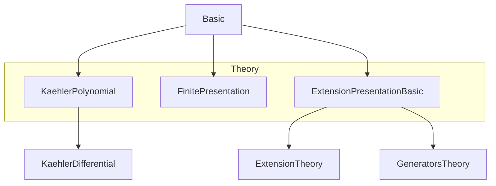

Here is the **technical metadata** extracted from the provided `Basic.lean` file, structured as requested:

---

### 1. **Key Definitions & Theorems**

| Name | Type / Kind | Purpose |
|------|-------------|---------|
| `CotangentSpace` | `Type _` | The *cotangent space* $ S \otimes_P \Omega_{P/R} $ for a presentation $ P \to S $. |
| `cotangentComplex` | `P.Cotangent →ₗ[S] P.CotangentSpace` | The differential $ I/I^2 \to \bigoplus_i S\,dx_i $ in the naive cotangent complex. |
| `cotangentComplex_mk` | `lemma` | Describes the action of `cotangentComplex` on generators: $ x \mapsto 1 \otimes d x $. |
| `CotangentSpace.map` | `Hom P P' → P.CotangentSpace →ₗ[S] P'.CotangentSpace` | Map on cotangent spaces induced by a morphism of presentations; corresponds to the Jacobian. |
| `Hom.sub` | `Hom P P' → P.CotangentSpace →ₗ[S] P'.Cotangent` | Difference of two maps $ f - g $ induces a homotopy operator between cotangent complex maps. |
| `Hom.subToKer` | `Hom P P' → P.Ring →ₗ[R] P'.ker` | The linear map $ x \mapsto f(x) - g(x) $ landing in the kernel. |
| `toKaehler` | `P.CotangentSpace →ₗ[S] Ω_{S/R}` | Projection from the cotangent space to the module of Kähler differentials. |
| `toKaehler_surjective` | `lemma` | $ \bigoplus_i S\,dx_i \to \Omega_{S/R} $ is surjective. |
| `exact_cotangentComplex_toKaehler` | `lemma` | Exactness at $ \bigoplus_i S\,dx_i $: $ \operatorname{im}(I/I^2 \to \bigoplus_i S\,dx_i) = \ker(\bigoplus_i S\,dx_i \to \Omega_{S/R}) $. |
| `H1Cotangent` | `Type _` | First homology $ H^1(L_{S/R}) = \ker(I/I^2 \to \bigoplus_i S\,dx_i) $. |
| `h1Cotangentι` | `P.H1Cotangent →ₗ[S] P.Cotangent` | Inclusion of $ H^1(L_{S/R}) $ into the conormal module $ I/I^2 $. |
| `H1Cotangent.map` | `Hom P P' → P.H1Cotangent →ₗ[S] P'.H1Cotangent` | Induced map on $ H^1 $ for morphisms of presentations. |
| `H1Cotangent.equiv` | `Hom P P' → Hom P' P → P.H1Cotangent ≃ₗ[S] P'.H1Cotangent` | Isomorphism on $ H^1 $ induced by inverse morphisms of presentations. |
| `Generators.cotangentSpaceBasis` | `Basis ι S (P.toExtension.CotangentSpace)` | Canonical basis indexed by generators $ \{x_i\} $, via $ 1 \otimes dx_i $. |
| `cotangentRestrict` | `Function.Injective u → P.Cotangent →ₗ[S] (σ →₀ S)` | Restriction of the cotangent complex to a subset of generators. |
| `H1Cotangent` (top-level) | `Type _` | Presentation-independent $ H^1(L_{S/R}) $, defined via `Generators.self`. |
| `Generators.equivH1Cotangent` | `P.toExtension.H1Cotangent ≃ₗ[S] H1Cotangent R S` | Equivalence between presentation-dependent and presentation-independent $ H^1 $. |

---

### 2. **Naming Conventions**

- **Prefixes**:
  - `cotangent*`: for objects/maps in the cotangent complex (e.g., `cotangentComplex`, `CotangentSpace`, `cotangentRestrict`).
  - `toKaehler*`: maps into Kähler differentials.
  - `H1Cotangent*`: for $ H^1 $-level constructions.
  - `Hom.*`: for morphism-related operations (`Hom.sub`, `Hom.subToKer`, `Hom.map`).
  - `map*`: for induced maps on derived objects (`CotangentSpace.map`, `H1Cotangent.map`).
  - `equiv*`: for isomorphisms between homology groups.

- **Suffixes**:
  - `*Basis`, `*ι`, `*ι_injective`, `*ι_ext`: for basis, inclusion, and extensionality lemmas.
  - `*mk`, `*tmul`: for definitions/lemmas on generators or simple tensors.
  - `*surjective`, `*exact`, `*injective`: for properties of maps.

- **Module/Algebra Notation**:
  - `P.Ring`, `P.ker`, `P.algebraMap`, `P.val`, `P.toExtension`: standard fields of `Extension`.
  - `P.Cotangent`, `P.CotangentSpace`: derived objects.

---

### 3. **Tactic Stack**

Frequently used tactics in proofs:
- `simp` / `simp only` — for simplification using lemmas and definitions.
- `rw` / `erw` — rewriting using equalities or definitional equalities.
- `ext` — extensionality for functions/maps.
- `induction x using TensorProduct.induction_on` — structural induction on tensor products.
- `haveI : IsScalarTower ...` — inserting scalar tower instances.
- `refine`, `convert`, `apply_fun` — for constructing proofs stepwise.
- `aesop` — in `IsScalarTower` proofs and simple algebraic reasoning.
- `ring` — for commutative ring identities (e.g., in `Hom.sub_aux`).
- `dsimp`, `congr` — for definitional simplification and congruence closure.
- `apply LinearMap.coe_injective` — to prove equality of linear maps.

---

### 4. **Proof Logic**

- **Inductive structure**: Proofs often proceed by:
  1. Induction on tensor product elements (`TensorProduct.induction_on`).
  2. Using surjectivity lemmas (e.g., `KaehlerDifferential.tensorProductTo_surjective`) to reduce to simple tensors.
  3. Applying `simp` with lemmas like `map_tmul`, `cotangentComplex_mk`, `Hom.sub_tmul`.
- **Homotopy arguments**: For `Hom.sub`, the key is verifying the Leibniz rule modulo $ I^2 $, using `Hom.sub_aux`.
- **Exactness**: Proven via base-change and known exact sequences (`exact_kerCotangentToTensor_mapBaseChange`).
- **Independence of presentation**: Uses `H1Cotangent.equiv` with `defaultHom` between presentations.

---

### 5. **Imports**

| Import | Purpose |
|--------|---------|
| `Mathlib.RingTheory.Kaehler.Polynomial` | Kähler differentials for polynomial rings, `D`, `mvPolynomialBasis`. |
| `Mathlib.Algebra.Module.FinitePresentation` | Finite presentation of modules, used for `Ω_{S/R}`. |
| `Mathlib.RingTheory.Extension.Presentation.Basic` | Theory of algebra presentations (`Extension`, `Hom`, `Generators`). |

---

### 6. **Mermaid Diagrams**

#### **Dependency Graph (Module-Level)**



#### **Overview of File Structure**

```mermaid
flowchart LR
  A[Extension R S] --> B[CotangentSpace]
  A --> C[CotangentComplex]
  B --> D[toKaehler]
  C --> D
  D --> E[Exactness]
  C --> F[H1Cotangent]
  A --> G[Hom P P']
  G --> H[Hom.sub]
  H --> I[Homotopy]
  F --> J[Independence of Presentation]
  K[Generators ι] --> L[cotangentSpaceBasis]
  L --> M[FiniteFree]
  K --> N[cotangentRestrict]
  J --> O[H1Cotangent (global)]
```

#### **Cotangent Complex Diagram (Naive)**

```mermaid
flowchart LR
  I/I²[P.Cotangent] -->|cotangentComplex| ⨁ᵢ S dxᵢ[P.CotangentSpace]
  -->|toKaehler| Ω_{S/R}
  style I/I² fill:#f9f,stroke:#333
  style ⨁ᵢ S dxᵢ fill:#bbf,stroke:#333
  style Ω_{S/R} fill:#9f9,stroke:#333
```

---

Let me know if you'd like a formalized summary in Lean or a LaTeX writeup of the theory.
