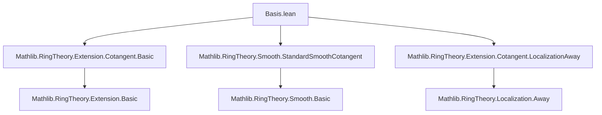

### Technical Brief: Basis of Cotangent Space and Presentation Construction

---

#### **1. Key Definitions & Theorems**

| Name | Type / Signature | Purpose |
|------|------------------|---------|
| `Aux` | `Structure` | Encapsulates data to construct a presentation with free cotangent space: a section `f : I/I² → I`, a multiplicative element `g` invertible in `S`, and containment `g·I ≤ ⟨f(b)⟩`. |
| `T` | `MvPolynomial ι R ⧸ Ideal.span (range (f ∘ b))` | Intermediate algebra between polynomial ring and `S`, defined by lifting basis elements of `I/I²`. |
| `hom : D.T →ₐ[R] S` | `Algebra homomorphism` | Factorization of original generator map through `T`. |
| `presLeft` | `Presentation R D.T ι σ` | Naive presentation of `T` over `R`, using lifts of basis elements as relations. |
| `kerGen (i : σ)` | `D.presLeft.toExtension.ker` | The `i`-th relation in `presLeft`, i.e., lift of `b i` in `I`. |
| `fhom : D.presLeft.Hom P` | `Presentation.Hom` | Identity map on polynomial ring, viewed as map between presentations. |
| `tensorCotangentEquiv` | `S ⊗[D.T] J/J² ≃ₗ[S] I/I²` | Linear isomorphism between base-changed cotangent space and original cotangent space. |
| `presRight` | `Presentation D.T S Unit Unit` | Localization-away presentation: `S = T[1/g]`. |
| `pres` | `Presentation R S (Unit ⊕ ι) (Unit ⊕ σ)` | Composite presentation: `R → T → S`. |
| `cotangentEquivProd` | `D.pres.toExtension.Cotangent ≃ₗ[S] D.presRight.toExtension.Cotangent × S ⊗[D.T] D.presLeft.toExtension.Cotangent` | Decomposition of cotangent space of composite presentation into “localization part” and “naive part”. |
| `basisLeft`, `basisRight`, `basis` | `Module.Basis` | Constructed basis for cotangent space of `pres`: product of basis from localization and pulled-back basis from `I/I²`. |
| `exists_presentation_of_basis_cotangent` | `lemma` | Main theorem: if `I/I²` is free with basis `b₀`, then there exists a presentation `P'` extending `P`, whose cotangent space has basis given by images of relations. |
| `exists_presentation_of_free_cotangent` | `lemma` | Corollary: if `I/I²` is free (not just basis-equipped), then same conclusion holds using finite basis from `finrank`. |

---

#### **2. Naming Conventions**

- **Prefixes**:
  - `D.`: Used for fields/constructs from an `Aux` instance `D`.
  - `pres`, `presLeft`, `presRight`: Presentation-related definitions.
  - `tensorCotangent*`: Related to the isomorphism `S ⊗[T] J/J² ≅ I/I²`.
  - `basis*`: Basis constructions for various cotangent spaces.
  - `kerGen`: Generator of kernel in naive presentation.
  - `hom`, `fhom`: Homomorphisms between presentations/algebras.

- **Suffixes**:
  - `Equiv`, `Iso`: Equivalences/isomorphisms (e.g., `tensorCotangentEquiv`).
  - `Away`: Localization away from an element (e.g., `Presentation.localizationAway`).
  - `Comp`: Composition of presentations (e.g., `cotangentCompLocalizationAwayEquiv`).
  - `Prod`: Product-type constructions (e.g., `cotangentEquivProd`).

- **Notable patterns**:
  - `mk`: Use of `Extension.Cotangent.mk` for canonical maps from kernel to cotangent space.
  - `constr`, `map`, `liftBaseChange`: Standard module/linear map constructions.

---

#### **3. Tactic Stack**

Frequently used tactics in proofs:

| Tactic | Usage |
|--------|-------|
| `simp` / `simp_rw` | Simplifying definitions, especially involving `Ideal.Quotient`, `algebraMap`, `aeval`, `Presentation.naive`, etc. |
| `rw` / `congr` | Rewriting using lemmas like `hf`, `hgmem`, `hf`, `ker_presLeft_le`. |
| `ext` / `funext` | Extensionality for functions/morphisms. |
| `exact`, `refine`, `apply` | Direct proof steps, especially for existence or inclusion goals. |
| `cases` / `obtain` | Case analysis on `Unit ⊕ σ`, or extracting witnesses (e.g., `⟨g, hgmem, hg⟩`). |
| `convert` / `congr'` | Matching goals up to definitional equality (e.g., in `cotangentEquivProd_symm_apply`). |
| `subsingleton` | Handling trivial cases where `S` is a subsingleton. |
| `aesop` / `linarith` | Not heavily used; mostly manual simplification. |
| `Module.Basis.*` lemmas | `constr_basis`, `map_apply`, `span_eq_top_of_span_eq_ker`, etc., for basis manipulations. |

---

#### **4. Proof Logic**

The logical flow of the main construction is:

1. **Setup**: Given `P : Generators R S ι` with kernel `I`, and a basis `b₀ : Module.Basis σ S (I/I²)`.
2. **Choose lifts**: Use choice to pick `f : I/I² → I` such that `mk ∘ f = id`.
3. **Define auxiliary data** (`Aux`):
   - Use finite presentation to get `I` f.g.
   - Apply [Stacks 00HT] (Nakayama-type lemma): find `g ∈ R[X]` with `g ≡ 1 mod I` and `g·I ≤ ⟨f(b₀(i))⟩`.
4. **Construct intermediate algebra `T = R[X]/J`**, where `J = ⟨f(b₀(i))⟩`.
5. **Show `S ≅ T[1/g]`** via `IsLocalization.Away`.
6. **Define naive presentation of `T`** (`presLeft`) and localization presentation of `S` over `T` (`presRight`).
7. **Compose** to get `pres : Presentation R S`.
8. **Analyze cotangent space**:
   - Use `cotangentCompLocalizationAwayEquiv` to decompose `I'/I'²`.
   - Construct explicit isomorphism `S ⊗[T] J/J² ≅ I/I²` using basis `b₀`.
9. **Define basis on `I'/I'²`**:
   - `basisRight`: from localization (generated by `gX - 1`).
   - `basisLeft`: pullback of `b₀` via `tensorCotangentEquiv`.
   - Combine via `prod` and `cotangentEquivProd`.
10. **Verify basis property**: Show `b r = mk(P'.relation r)` for all `r : Unit ⊕ σ`.

The proof leverages:
- **Localization theory** (`IsLocalization.Away`, `Presentation.localizationAway`)
- **Cotangent complex basics** (`Extension.Cotangent`, `mk`, `map`)
- **Module basis manipulation** (`Module.Basis.map`, `constr`, `prod`)
- **Ideal arithmetic** (`Ideal.span`, `Ideal.mul`, `Ideal.smul_le`, `FG`)

---

#### **5. Imports**

| Import | Purpose |
|--------|---------|
| `Mathlib.RingTheory.Extension.Cotangent.Basic` | Core definitions: `Extension.Cotangent`, `mk`, `map`, `ker_mk`. |
| `Mathlib.RingTheory.Smooth.StandardSmoothCotangent` | Cotangent module in context of smooth morphisms; used for `basisCotangentAway`. |
| `Mathlib.RingTheory.Extension.Cotangent.LocalizationAway` | Behavior of cotangent space under localization away from element. |

---

#### **6. Mermaid Diagrams**

##### **Dependency Graph (Module-Level)**



##### **Overview of File Structure**

```mermaid
flowchart LR
  subgraph Definitions
    D[Aux] --> T[T]
    T --> hom[hom : T →ₐ[R] S]
    D --> presLeft[presLeft : Presentation R T]
    D --> presRight[presRight : Presentation T S]
    presLeft --> pres[pres : Presentation R S]
  end

  subgraph Isomorphisms
    tensorCotangentEquiv[tensorCotangentEquiv]
    cotangentEquivProd[cotangentEquivProd]
  end

  subgraph Basis
    basisLeft[basisLeft : σ → S ⊗[T] J/J²]
    basisRight[basisRight : Unit → (gX - 1)/(gX - 1)²]
    basis[basis : Unit ⊕ σ → I'/I'²]
  end

  subgraph Theorems
    exists_presentation_of_basis_cotangent
    exists_presentation_of_free_cotangent
  end

  D -->|construction| pres
  pres -->|cotangent analysis| tensorCotangentEquiv
  pres -->|cotangent decomposition| cotangentEquivProd
  cotangentEquivProd --> basis
  exists_presentation_of_basis_cotangent <--> D
  exists_presentation_of_free_cotangent <--> exists_presentation_of_basis_cotangent
```

##### **Proof Flow (High-Level)**

```mermaid
flowchart LR
  P[P : Generators R S ι] --> I/I²[I/I² free with basis b₀]
  I/I² --> choose_lifts[choose f : I/I² → I]
  choose_lifts --> Aux[Aux P b₀]
  Aux --> T[T = R[X]/⟨f(b₀)⟩]
  T --> localization[S = T[1/g]]
  localization --> presLeft[presLeft : R → T]
  localization --> presRight[presRight : T → S]
  presLeft & presRight --> pres[pres = presRight ∘ presLeft]
  pres --> cotangent_iso[S ⊗[T] J/J² ≅ I/I²]
  cotangent_iso --> basis[basis on I'/I'²]
  basis --> theorem[exists_presentation_of_basis_cotangent]
```

---

#### **7. Theory Context**

This file sits in the **commutative algebra / deformation theory** ecosystem of `Mathlib`, specifically:

- **Cotangent complex / module**: Used to study smoothness, étaleness, and presentations.
- **Presentations of algebras**: `Presentation R S` encodes generators and relations.
- **Localization away from element**: A key tool to modify presentations while preserving properties like finite presentation.
- **Stacks Project tag 07CF**: The main reference — constructing a presentation where the cotangent module is free on the relations.

The result is foundational for:
- Constructing **smooth presentations** (used in smooth morphism theory).
- Defining **cotangent cohomology** and **obstruction theory**.
- Formalizing results in **deformation theory** where control over relations is essential.

--- 

Let me know if you'd like a formalized dependency graph (e.g., for `leanproject`), or a visualization of the `Aux` structure and its usage in the proof.
