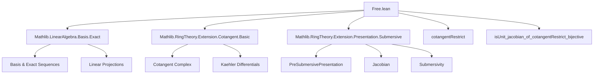

**Technical Brief: `Free.lean` — Computation of Jacobian via Cotangent Basis**

---

### 1. KEY DEFINITIONS & THEOREMS

| Name | Type / Signature | Purpose |
|------|------------------|---------|
| `cotangentRestrict` | `cotangentRestrict P hu : I/I² → ⊕_{i ∈ ι} S dxᵢ` | Restriction of the cotangent map to a summand indexed by `ι`, used to relate generators of the kernel to Kaehler differentials. |
| `cotangentRestrict_bijective_of_isCompl` | Lemma | Under conditions: `IsCompl`, spanning of `D R S (P.val (v i))`, disjointness of kernel and span, and `H¹(L_{S/R}) = 0`, proves `cotangentRestrict` is bijective. |
| `disjoint_ker_toKaehler_of_linearIndependent` | Lemma | If `D R S (P.val (v k))` are linearly independent, then the kernel of `toKaehler` intersects trivially with the span of `cotangentSpaceBasis (v x)`. |
| `cotangentRestrict_bijective_of_basis_kaehlerDifferential` | Lemma | If `D R S (P.val (v k))` form a basis of `Ω[S/R]`, then `cotangentRestrict` is bijective. |
| `isUnit_jacobian_of_cotangentRestrict_bijective` | Lemma | If `fᵢ` map to a basis of `I/I²` and `cotangentRestrict` is bijective, then the Jacobian matrix of the presentation is invertible (`IsUnit`). |
| `cotangentSpaceBasis` | `P.cotangentSpaceBasis : σ → P.toExtension.Cotangent` | Basis of the cotangent module of the extension `R[X] → S`. |
| `Extension.Cotangent.mk` | `Extension.Cotangent.mk : I → P.toExtension.Cotangent` | Canonical map from kernel `I` to cotangent module of extension. |
| `jacobian` | `P.jacobian : σ → ι → S` | Jacobian matrix of the presentation: `jacobian r i = (aeval P.val) (∂/∂X_{P.map i}) (P.relation r)` |

---

### 2. NAMING CONVENTIONS

- **Prefixes**:
  - `cotangentRestrict_`: relates to restriction of cotangent map.
  - `disjoint_ker_`: concerns disjointness of kernel with some submodule.
  - `isUnit_jacobian_`: criteria for Jacobian to be invertible.
  - `linearIndependent`, `span_eq`, `bijective`, `exact`: standard mathematical properties.

- **Suffixes**:
  - `_of_`: condition-based naming (e.g., `bijective_of_basis_kaehlerDifferential`).
  - `_comp_`, `_map'`, `_repr`: functional composition, module maps, and representation maps.

- **Notable abbreviations**:
  - `D R S`: `KaehlerDifferential.D` — the universal derivation.
  - `P.toExtension.toKaehler`: the Kaehler differential map of the extension.
  - `P.cotangentSpaceBasis`: basis of cotangent module of extension.

---

### 3. TACTIC STACK

| Tactic | Usage Frequency | Purpose |
|--------|-----------------|---------|
| `simp_rw` | High | Rewriting with simplification, especially for `hb`, `hb'`, definitions like `cotangentRestrict_mk`. |
| `rw` | High | Rewriting equalities, especially for `heq`, `hb`, `span_eq`, etc. |
| `exact` | High | Supplying proofs of goals directly (e.g., `exact b.span_eq`). |
| `apply` | High | Applying lemmas (e.g., `apply P.cotangentRestrict_bijective_of_isCompl`). |
| `intro` / `intro x ⟨hx, hxs⟩` | Medium | Case analysis on hypotheses. |
| `simp only` | Medium | Simplifying with precise lemmas (e.g., `map_finsuppSum`, `toKaehler_cotangentSpaceBasis`). |
| `ext` | Medium | Extensionality for functions/morphisms (e.g., `ext i j`). |
| `have`, `let` | Medium | Introducing intermediate definitions/lemmas (e.g., `set f := ...`). |
| `simpa` | Medium | Simplifying with assumptions (e.g., `simpa [← disjoint_iff]`). |
| `convert` / ` rfl` | Low | Rarely used; mostly `rfl` in trivial cases. |

---

### 4. PROOF LOGIC

**General proof strategy**:

1. **Decompose the index set**:
   - Use `IsCompl (Set.range v) (Set.range u)` to split indices into complementary parts (`σ ⊕ κ`).
   - This allows projection onto summands via `linearProjOfIsCompl`.

2. **Relate cotangent complex and Kaehler differentials**:
   - Define maps `f`, `g` such that `f ∘ g = 0` (via `exact_cotangentComplex_toKaehler`).
   - Use `LinearMap.linearProjOfIsCompl_comp_bijective_of_exact` to deduce bijectivity.

3. **Use linear independence & spanning**:
   - `LinearIndependent` of `D R S (P.val (v k))` implies disjointness of kernel and span (`disjoint_ker_toKaehler_of_linearIndependent`).
   - If they form a basis, then they span and are independent ⇒ bijectivity.

4. **Jacobian invertibility**:
   - Express Jacobian matrix via `heq` as composition of:
     - basis isomorphism `b : κ → Ω[S/R]`
     - bijective `cotangentRestrict`
     - linear equivalence `Finsupp.linearEquivFunOnFinite`
   - Use properties of linear equivalences to preserve linear independence and spanning.

**Induction / recursion**: None explicitly used. Proofs are structural, relying on module-theoretic properties and exact sequences.

---

### 5. IMPORTS

| Module | Role |
|--------|------|
| `Mathlib.LinearAlgebra.Basis.Exact` | Provides tools for exact sequences and basis manipulation (e.g., `linearProjOfIsCompl_comp_bijective_of_exact`). |
| `Mathlib.RingTheory.Extension.Cotangent.Basic` | Defines cotangent complex, `Cotangent`, `cotangentSpaceBasis`, `Extension`, etc. |
| `Mathlib.RingTheory.Extension.Presentation.Submersive` | Defines `PreSubmersivePresentation`, `jacobian`, `IsUnit`, and submersivity criteria. |

---

### 6. MERMAID DIAGRAMS

#### Dependency Graph (High-Level)



#### Overview of File Logic Flow

```mermaid
flowchart LR
  subgraph Setup
    P[PreSubmersivePresentation P]
    I[I = kernel]
    Ω[Ω[S/R]]
    C[Cotangent Complex I/I² → ⊕S dxᵢ]
  end

  subgraph Main Lemmas
    L1[cotangentRestrict_bijective_of_isCompl]
    L2[disjoint_ker_toKaehler_of_linearIndependent]
    L3[cotangentRestrict_bijective_of_basis_kaehlerDifferential]
    L4[isUnit_jacobian_of_cotangentRestrict_bijective]
  end

  P -->|Assumptions| L1
  L2 --> L1
  L3 -->|basis case| L1
  L1 --> L4
  L4 -->|Conclusion| J[Jacobian invertible]
```

---

### 7. THEORY CONTEXT

This file contributes to the **presentation-independent characterization of standard smooth algebras** (as noted in the docstring). It bridges:

- **Algebraic presentations** (`PreSubmersivePresentation`) with
- **Module-theoretic properties** (bases of `I/I²`, `Ω[S/R]`)
- **Differential geometry intuition** (Jacobian criterion for smoothness/submersivity)

The main theorem `isUnit_jacobian_of_cotangentRestrict_bijective` is a *relative* version of the classical Jacobian criterion: invertibility of the Jacobian matrix is equivalent to the cotangent map being an isomorphism, given suitable basis conditions.

---

Let me know if you'd like a formalized dependency graph (e.g., for `leanpkg`), or a summary of how this fits into the broader `Mathlib` smooth algebra pipeline.
