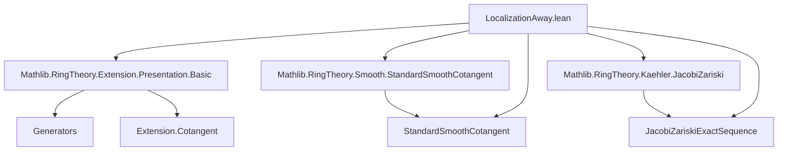

### Technical Brief: `LocalizationAway.lean`

---

#### **1. Key Definitions & Theorems**

| Name | Type / Signature | Purpose |
|------|------------------|---------|
| `comp_localizationAway_ker` | `lemma` | Describes the kernel of the composite algebra map `R[X,Y] → T` as the sum of the extension of `I = ker(P)` and the principal ideal generated by `g·X - 1`. |
| `compLocalizationAwayAlgHom` | `def` | An `R`-algebra map `R[X,Y] → (R[X]/I²)[1/f]` sending `Y ↦ 1/f`, used to construct the localization-aware lift. |
| `sq_ker_comp_le_ker_compLocalizationAwayAlgHom` | `lemma` | Shows that the square of the kernel of the composite map lies in the kernel of `compLocalizationAwayAlgHom`. |
| `liftBaseChange_injective_of_isLocalizationAway` | `lemma` | Proves injectivity of the base-changed cotangent map $T \otimes_S (I/I^2) \to J/J^2$ when $T$ is a localization away from one element. |
| `cotangentCompAwaySec` | `def` | A section of the cotangent map $J/J^2 \to K/K^2$, defined via the universal property of the free module on the generator $g·X - 1$. |
| `cotangentCompAwaySec_apply` | `lemma` | Verifies that the section sends the generator $g·X - 1$ to the chosen preimage $x$. |
| `map_comp_cotangentCompAwaySec` | `lemma` | Shows that the section is indeed a right-inverse to the canonical map $J/J^2 \to K/K^2$. |
| `cotangentCompLocalizationAwayEquiv` | `def` | The main equivalence $J/J^2 \simeq T \otimes_S (I/I^2) \times K/K^2$, constructed via splitting of the Jacobi–Zariski exact sequence. |
| `cotangentCompLocalizationAwayEquiv_symm_inr`, `symm_inl` | `lemmas` | Characterize the inverse equivalence on the summands. |
| `snd_cotangentCompLocalizationAwayEquiv` | `lemma` | Projects the equivalence onto the second factor, recovering the canonical map $J/J^2 \to K/K^2$. |

---

#### **2. Naming Conventions**

- **Prefixes**:
  - `comp_`: Composite maps (e.g., `comp_localizationAway_ker`, `compLocalizationAwayAlgHom`)
  - `liftBaseChange_`: Base change of cotangent maps (e.g., `liftBaseChange_injective_of_isLocalizationAway`)
  - `cotangentComp_`: Maps involving cotangent complexes of composite presentations (e.g., `cotangentCompAwaySec`, `cotangentCompLocalizationAwayEquiv`)
- **Suffixes**:
  - `_of_isLocalizationAway`: Conditions specific to localization away from one element.
  - `_sec`: Section maps (e.g., `cotangentCompAwaySec`)
  - `_equiv`: Equivalences (e.g., `cotangentCompLocalizationAwayEquiv`)
- **Variables**:
  - `g`: Element being localized away.
  - `P`: Presentation of $S$ over $R$.
  - `T`: Localization of $S$ away from $g$.
  - `x`: Element in the cotangent complex of the composite presentation.

---

#### **3. Tactic Stack**

- **Core tactics**:
  - `rw`, `simp`, `simp only`, `change`, `refine`, `apply`, `intro`, `obtain`, `set`
- **Algebraic reasoning**:
  - `algebraize`: Converts ring homomorphisms to algebra homomorphisms.
  - `Ideal.map_span`, `Ideal.mem_span_singleton`, `Ideal.sup_mul`, `Ideal.mul_sup`, `Ideal.mul_le`
  - `IsLocalization.map_eq_zero_iff`, `IsLocalizedModule.injective_of_map_zero`, `IsLocalizedModule.eq_zero_iff`
  - `Extension.Cotangent.mk_eq_zero_iff`, `Extension.Cotangent.map_mk`
- **Module/LinearMap reasoning**:
  - `LinearMap.ext`, `Module.Basis.constr_basis`, `basisCotangentAway_apply`
  - `TensorProduct.mk_surjective`, `LinearMap.coe_comp`, `Function.comp_apply`
- **Ring theory**:
  - `RingHom.ker_eq_comap_bot`, `RingHom.mem_ker`, `Ideal.comap_map_of_surjective`

---

#### **4. Proof Logic**

The proof follows a structured algebraic strategy:

1. **Kernel description** (`comp_localizationAway_ker`):  
   Uses properties of localization and presentations to express the kernel $J$ as a sum of two ideals.

2. **Construction of auxiliary map** (`compLocalizationAwayAlgHom`):  
   Defines a map to $(R[X]/I^2)[1/f]$ to detect vanishing of elements in $J^2$.

3. **Injectivity of the left map** (`liftBaseChange_injective_of_isLocalizationAway`):  
   - Uses localization-specific injectivity criterion (`IsLocalizedModule.injective_of_map_zero`).
   - Reduces to showing that if the image of $x$ under the localization map is zero, then $g^n \cdot x = 0$ in the original module.

4. **Splitting of the exact sequence**:  
   - Uses that $K/K^2$ is free of rank 1 (standard smoothness of dimension 1), generated by $g·X - 1$.
   - Constructs a section via `cotangentCompAwaySec`.
   - Verifies it is a section (`map_comp_cotangentCompAwaySec`).

5. **Main equivalence** (`cotangentCompLocalizationAwayEquiv`):  
   - Applies `Cotangent.exact.splitSurjectiveEquiv`, which splits the exact sequence:
     $$
     0 \to T \otimes_S (I/I^2) \to J/J^2 \to K/K^2 \to 0
     $$
   - Uses the section to get an equivalence with the product.

6. **Characterization of inverse**:  
   - `symm_inl`, `symm_inr`, `snd_cotangentCompLocalizationAwayEquiv` verify the equivalence behaves as expected on summands.

---

#### **5. Imports & Dependencies**

- **Core libraries**:
  - `Mathlib.RingTheory.Extension.Presentation.Basic`: Presentations of algebras and their cotangent complexes.
  - `Mathlib.RingTheory.Smooth.StandardSmoothCotangent`: Cotangent modules for standard smooth maps.
  - `Mathlib.RingTheory.Kaehler.JacobiZariski`: Jacobi–Zariski exact sequences for cotangent complexes.

- **Key abstractions used**:
  - `Generators`, `Localization.Away`, `Extension.Cotangent`, `TensorProduct`, `Ideal.Quotient`, `IsLocalization`.

---

#### **6. Mermaid Diagrams**

##### **Dependency Graph (Module Level)**



##### **Overview of Theoretical Flow**

```mermaid
flowchart LR
  P[Presentation R S ι] -->|kernel I| I[Ideal I]
  Q[Presentation S T] -->|kernel K| K[Ideal K]
  R[Composite R[X,Y] → T] -->|kernel J| J[Ideal J]
  I -->|base change| T⊗S(I/I²)
  K -->|free rank 1| K/K²
  J -->|quotient| J/J²
  T⊗S(I/I²) -->|injective| J/J²
  J/J² -->|surjective| K/K²
  K/K² -->|section| J/J²
  J/J² <-->|equiv| T⊗S(I/I²) × K/K²
```

##### **Exact Sequence & Splitting**

```mermaid
sequenceDiagram
  participant 0
  participant T⊗I
  participant J/J²
  participant K/K²
  participant 0

  0 ->> T⊗I : injective (liftBaseChange_injective_)
  T⊗I ->> J/J² : natural map
  J/J² ->> K/K² : surjective (Jacobi–Zariski)
  K/K² ->> 0

  Note over J/J²,K/K²: Split via section cotangentCompAwaySec
  J/J² <--|equiv| T⊗I × K/K²
```

---

#### **7. Summary**

This file formalizes a key structural result about cotangent complexes under localization away from one element: the cotangent complex of the composite presentation splits as a direct sum of the base-changed cotangent complex of the first map and the cotangent complex of the localization. This is a foundational step in proving smoothness properties and computing cotangent complexes in relative settings.

The proof leverages:
- Explicit presentations and kernel computations,
- Localization-specific injectivity criteria,
- Free rank-1 structure of $K/K^2$ (from standard smoothness),
- Jacobi–Zariski exact sequences and their splitting.

The formalization is highly structured, with clear separation of:
- Construction (`def`s),
- Verification (`simp`-friendly lemmas),
- Global equivalence (`cotangentCompLocalizationAwayEquiv`).

This aligns with the Stacks Project tag [08JZ](https://stacks.math.columbia.edu/tag/08JZ), part (1).
