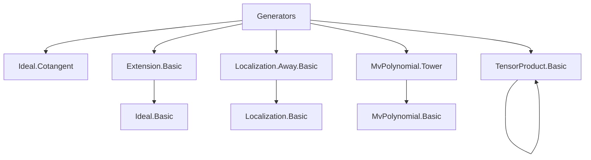
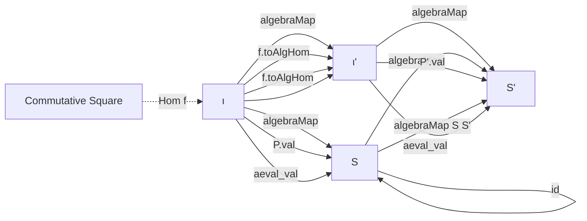

### Technical Brief: `Generators.lean`

---

#### **1. Key Definitions & Theorems**

| Name | Type / Signature | Purpose |
|------|------------------|---------|
| `Algebra.Generators` | `structure` | Encodes a presentation of an $R$-algebra $S$ via a section $\sigma : S \to R[\iota]$ of the evaluation map $\mathrm{aeval}\,v : R[\iota] \to S$. |
| `Algebra.Generators.Ring` | `abbrev` | The polynomial ring $R[\iota]$ associated to a family of generators. |
| `Algebra.Generators.σ` | `def` | The designated section $S \to R[\iota]$, reducible to `σ'`. |
| `Algebra.Generators.ofSurjective` | `def` | Constructs generators from a surjective evaluation map. |
| `Algebra.Generators.comp` | `def` | Composes generators along a tower $R \to S \to T$, yielding generators for $T$ over $R$ indexed by $\iota' \oplus \iota$. |
| `Algebra.Generators.extendScalars` | `def` | Extends scalars: from $R$-generators of $T$, get $S$-generators of $T$ for $R \to S \to T$. |
| `Algebra.Generators.baseChange` | `def` | Base change: from $R$-generators of $S$, get $T$-generators of $T \otimes_R S$. |
| `Algebra.Generators.Hom` | `structure` | Morphism between two families of generators: an assignment $\iota \to R'[\iota']$ making the square commute. |
| `Algebra.Generators.Hom.toAlgHom` | `def` | Induced $R$-algebra map $R[\iota] \to R'[\iota']$. |
| `Algebra.Generators.Hom.equivAlgHom` | `def` | Equivalence between `Hom` and algebra homs satisfying a commutativity condition. |
| `Algebra.Generators.ker` | `abbrev` | Kernel ideal of the presentation $R[\iota] \to S$. |
| `Algebra.Generators.naive` | `def` | Generators for a quotient $R[X]/I$, using a section of the quotient map. |
| `Algebra.Generators.finiteType` | `lemma` | If generators exist over a finite index type, then $S$ is finitely typed over $R$. |
| `Algebra.FiniteType.iff_exists_generators` | `lemma` | $S$ is finitely typed over $R$ iff there exist generators indexed by $\mathrm{Fin}\,n$ for some $n$. |
| `Algebra.Generators.kerCompPreimage` | `def` | Lifts elements of $\ker(S[\iota'] \to T)$ to $\ker(R[\iota][\iota'] \to T)$ using $\sigma$. |
| `Algebra.Generators.ker_comp_eq_sup` | `lemma` | Describes the kernel of the composite presentation as the sum of the image of the first kernel and the pullback of the second. |

---

#### **2. Naming Conventions**

- **Prefixes**:
  - `of_`: Construction from a universal property or data (e.g., `ofSurjective`, `ofAlgEquiv`, `ofSet`).
  - `extend_`, `baseChange`, `comp`: Operations building new structures from existing ones.
  - `localizationAway`: Specialized construction for localization away from an element.
  - `naive`: Default/constructive version (often noncanonical).
  - `to_`, `of_`: Directional morphisms between structures (e.g., `toComp`, `ofComp`, `toExtendScalars`).
- **Suffixes**:
  - `_val`: Projection to the assignment $\iota \to S$.
  - `_σ`: Projection to the section $S \to R[\iota]$.
  - `_algebraMap`: Relates algebra maps to evaluation.
  - `_toAlgHom`: Induced algebra homomorphism.
- **Other**:
  - `id`, `defaultHom`, `comp`: Standard categorical operations.
  - `reindex`: Change of indexing type via equivalence.

---

#### **3. Tactic Stack**

- **Core simplification & rewriting**:
  - `simp`, `simp only`, `simp_rw`
  - `rw`, `conv_rhs => rw ...`
- **Induction & structural reasoning**:
  - `induction ... using MvPolynomial.induction_on`
  - `induction x using TensorProduct.induction_on`
- **Extensionality & equality**:
  - `ext`, `ext1`, `Funext`, `DFunLike.congr_fun`
- **Ring & module theory**:
  - `ring`, `ring1`, `abelian`
- **Set-theoretic reasoning**:
  - `exact`, `obtain ⟨x, hx⟩`, `rw [Ideal.mem_map_iff_of_surjective]`
- **Category-theoretic**:
  - `apply`, `refine`, `convert_to`, `apply le_antisymm`
- **Specialized**:
  - `change`, `nth_rw`, `convert`, `congr!`, `rw [← ...]`

---

#### **4. Proof Logic**

- **Inductive structure**: Proofs over `MvPolynomial` or `TensorProduct` via induction principles (`induction_on`, `induction_on'`).
- **Section-based reasoning**: Many proofs rely on the section $\sigma$ satisfying $\mathrm{aeval}\,v \circ \sigma = \mathrm{id}$, used to reduce goals to polynomial identities.
- **Ideal-theoretic manipulations**: Use of kernel descriptions (`ker_eq_ker_aeval_val`), mapping of ideals (`Ideal.map`, `Ideal.comap`), and surjectivity to lift elements.
- **Commutative diagram chasing**: Hom definitions encode commutativity; proofs often verify diagrams commute by unfolding definitions and applying `simp`.
- **Equivalence of presentations**: `equivAlgHom` and `reindex` allow transport of structure along equivalences.
- **Localization & quotient handling**: Specialized lemmas (`localizationAway`, `naive`, `ker_naive`) handle concrete presentations.

---

#### **5. Imports & Dependencies**

| Module | Purpose |
|--------|---------|
| `Mathlib.RingTheory.Ideal.Cotangent` | Cotangent space $I/I^2$; used in `Cotangent` TODO. |
| `Mathlib.RingTheory.Localization.Away.Basic` | Localization away from an element; used in `localizationAway`. |
| `Mathlib.RingTheory.MvPolynomial.Tower` | Tower laws for multivariate polynomials. |
| `Mathlib.RingTheory.TensorProduct.Basic` | Tensor product of algebras; used in `baseChange`. |
| `Mathlib.RingTheory.Extension.Basic` | `Extension R S` (a presentation $R[X] \to S$); used in `toExtension`. |

---

#### **6. Mermaid Diagrams**

##### **Dependency Graph (Module-Level)**



##### **Overview of `Generators` Theory**

```mermaid
flowchart LR
  A[Algebra R S] --> B[Generators R S ι]
  B --> C[Ring = R[ι]]
  B --> D[σ : S → R[ι]]
  B --> E[aeval_val ∘ σ = id]

  C --> F[Algebra R[ι] S]
  D --> G[Hom P P']
  G --> H[toAlgHom : R[ι] → R'[ι']]
  H --> I[Commutative Square]

  B --> J[Extension R S]
  J --> K[ker : Ideal R[ι]]
  K --> L[Cotangent Space I/I²]

  B --> M[Construction Ops]
  M --> N[comp, extendScalars, baseChange]
  M --> O[ofSurjective, naive, id]
```

##### **Morphism Diagram (Hom)**



---

#### **7. Notes & Open Issues**

- **Definitional fragility**: The `vars` field (index type) is not always definitionally equal after constructions (e.g., `comp`, `reindex`), causing `simp`/`rw` to fail. Suggested fix: unbundling or using unification hints.
- **`simpNF` timeouts**: Some lemmas (e.g., `ker_ofAlgHom`, `ker_ofAlgEquiv`) disable `simpNF` due to typeclass inference issues.
- **Cotangent space**: Defined in the TODO but not yet formalized in this file.
- **Future work**: Refactoring `Generators` to make index types more transparent and definitional.

--- 

This file formalizes a robust framework for handling algebra presentations via generators and sections, enabling modular reasoning about finite type, base change, and localization in commutative algebra.
