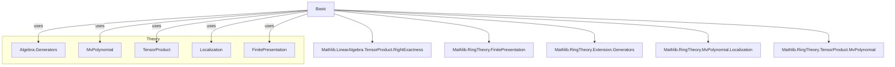
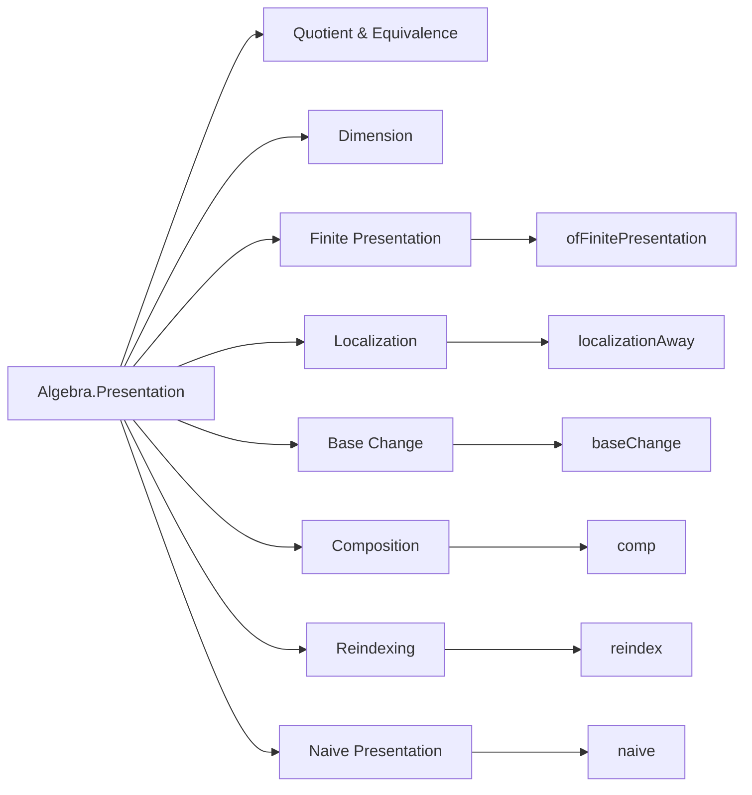
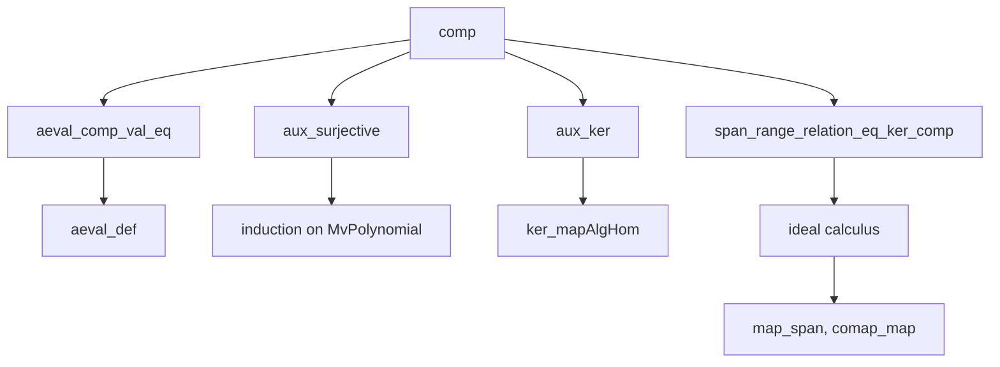

### Technical Brief: `Basic.lean` — Presentations of Algebras in Lean 4

---

#### **1. Key Definitions & Theorems**

| Name | Type / Signature | Purpose |
|------|------------------|---------|
| `Algebra.Presentation` | `structure` extending `Algebra.Generators R S ι` | Represents an $R$-algebra $S$ via generators (`ι`) and relations (`σ`) with a map `relation : σ → MvPolynomial ι R` whose span equals $\ker(\mathrm{aeval})$. |
| `Algebra.Presentation.IsFinite` | `Prop` | A presentation is *finite* if both `ι` and `σ` are finite types. |
| `Algebra.Presentation.dimension` | `ℕ` | Defined as `Nat.card ι - Nat.card σ`. Non-sensical unless presentation is a *complete intersection*. |
| `Algebra.Presentation.Quotient` | `Type` | $P.Ring / P.ker$, i.e., the polynomial algebra modulo relations. |
| `Algebra.Presentation.quotientEquiv` | `P.Quotient ≃ₐ[P.Ring] S` | Canonical equivalence between the quotient and $S$. |
| `Algebra.Presentation.ofFinitePresentation` | `Presentation R S (Fin n) (Fin m)` | A *canonical* finite presentation for any finitely presented algebra $S/R$. |
| `Algebra.Presentation.localizationAway` | `Presentation R S Unit Unit` | Presentation of localization $R[r^{-1}]$ with one generator $X$ and relation $rX - 1 = 0$. |
| `Algebra.Presentation.baseChange` | `Presentation T (T ⊗[R] S) ι σ` | Base change of a presentation along $R → T$. |
| `Algebra.Presentation.comp` | `Presentation R T (ι' ⊕ ι) (σ' ⊕ σ)` | Composition of presentations: if $S/R$ and $T/S$ have presentations, then $T/R$ does. |
| `Algebra.Presentation.reindex` | `Presentation R S ι' σ'` | Induced presentation under equivalences of index types. |
| `Algebra.Presentation.naive` | `Presentation R (MvPolynomial σ R ⧸ I) σ ι` | Naive presentation of a quotient of a multivariate polynomial ring. |
| `Algebra.Presentation.dimension_reindex` | `dimension (P.reindex e f) = dimension P` | Dimension is invariant under reindexing. |
| `Algebra.Presentation.fg_ker` | `[Finite σ] → P.ker.FG` | Kernel is finitely generated if relations are finite. |
| `Algebra.Presentation.finitePresentation_of_isFinite` | `[Finite σ] [Finite ι] → FinitePresentation R S` | Finite presentation implies algebra is finitely presented. |
| `Algebra.Presentation.exists_presentation_fin` | `FinitePresentation R S → ∃ n m, Nonempty (Presentation R S (Fin n) (Fin m))` | Every finitely presented algebra admits a finite presentation. |

**Key Lemmas**:
- `aeval_val_relation`: Relations evaluate to zero.
- `relation_mem_ker`: Each relation lies in the kernel.
- `quotientEquiv_mk`, `quotientEquiv_symm`: Explicit formulas for the equivalence.
- `localizationAway_dimension_zero`: Localization away from one element has dimension 0.
- `comp_relation_inr`, `comp_aeval_relation_inl`: Structure of relations in composite presentation.
- `naive_relation_apply`, `mem_ker_naive`: Basic properties of naive presentation.

---

#### **2. Naming Conventions**

| Pattern | Examples | Meaning |
|--------|----------|---------|
| `is_` / `fg_` | `fg_ker`, `finitePresentation_of_isFinite` | Properties (e.g., finite generation, finiteness). |
| `of_` | `ofAlgEquiv`, `ofBijectiveAlgebraMap`, `ofFinitePresentation` | Construction from a structural property. |
| `reindex`, `baseChange`, `comp`, `localizationAway` | — | Operations on presentations. |
| `naive` | `naive` | Canonical but possibly non-canonical (requires choice) construction. |
| `dimension`, `quotient`, `Quotient` | — | Derived objects. |
| `relation`, `relation_mem_ker`, `aeval_val_relation` | — | Relation-related lemmas. |
| `aux`, `compRelationAux` | `aux`, `compRelationAux`, `compRelationAux_map` | Technical auxiliary constructions in proofs. |

---

#### **3. Tactic Stack**

Frequently used tactics in proofs:
- `simp` / `simp only` — Simplification with definitional equalities and lemmas.
- `rw` / `erw` — Rewriting using equalities, often with `←` to go backwards.
- `ext` — Extensionality for functions/relations.
- `apply` / `exact` — Direct proof steps.
- `induction` — Structural induction on `MvPolynomial`.
- `change`, `convert`, `congr` — Fine-grained control over goals.
- `have`, `replace`, `obtain` — Intermediate lemma introduction.
- `set_option backward.privateInPublic true` — Used to allow private lemmas in public sections.
- `aesop` — Not used here (proofs are mostly manual).
- `ring` — Not used (polynomial arithmetic handled via `MvPolynomial` lemmas).
- `simp_rw` — Rare, but used in `dimension_reindex`.

---

#### **4. Proof Logic**

**Typical proof structure**:
1. **Reduction to evaluation maps**: Many proofs reduce to showing equality of kernels or spans using:
   - `Generators.ker_eq_ker_aeval_val`
   - `Ideal.span_le`, `Ideal.mem_span`, `Ideal.map_span`
2. **Use of equivalences**:
   - `MvPolynomial.algebraTensorAlgEquiv`, `sumAlgEquiv`, `renameEquiv`
   - `Ideal.comap_map_of_bijective`, `Ideal.comap_injective_of_surjective`
3. **Induction on polynomials**:
   - `MvPolynomial.induction_on` with `C`, `add`, `mul_X` cases.
4. **Surjectivity/injectivity arguments**:
   - `aux_surjective`, `algEquiv.bijective`, `Function.surjInv_eq`
5. **Ideal calculus**:
   - `Ideal.map_map`, `Ideal.comap_comap`, `Ideal.span_union`, `Ideal.map_span`
6. **Construction via choice**:
   - `exists_presentation_fin` uses `FinitePresentation.out` and `Submodule.fg_iff_exists_fin_generating_family`.

**Example flow** (e.g., `comp`):
- Show kernel of composite evaluation = sum of images of relations.
- Use:
  - `aeval_comp_val_eq`: factorization of evaluation.
  - `aux_surjective`: surjectivity of auxiliary map.
  - `aux_ker`: description of kernel via `rename`.
  - `Ideal.comap_map_of_surjective'`: pullback of ideal under surjection.

---

#### **5. Imports**

| Module | Purpose |
|--------|---------|
| `Mathlib.LinearAlgebra.TensorProduct.RightExactness` | Tensor product properties, especially kernel behavior. |
| `Mathlib.RingTheory.FinitePresentation` | Definition and basic properties of finitely presented algebras. |
| `Mathlib.RingTheory.Extension.Generators` | Theory of algebra generators (used in `Algebra.Generators`). |
| `Mathlib.RingTheory.MvPolynomial.Localization` | Localization of multivariate polynomial rings. |
| `Mathlib.RingTheory.TensorProduct.MvPolynomial` | Interaction of tensor products and multivariate polynomials. |

---

#### **6. Mermaid Diagrams**

##### **Dependency Graph (Module-Level)**

##### **Overview of `Basic.lean` Structure**

##### **Proof Dependency (Composition Example)**

---

#### **7. Notes & Observations**

- **Non-canonicity**: Many constructions (e.g., `ofFinitePresentation`, `naive`) rely on choice (` Classical.some`), especially when extracting finite generating families.
- **Dimension caveat**: Explicitly noted as non-sensical unless presentation is a *complete intersection*.
- **Choice of section**: In `naive`, a section `s` is required; default is `Function.surjInv`.
- **Reindexing invariance**: Dimension and presentation structure are stable under bijections of index types.
- **Composition**: Uses `Sum.elim` to combine generators and relations; auxiliary map `aux` is key to relating kernels.

--- 

Let me know if you'd like a formalization of `Hom`s of presentations (as mentioned in `TODO`) or a deeper dive into any specific construction.
