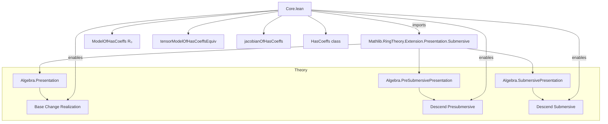

Here is the structured technical metadata extracted from `Core.lean`:

---

### **1. KEY DEFINITIONS & THEOREMS**

| Name | Type / Signature | Purpose |
|------|------------------|---------|
| `coeffs` | `P.coeffs : Set R` | Set of all coefficients appearing in the relations of presentation `P`. |
| `core` | `P.core : Subalgebra ℤ R` | Subalgebra of `R` generated (over `ℤ`) by `P.coeffs`. |
| `Core` | `P.Core : Type _` | Coercion of `P.core` to a type (for performance). |
| `HasCoeffs` | `class HasCoeffs (R₀ : Type*) [...]` | Predicate: `R₀` contains coefficients of `P` (i.e., `P.coeffs ⊆ range(algebraMap R₀ R)`). |
| `relationOfHasCoeffs` | `P.relationOfHasCoeffs R₀ r : MvPolynomial ι R₀` | Preimage of `P.relation r` under `MvPolynomial.map (algebraMap R₀ R)`. |
| `ModelOfHasCoeffs` | `P.ModelOfHasCoeffs R₀ : Type _` | Quotient `MvPolynomial ι R₀ / ⟨relations lifted from R₀⟩`; model of `S` over `R₀`. |
| `tensorModelOfHasCoeffsEquiv` | `R ⊗[R₀] P.ModelOfHasCoeffs R₀ ≃ₐ[R] S` | Natural algebra isomorphism realizing `S` as base change of the model over `R₀`. |
| `jacobianRelations` | `P.jacobianRelations : σ → MvPolynomial ι R` | Relations witnessing invertibility of the Jacobian (via determinant + unit). |
| `coeffs` (submersive) | `P.coeffs : Set R` | Extended coefficient set for submersive presentations: includes `σ(unit⁻¹)` and `jacobianRelations` coeffs. |
| `HasCoeffs` (submersive) | `class HasCoeffs (R₀ : Type*) [...]` | `R₀` contains *all* needed coefficients to descend submersive structure. |
| `jacobianOfHasCoeffs`, `invJacobianOfHasCoeffs`, `jacobianRelationsOfHasCoeffs` | `MvPolynomial ι R₀` | Lifted Jacobian, its inverse, and relation coefficients to `R₀`. |
| `ofHasCoeffs` (submersive) | `Algebra.SubmersivePresentation R₀ (P.ModelOfHasCoeffs R₀) ι σ` | Descends submersive presentation to `R₀` under `HasCoeffs R₀`. |

**Key Theorems**:
- `tensorModelOfHasCoeffsEquiv`: `S ≅ R ⊗[R₀] S₀`, where `S₀ = ModelOfHasCoeffs R₀`.
- `map_jacobianOfHasCoeffs`, `aeval_jacobianOfHasCoeffs`: Compatibility of Jacobian lift with base change.
- `sum_jacobianRelationsOfHasCoeffs_mul_relationOfHasCoeffs`: Descended Jacobian invertibility relation.
- `ofHasCoeffs` (submersive): Submersive structure descends along `HasCoeffs`.

---

### **2. NAMING CONVENTIONS**

- **Prefixes**:
  - `coeffs_`: relates to coefficient sets (`coeffs`, `finite_coeffs`, `coeffs_subset_core`, `coeffs_toPresentation_subset_coeffs`).
  - `relation_`: for relations (`relation_subset_coeffs`, `relation_mem_range_map`, `relationOfHasCoeffs`).
  - `jacobian_`: for Jacobian-related constructions (`jacobianRelations`, `jacobianOfHasCoeffs`, `invJacobianOfHasCoeffs`).
  - `tensorModelOfHasCoeffs_`: for the base-change isomorphism and its components.
  - `map_`: for lifting polynomials over `R₀` to `R` (`map_relationOfHasCoeffs`, `map_jacobianOfHasCoeffs`, `map_invJacobianOfHasCoeffs`).
  - `aeval_`: evaluation at the generators (`aeval_val_relationOfHasCoeffs`, `aeval_jacobianOfHasCoeffs`).

- **Suffixes**:
  - `_OfHasCoeffs`: objects/properties defined assuming `HasCoeffs R₀`.
  - `_subset_`: subset relations (`coeffs_subset_core`, `coeffs_toPresentation_subset_coeffs`).
  - `_mem_range`: membership in image of `algebraMap` (`relation_mem_range_map`, `coeffs_relation_mem_range`).

---

### **3. TACTIC STACK**

- `simp` / `simp_rw`: pervasive simplification, especially with `SetLike`, `Ideal.span`, `algHom`, `tensorProduct`.
- `rw`: rewriting using lemmas like `map_relationOfHasCoeffs`, `algebraTensorAlgEquiv_symm_map`.
- `exact`, `refine`, `convert`: construction of proofs and definitions.
- `intro`, `ext`, `apply`, `cases`: standard proof scripting.
- `have`, `set_option`: for auxiliary lemmas and scoping control (e.g., `hom_comp_inv`, `inv_comp_hom`).
- `classical`: used for noncomputable definitions (`jacobianRelations`, `jacobianOfHasCoeffs`, etc.).
- `congr`: congruence reasoning (e.g., `congr(MvPolynomial.aeval P.val $(...))`).
- `apply_fun`, `funext`: functional extensionality.

---

### **4. PROOF LOGIC**

- **Induction / case analysis** is minimal; most proofs are *constructive* and rely on:
  - **Universal properties** (e.g., tensor product, quotient, adjoin).
  - **Set-theoretic containment arguments** (e.g., `subset_trans`, `subset_union_left`).
  - **Lifting via surjectivity/injectivity** (e.g., `Ideal.Quotient.liftₐ`, `map_injective`).
  - **Equational reasoning** with `aeval`, `map`, and `algebraMap`.
- **Key pattern**:
  1. Assume `HasCoeffs R₀`.
  2. Lift relations (`relationOfHasCoeffs`) and verify they land in kernel.
  3. Construct induced algebra map (`tensorModelOfHasCoeffsHom`).
  4. Construct inverse (`tensorModelOfHasCoeffsInv`) using universal property of quotients.
  5. Prove mutual inverses via `ext` and simplifications.
- For submersive case:
  - Use Jacobian invertibility condition to extract relations (`jacobianRelations`).
  - Show these relations descend under `HasCoeffs R₀`.
  - Verify `jacobian_isUnit` in the model over `R₀`.

---

### **5. IMPORTS**

- `Mathlib.RingTheory.Extension.Presentation.Submersive`: main dependency; provides `Algebra.Presentation`, `PreSubmersivePresentation`, `SubmersivePresentation`, and related API.

---

### **6. DEPENDENCY & OVERVIEW DIAGRAM**

#### **File Overview**

- **Goal**: Provide a *coefficient descent* framework for algebra presentations, especially submersive ones.
- **Core idea**: If a presentation `P` has coefficients in a subring `R₀ ⊆ R`, then `S ≅ R ⊗[R₀] S₀`, where `S₀` is built from the same relations over `R₀`.
- **Main result**: `tensorModelOfHasCoeffsEquiv` gives explicit base-change isomorphism.
- **Submersive refinement**: Under finiteness, one can descend *Jacobian invertibility*, enabling removal of Noetherian hypotheses in applications (e.g., formal smoothness, étale descent).

---

Let me know if you'd like a formalized dependency graph (e.g., in `.dot` format) or a summary of how this file fits into the broader `Mathlib` presentation theory.
