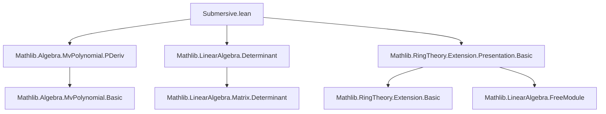

### Technical Brief: `Submersive.lean`

---

#### **1. Key Definitions & Theorems**

| Name | Type / Structure | Purpose |
|------|------------------|---------|
| `PreSubmersivePresentation` | `Structure` | A presentation of an $R$-algebra $S$ with an injective map `map : σ → ι` from relations to variables. |
| `differential` | `(σ → P.Ring) →ₗ[P.Ring] (σ → P.Ring)` | Linear map sending basis vector $e_j$ (relation $j$) to vector of partial derivatives $\left(\frac{\partial r_j}{\partial x_{\text{map}(i)}}\right)_{i:\sigma}$. |
| `jacobian` | `S` | Determinant of `differential`, viewed in $S$ via `algebraMap`. |
| `jacobiMatrix` | `Matrix σ σ P.Ring` | Matrix representation of `differential` w.r.t. standard basis (requires `Fintype σ`, `DecidableEq σ`). |
| `aevalDifferential` | `(σ → S) →ₗ[S] (σ → S)` | Pushforward of `differential` via `aeval P.val`. |
| `SubmersivePresentation` | `Structure` | A finite `PreSubmersivePresentation` whose `jacobian` is a unit in $S$. |
| `comp_jacobian_eq_jacobian_smul_jacobian` | `lemma` | Jacobian of composite presentation is product: $(Q \circ P).\text{jacobian} = P.\text{jacobian} \cdot Q.\text{jacobian}$. |
| `aevalDifferentialEquiv` | `noncomputable def` | For submersive $P$, `aevalDifferential` is an $S$-linear equivalence (isomorphism). |
| `basisDeriv` | `noncomputable def` | Basis of $(\sigma \to S)$ given by partial derivatives of relations w.r.t. mapped variables. |
| `localizationAway_jacobian` | `lemma` | For $S = R[r^{-1}]$, Jacobian = image of $r$ under `algebraMap`. |
| `naive` | `noncomputable def` | Canonical presubmersive presentation for a quotient $R[X_i]/(v_j)$ with injective indexing $a : \iota \to \sigma$. |

---

#### **2. Naming Conventions**

- **Prefixes**:
  - `isUnit_`, `linearIndependent_`, `span_eq_top_`: properties of modules/elements.
  - `aeval_`: induced maps after evaluating generators.
  - `jacobiMatrix_`, `jacobian_`: determinant-related constructions.
  - `comp_`, `baseChange_`, `reindex_`, `ofAlgEquiv_`: structural constructions.
  - `localizationAway_`: specific to localization.

- **Suffixes**:
  - `_eq_`: equality lemmas (e.g., `comp_jacobian_eq_jacobian_smul_jacobian`).
  - `_apply`: action on elements (e.g., `jacobiMatrix_apply`, `aevalDifferential_single`).
  - `_inl`, `_inr`, `_₁₁`, `_₂₂`: block decomposition notation in `comp` section.

- **Structure fields**:
  - `map`, `map_inj`: core data of `PreSubmersivePresentation`.
  - `jacobian_isUnit`: witness of submersiveness.

---

#### **3. Tactic Stack**

Frequently used tactics:
- `simp` / `simp only` / `simp_rw`: simplification with definitional equalities, especially for `jacobiMatrix_apply`, `aevalDifferential_single`.
- `rw`: rewriting using lemmas like `jacobian_eq_jacobiMatrix_det`, `comp_jacobian_eq_jacobian_smul_jacobian`.
- `congr`: for proving equality of determinants/matrices.
- `ext`: extensionality for matrices/functions.
- `cases`: on `Fintype`, `Finite`, `Subsingleton`, `PEmpty`.
- `have`, `convert_to`, `convert`: intermediate proof steps, especially in block-matrix determinant arguments.
- `ring`, `linarith`, `lia`: for algebraic manipulations and inequalities (e.g., `card_relations_le_card_vars_of_isFinite`).
- `apply`, `exact`, `intro`: standard proof scripting.
- `induction ... using MvPolynomial.induction_on`: structural induction on multivariate polynomials.

---

#### **4. Proof Logic**

- **Inductive structure**: Proofs often proceed by:
  1. Reducing to matrix form via `jacobiMatrix` (requires `Fintype σ`).
  2. Decomposing matrices (e.g., block decomposition for `comp`).
  3. Showing off-diagonal blocks vanish (`jacobiMatrix_comp_inl_inr`).
  4. Computing determinants of diagonal blocks separately (`jacobiMatrix_comp_₁₁_det`, `jacobiMatrix_comp_₂₂_det`).
  5. Applying `Matrix.det_fromBlocks_zero₁₂` to get full determinant.

- **Key logical patterns**:
  - *Equivalence via isUnitDet*: `IsUnit det ↔ LinearEquiv` (used in `aevalDifferentialEquiv`).
  - *Localization*: Jacobian = image of localized element (`localizationAway_jacobian`).
  - *Base change*: Jacobian transforms as $1 \otimes j$ under tensor product.
  - *Reindexing invariance*: Jacobian unchanged under bijections of indices.

- **Induction on polynomials**: Used in `jacobiMatrix_comp_₂₂_det` to verify equality on generators.

---

#### **5. Imports & Dependencies**

| Import | Role |
|--------|------|
| `Mathlib.Algebra.MvPolynomial.PDeriv` | Partial derivatives on multivariate polynomials (`pderiv`). |
| `Mathlib.LinearAlgebra.Determinant` | Determinant of linear maps/matrices. |
| `Mathlib.RingTheory.Extension.Presentation.Basic` | `Presentation`, `Generators`, `Algebra.Presentation` infrastructure. |

**Core libraries used**:
- `Pi.basisFun`, `LinearMap.det`, `MvPolynomial`, `TensorProduct`, `Ideal.Quotient`, `IsLocalization`.

---

#### **6. Mermaid Diagrams**

##### **Dependency Graph (Module-Level)**



##### **Conceptual Overview of Theory**

```mermaid
flowchart LR
  A[Algebra R S] --> B[PreSubmersivePresentation R S ι σ]
  B -->|map : σ ↪ ι| C[Injective indexing]
  C --> D[differential : (σ → P.Ring) →ₗ (σ → P.Ring)]
  D --> E[jacobian = det(differential) ∈ S]
  E --> F{IsUnit?}
  F -->|Yes| G[SubmersivePresentation]
  G --> H[Standard Smooth Algebras]
  B --> I[Constructions]
  I --> J[comp, baseChange, reindex, localizationAway, naive]
  I --> K[aevalDifferentialEquiv]
  K --> L[BasisDeriv]
  L --> M[Linear independence of partial derivatives]
```

##### **Proof Structure for `comp_jacobian_eq_jacobian_smul_jacobian`**

```mermaid
flowchart TD
  A[(Q.comp P).jacobian] --> B[jacobian = det(jacobiMatrix)]
  B --> C[Block decomposition of jacobiMatrix]
  C --> D[toBlocks₁₂ = 0]
  C --> E[toBlocks₁₁ det = Q.jacobian]
  C --> F[toBlocks₂₂ det = P.jacobian]
  D --> G[det(fromBlocks) = det₁₁ * det₂₂]
  E --> G
  F --> G
  G --> H[= P.jacobian • Q.jacobian]
```

---

#### **7. Theory Scope & Applications**

- **Goal**: Formalize *standard smooth morphisms* via *submersive presentations*.
- **Key theorem**: An algebra $S/R$ is *standard smooth* iff it admits a submersive presentation.
- **Applications** (see `Mathlib.RingTheory.Smooth.StandardSmooth`):
  - Smoothness is stable under base change, composition, localization.
  - Jacobian criterion for smoothness in algebraic geometry.

---

#### **8. Summary**

This file formalizes the foundational theory of *submersive presentations*, a key ingredient in the algebraic definition of smooth morphisms. It introduces:
- A structural notion (`PreSubmersivePresentation`) encoding “fewer relations than generators” via injective indexing.
- A Jacobian determinant built from partial derivatives.
- A robust calculus of constructions (`comp`, `baseChange`, `reindex`, `localizationAway`, `naive`) with explicit Jacobian behavior.
- Equivalence between submersiveness and invertibility of the differential.

The formalization is highly structured, leveraging linear algebra over polynomial rings and module theory, with proofs relying on block matrix determinants and induction on multivariate polynomials.
