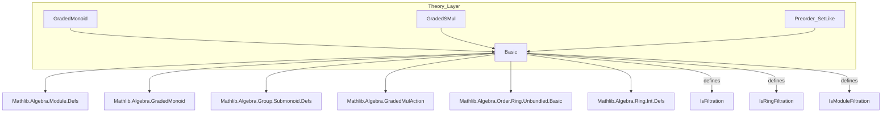
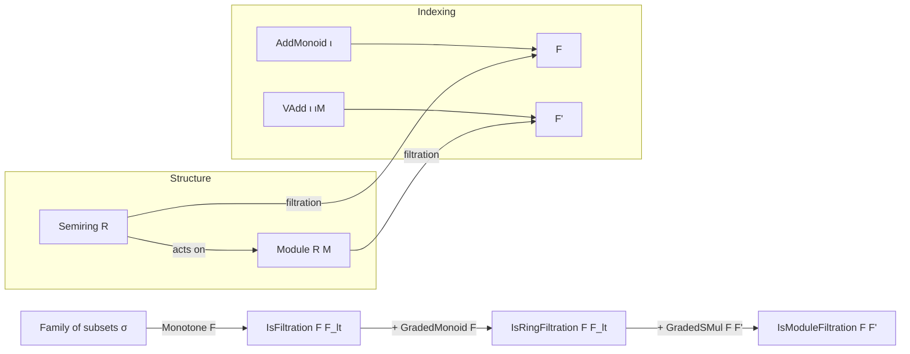

### Technical Brief: `Basic.lean` — Filtration Theory in Lean 4

---

#### **1. Key Definitions & Theorems**

| Name | Type | Purpose |
|------|------|---------|
| `IsFiltration` | `class` | Defines a filtration as a monotone family `F : ι → σ` equipped with a “lower bound” family `F_lt` satisfying:  • `F i ≤ F_lt j` when `i < j`  • `F_lt j` is the *least upper bound* of all `F i` for `i < j`. |
| `IsFiltration.F_lt_le_F` | `lemma` | Shows `F_lt i ≤ F i`, i.e., the lower bound is pointwise ≤ the original family. |
| `IsFiltration.mk_int` | `lemma` | Constructs `IsFiltration` for index type `ι = ℤ` using `F_lt n := F (n - 1)`. |
| `IsRingFiltration` | `class` | Extends `IsFiltration` with `SetLike.GradedMonoid F`, i.e., `F i * F j ⊆ F (i + j)`. Models filtrations on semirings compatible with multiplication. |
| `IsRingFiltration.mk_int` | `lemma` | Constructs `IsRingFiltration` on `ℤ` from monotone `F` and `GradedMonoid` instance. |
| `IsModuleFiltration` | `class` | Extends `IsFiltration` for module terms `F'` with `SetLike.GradedSMul F F'`, i.e., `F i • F' j ⊆ F' (i +ᵥ j)`. Models filtrations on modules over filtered rings. |
| `IsModuleFiltration.mk_int` | `lemma` | Constructs `IsModuleFiltration` on `ℤ` from monotone `F`, `F'`, and `GradedSMul` instance. |

---

#### **2. Naming Conventions**

- **Prefixes**:
  - `is_`: Predicate classes (`IsFiltration`, `IsRingFiltration`, `IsModuleFiltration`)
  - `F_`, `F'_`: Families of subsets (filtration components)
  - `mono`: Monotonicity hypothesis
- **Suffixes**:
  - `_lt`: “lower” or “strictly less than” index family (e.g., `F_lt`, `F'_lt`)
  - `_int`: Integer-indexed convenience constructors
- **Variables**:
  - `F`, `F'`: Filtration families (ring/module)
  - `F_lt`, `F'_lt`: Associated “suprema over smaller indices”
  - `ι`, `ιM`: Index types (additive monoids with partial orders)
  - `σ`, `σM`: Families of subsets (via `SetLike`)

---

#### **3. Tactic Stack**

- **Core tactics** used in proofs (inferred from structure):
  - `intro`, `exact`, `apply`, `refine`, `cases`
  - `simp`, `simp_rw` (for rewriting definitions like `F_lt n := F (n - 1)`)
  - `aesop` (for monotonicity, order reasoning, and `SetLike` facts)
  - `linarith` (for integer arithmetic, e.g., `j - 1 < j`)
  - `ring` (for additive monoid/semiring identities)
- **No heavy automation** — proofs are mostly definitional or rely on `SetLike`/`Preorder`/`AddMonoid` instances.

---

#### **4. Proof Logic**

- **Structure**: Definitions are *class-based*, with proofs deferred to constructors.
- **Typical proof pattern**:
  1. **Introduce** hypotheses (`mono`, `GradedMonoid`, etc.)
  2. **Instantiate** `F_lt` (e.g., `fun n ↦ F (n - 1)`)
  3. **Verify** `IsFiltration` axioms:
     - `mono`: given or inherited
     - `is_le`: use monotonicity + integer arithmetic (`i < j → i ≤ j - 1`)
     - `is_sup`: use universal property of suprema (via `is_sup` in class)
  4. **Extend** to ring/module filtrations by inheriting `GradedMonoid`/`GradedSMul` instances.
- **No induction** needed — integer indexing simplifies to arithmetic shifts.

---

#### **5. Imports & Scope**

| Module | Role |
|--------|------|
| `Mathlib.Algebra.Module.Defs` | Module structure |
| `Mathlib.Algebra.GradedMonoid` | Encodes `F i * F j ⊆ F (i + j)` |
| `Mathlib.Algebra.Group.Submonoid.Defs` | Submonoid lattice structure (for `σ`) |
| `Mathlib.Algebra.GradedMulAction` | Generalizes `GradedSMul` (scalar multiplication compatibility) |
| `Mathlib.Algebra.Order.Ring.Unbundled.Basic` | Preordered rings, order-compatible ops |
| `Mathlib.Algebra.Ring.Int.Defs` | Integer arithmetic (used in `mk_int` lemmas) |

**Scope**: This file formalizes *abstract filtration theory* for:
- Abelian groups (via modules over `ℤ`)
- Semirings (with `GradedMonoid`)
- Modules over filtered semirings (with `GradedSMul`)

It is **unbundled** (filtrations are families of subsets, not subobjects), and index-agnostic (works for any `ι` with `AddMonoid` + `PartialOrder`), but provides `ℤ`-specific simplifications.

---

#### **6. Mermaid Diagrams**

##### **Dependency Graph (Module-Level)**

##### **Overview of Filtration Hierarchy**

---

#### **7. Summary**

This file provides the **foundational abstraction** for filtrations in algebra:
- Separates *order-theoretic* (`IsFiltration`) from *algebraic* (`IsRingFiltration`, `IsModuleFiltration`) structure.
- Uses `SetLike` to model subsets without bundling subobjects.
- Leverages `GradedMonoid`/`GradedSMul` to encode compatibility with multiplication/scalar action.
- Designed for extensibility: works for `ι = ℕ`, `ℤ`, `ℝ≥0`, or arbitrary additive monoids with order.

It serves as the **base layer** for deeper developments (e.g., associated graded objects, completion, spectral sequences).
