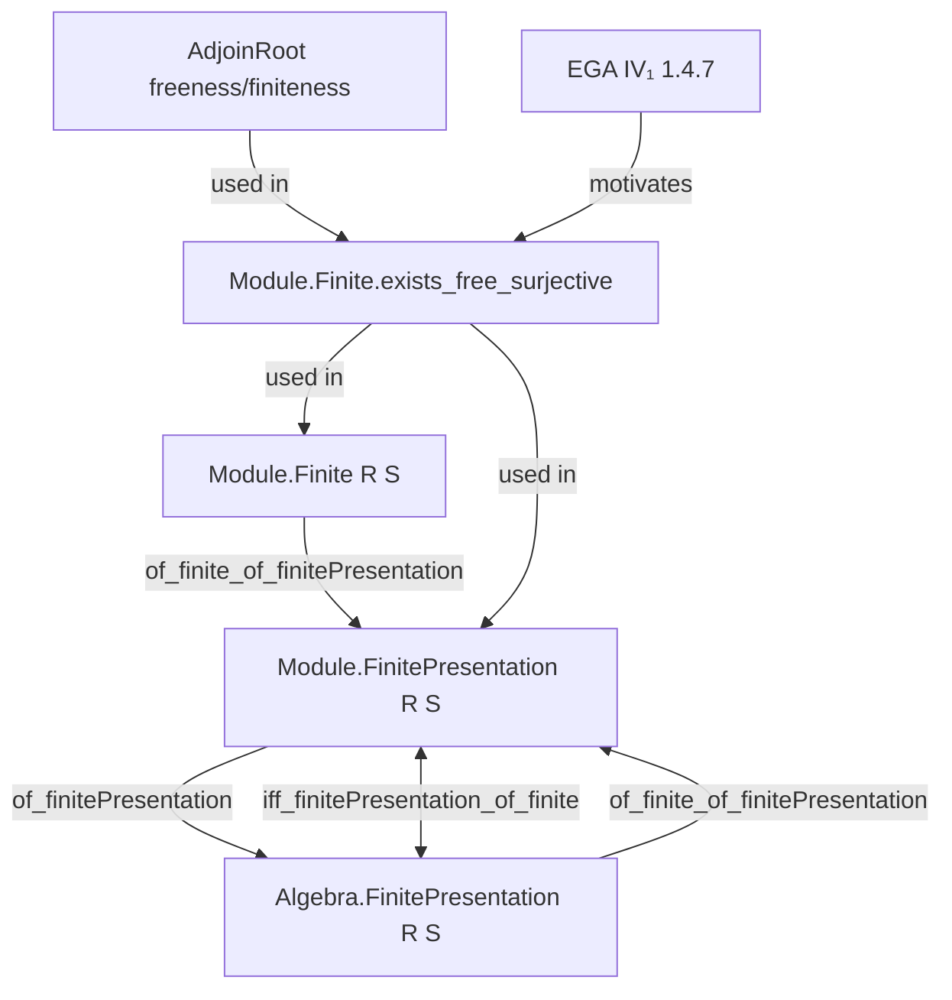
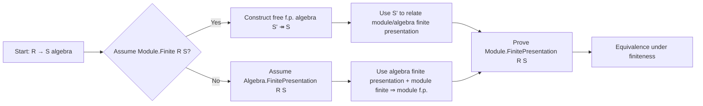

**Technical Brief: `ModuleFinitePresentation.lean`**

---

### 1. KEY DEFINITIONS & THEOREMS

| Name | Type / Signature | Purpose |
|------|------------------|---------|
| `Module.Finite.exists_free_surjective` | `[Module.Finite R S] → ∃ S', …, f : S' →ₐ[R] S, Function.Surjective f` | Constructs a *free*, *finitely presented* $R$-algebra $S'$ surjecting onto $S$ (EGA IV₁, 1.4.7.1). |
| `Algebra.FinitePresentation.of_finitePresentation` | `[Module.FinitePresentation R S] → Algebra.FinitePresentation R S` | Shows module finite presentation ⇒ algebra finite presentation. |
| `Module.FinitePresentation.of_finite_of_finitePresentation` | `[Module.Finite R S] → [Algebra.FinitePresentation R S] → Module.FinitePresentation R S` | Converse: finite module + algebra finite presentation ⇒ module finite presentation. |
| `Module.FinitePresentation.iff_finitePresentation_of_finite` | `[Module.Finite R S] → (Module.FinitePresentation R S ↔ Algebra.FinitePresentation R S)` | Equivalence under finiteness assumption. |

All lemmas assume `R`, `S` commutative rings with `S` an `R`-algebra.

---

### 2. NAMING CONVENTIONS

- **Prefixes**:
  - `of_`: indicates implication *from* a stronger hypothesis to a weaker conclusion (e.g., `of_finitePresentation`).
  - `iff_`: for biconditional statements.
- **Suffixes**:
  - `_of_finite`: indicates use of module finiteness.
  - `_of_surjective`: used when surjectivity of an algebra map is key.
- **General pattern**: `Type.class.of_conditions` (e.g., `Module.FinitePresentation.of_finite_of_finitePresentation`).

---

### 3. TACTIC STACK

| Tactic | Frequency | Role |
|--------|-----------|------|
| `obtain` / `rcases` | High | Extract existential witnesses (e.g., finite generating sets, surjections). |
| `induction` | Medium | Structural induction on finite sets (via `Finset.induction`). |
| `simp` / `simp only` | High | Simplify algebraic expressions, especially involving `AlgHom`, `restrictScalars`, `AdjoinRoot`. |
| `refine` | Medium | Partial proof construction, filling in holes (`?_`). |
| `rw` / `rwa` | Medium | Rewrite using lemmas like `top_le_iff`, `range_eq_top`. |
| `algebraize` | Low | Custom tactic (likely user-defined) to transfer algebra structures. |
| `apply`, `exact` | Medium | Apply known lemmas or hypotheses. |
| `classical` | Medium | Enable classical choice for existential eliminations. |

---

### 4. PROOF LOGIC

- **Inductive construction** for `exists_free_surjective`:
  - Build $S'$ as iterated adjunction of roots of minimal polynomials over a free algebra.
  - Base case: $S' = R$.
  - Inductive step: adjoin a root of the minimal polynomial of a new generator $a$, using integrality and properties of `AdjoinRoot`.
- **Main implications**:
  - *Module ⇒ Algebra*: Use `exists_free_surjective` to get a surjection $S' \twoheadrightarrow S$ with $S'$ free & f.p. as algebra; then show $\ker f$ is finitely generated as an $R$-module ⇒ f.g. as ideal in $S'$.
  - *Algebra + Finite ⇒ Module*: Factor $R \to R' \to S$, where $R'$ is free f.p. over $R$, $S$ is f.p. over $R'$ (via surjection), and use transitivity of finite presentation and scalar tower properties.
- **Key logical flow**:
  1. Reduce to surjective algebra maps from free f.p. algebras.
  2. Use module-theoretic properties (f.g. kernel, projectivity, transitivity).
  3. Leverage `AdjoinRoot` constructions for integrality and freeness.

---

### 5. IMPORTS & DEPENDENCIES

| Import | Role |
|--------|------|
| `Mathlib.Algebra.Module.FinitePresentation` | Core definitions: `Module.FinitePresentation`, `Algebra.FinitePresentation`, `fg_ker`, etc. |
| `Mathlib.RingTheory.AdjoinRoot` | Construction of $R[a^{1/n}]$, minimal polynomials, freeness/finiteness of `AdjoinRoot`. |
| `Mathlib.Algebra.Module.Basic`, `Mathlib.Algebra.Algebra`, `Mathlib.RingTheory.IsScalarTower` | Implicit via `algebra`, `algebraMap`, `IsScalarTower`, etc. |

---

### 6. MERMAID DIAGRAMS

#### Dependency Graph (Theoretical)

#### File Overview Flow

---

### 7. CONTEXTUAL NOTES

- This file formalizes a classical result in commutative algebra: for a finite algebra $S/R$, being finitely presented as a module is equivalent to being finitely presented as an algebra.
- The proof relies heavily on *integral extensions* and *adjunction of roots*, leveraging that minimal polynomials of integral elements are monic, hence their adjunction yields free & finite modules.
- The `algebraize` tactic (likely from the same project) is used to transfer algebra structures along ring isomorphisms.

--- 

Let me know if you'd like the dependency graph for `AdjoinRoot` or `FinitePresentation` in Mathlib expanded.
