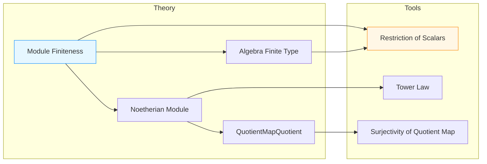

**Technical Brief: `Quotient.lean` (Mathlib Module Finiteness Results)**

---

### 1. **Key Definitions & Theorems**

| Name | Type / Statement | Purpose |
|------|------------------|---------|
| `module_finite_of_liesOver` | `[Module.Finite A B] → Module.Finite (A ⧸ p) (B ⧸ P)` | Shows that if $B$ is a finite $A$-module and $P \subseteq B$ lies over $p \subseteq A$, then the quotient $B/P$ is a finite module over $A/p$. |
| `algebra_finiteType_of_liesOver` | `[Algebra.FiniteType A B] → Algebra.FiniteType (A ⧸ p) (B ⧸ P)` | Proves finite type (finitely generated algebra) descends to quotients under lying-over condition. |
| `isNoetherian_of_liesOver` | `[IsNoetherian A B] → IsNoetherian (A ⧸ p) (B ⧸ P)` | Establishes Noetherian property descends to quotients. |
| `QuotientMapQuotient.isNoetherian` | `[IsNoetherian A B] → IsNoetherian (A ⧸ p) (B ⧸ p.map (algebraMap A B))` | Special case where $P = pB$ (extension of $p$), using surjectivity of structure maps. |
| `example` | `[Module.Finite A B] → Module.Finite (A ⧸ P.under A) (B ⧸ P)` | Instantiates the main theorem using `P.under A` (contraction of $P$ to $A$). |

---

### 2. **Naming Conventions**

- **Prefixes**:
  - `module_finite_of_`, `algebra_finiteType_of_`, `isNoetherian_of_`: indicate descent of finiteness properties along quotient maps.
  - `under`: used in `P.under A` (contraction of ideal $P$ along algebra map $A \to B$).
- **Suffixes**:
  - `_of_liesOver`: condition that $P$ lies over $p$ (`[P.LiesOver p]`).
  - `_of_restrictScalars_finite[_Type]`: uses restriction of scalars to transfer finiteness.
  - `_of_tower`: uses transitivity of module/algebra structure in towers.

---

### 3. **Tactic Stack**

- `Module.Finite.of_restrictScalars_finite`
- `Algebra.FiniteType.of_restrictScalars_finiteType`
- `isNoetherian_of_tower`
- `isNoetherian_of_surjective`
- `LinearMap.range_eq_top.mpr`
- `Ideal.Quotient.mk_surjective`
- `inferInstance`

No heavy automation (e.g., `aesop`, `ring`, `simp_rw`) appears—proofs rely on structured lemmas from `Mathlib`.

---

### 4. **Proof Logic**

- **Core Strategy**: Use *restriction of scalars* and *tower laws* to reduce statements about $B/P$ over $A/p$ to known properties of $B$ over $A$.
- **Typical Flow**:
  1. Assume $B$ finite/f.g. algebra/Noetherian over $A$.
  2. Use `P.LiesOver p` to ensure $p = P \cap A$, so $A/p \to B/P$ is well-defined.
  3. Apply `of_restrictScalars_*` lemmas, which rely on:
     - `restrictScalars` functor preserving finite generation / Noetherianess.
     - Tower law for modules/algebras: $B$ finite over $A$ ⇒ $B$ finite over $A/p$ via $A \to A/p \to B/P$.
  4. For `QuotientMapQuotient.isNoetherian`, use:
     - Surjectivity of $\mathrm{Quotient.mkₐ}$ to show $B \to B/pB$ is surjective.
     - `isNoetherian_of_surjective` to descend Noetherianess along surjections.

---

### 5. **Imports**

| Module | Role |
|--------|------|
| `Mathlib.Algebra.Group.Subgroup.Actions` | For group actions and orbit-stabilizer-like reasoning (possibly for liesOver context). |
| `Mathlib.RingTheory.FiniteType` | Defines `Algebra.FiniteType`, used in `algebra_finiteType_of_liesOver`. |
| `Mathlib.RingTheory.Ideal.Pointwise` | For ideal operations like extension/contraction (`map`, `under`). |
| `Mathlib.RingTheory.Ideal.Over` | Defines `LiesOver`, `under`, and related ideal-theoretic conditions. |

---

### 6. **Mermaid Diagrams**

#### **Dependency Graph (Theoretical Flow)**

```mermaid
graph TD
  A[CommRing A, B] --> B[Algebra A B]
  B --> C[Ideal P : B]
  B --> D[Ideal p : A]
  C --> E[P.LiesOver p]
  D --> E
  E --> F[Quotient Ring A/p]
  E --> G[Quotient Module B/P]
  F --> H[Module Structure on B/P]
  G --> H
  H --> I[Module.Finite (A/p) (B/P)]
  style I fill:#d4f7e2,stroke:#3a3
  style E fill:#ffe4b5,stroke:#d2691e
```

#### **Overview of File Structure**



---

### 7. **Mathematical Context**

- **Setting**: $A \to B$ is a ring homomorphism (commutative rings with 1), $P \subseteq B$ an ideal lying over $p = P \cap A \subseteq A$.
- **Goal**: Transfer finiteness conditions (finite module, finite type algebra, Noetherian) from $B$ over $A$ to $B/P$ over $A/p$.
- **Key Lemma Used**: If $R \to S$ is a ring map and $M$ is a finite $R$-module, then $M / IM$ is finite over $R/I$ for any ideal $I \subseteq R$ (here $I = p$, $M = B$).

---

### 8. **Summary**

This file formalizes standard commutative algebra results about how finiteness properties descend along quotient maps under the *lying-over* condition. It leverages Lean’s `restrictScalars` and tower laws to avoid repetitive proofs, and is foundational for dimension theory, going-down theorems, and Noether normalization in Mathlib.
