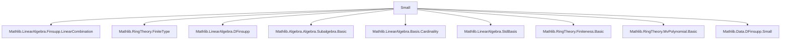
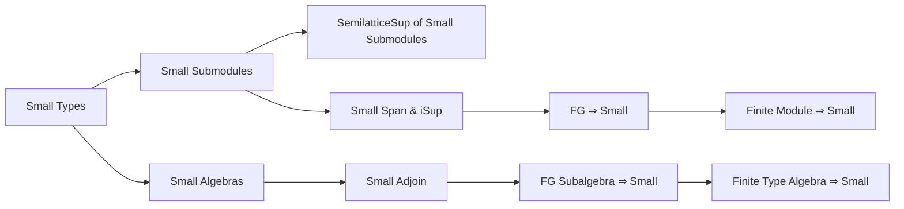
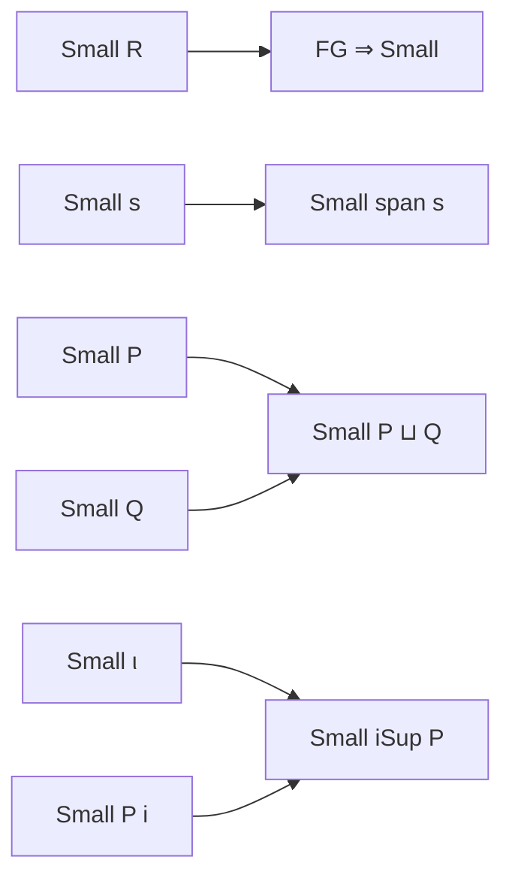
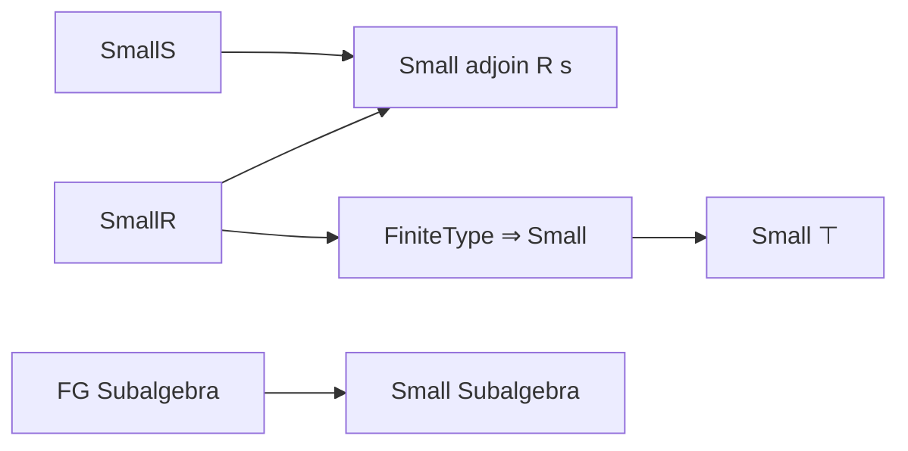

### Technical Brief: `Small.lean`

---

#### **1. Key Definitions & Theorems**

| Name | Type / Signature | Purpose |
|------|------------------|---------|
| `small_sup` | `Small P → Small Q → Small (P ⊔ Q)` | Shows that the supremum (join) of two small submodules is small. |
| `SemilatticeSup {P : Submodule R M // Small P}` | Instance | Constructs a semilattice sup structure on small submodules. |
| `small_iSup` | `[Small ι] → [∀ i, Small (P i)] → Small (iSup P)` | Shows that the indexed supremum of a family of small submodules indexed by a small type is small. |
| `FG.small` | `[Small R] → P.FG → Small P` | Finitely generated submodules over a small ring are small. |
| `Module.Finite.small` | `[Small R] → Module.Finite R M → Small M` | Finite modules over a small ring are small. |
| `small_span_singleton` | `[Small R] → Small (span {m})` | The span of a singleton is small. |
| `small_span` | `[Small R] → [Small s] → Small (span s)` | The span of a small set is small. |
| `small_adjoin` | `[Small R] → [Small s] → Small (adjoin R s)` | The subalgebra generated by a small subset is small. |
| `Subalgebra.FG.small` | `[Small R] → A.FG → Small A` | Finitely generated subalgebras over a small base are small. |
| `FiniteType.small` | `[Small R] → Algebra.FiniteType R S → Small S` | Finite type algebras over a small ring are small. |

---

#### **2. Naming Conventions**

- **Prefixes**:
  - `small_`: Indicates properties or constructions preserving smallness (e.g., `small_sup`, `small_iSup`, `small_span`).
  - `FG.`: Used for finitely generated objects (`FG.small`, `Subalgebra.FG.small`).
- **Suffixes**:
  - `_iff`: Not present here, but `small_univ_iff` is used in rewriting.
- **Structure**:
  - `instance` declarations often follow `small_*` pattern for closure properties.
  - Theorems like `small_span` use `small_` + `span` to denote preservation under span.

---

#### **3. Tactic Stack**

Frequently used tactics in proofs:

| Tactic | Usage |
|--------|-------|
| `rw` | Rewriting definitions (`sup_eq_range`, `iSup_eq_range_dfinsupp_lsum`, `fg_iff_exists_fin_generating_family`, `adjoin_eq_range`, `small_univ_iff`). |
| `apply` | Applying known instances or lemmas (`small_range`, `small_iSup`, `FG.small`). |
| `exact` | Closing goals with exact terms (e.g., `exact le_sup_left`). |
| `simp` / `simp_rw` | Simplifying using `Submodule.span_iUnion`, subtype lemmas. |
| `classical` | Used in `small_iSup` to enable classical choice for indexing. |
| `rwa` | Rewriting and applying assumptions (`rwa [← small_univ_iff]`). |
| `have` / `obtain` | Introducing intermediate facts or decomposing hypotheses. |

---

#### **4. Proof Logic**

- **General Strategy**:
  - **Rewrite definitions** to express constructions (e.g., `sup`, `iSup`, `span`, `adjoin`) as images/ranges of functions.
  - **Apply `small_range`** or `small_iSup` to deduce smallness from smallness of domain/indexing type and fibers.
  - **Leverage closure properties**:
    - Small types are closed under finite sums (`sup`), indexed sums (`iSup`), spans, and subalgebra generation.
    - Finitely generated objects over small rings are small (`FG.small`, `Subalgebra.FG.small`).
  - **Use subtype structure** to lift lattice operations to the subtype of small submodules.

- **Typical Flow**:
  1. Unfold definitions (e.g., `sup`, `iSup`, `span`, `adjoin`).
  2. Reduce to known smallness (e.g., finite type → finitely generated → small).
  3. Apply `small_range` or `small_iSup`.
  4. Use subtype lemmas (`Subtype.coe_le_coe`) to reason about the ordered subtype.

---

#### **5. Imports**

| Module | Purpose |
|--------|---------|
| `Mathlib.LinearAlgebra.Finsupp.LinearCombination` | Linear combinations and finite support functions. |
| `Mathlib.RingTheory.FiniteType` | Finite type algebras and related notions. |
| `Mathlib.LinearAlgebra.DFinsupp` | Dependent finite support functions, used for `iSup`. |
| `Mathlib.Algebra.Algebra.Subalgebra.Basic` | Subalgebras, `adjoin`, finite generation. |
| `Mathlib.LinearAlgebra.Basis.Cardinality` | Cardinality of bases, used in smallness arguments. |
| `Mathlib.LinearAlgebra.StdBasis` | Standard basis vectors, often used in finite generation. |
| `Mathlib.RingTheory.Finiteness.Basic` | FG, finite, etc., definitions and basic facts. |
| `Mathlib.RingTheory.MvPolynomial.Basic` | Multivariate polynomials (used in `Algebra` namespace via `MvPolynomial`). |
| `Mathlib.Data.DFinsupp.Small` | Smallness of `dfinsupp` types, foundational for `small_iSup`. |

---

#### **6. Mermaid Diagrams**

##### **Dependency Graph (Module-Level)**

##### **Overview of Theory Flow**

##### **Submodule Smallness Closure**

##### **Algebra Smallness Closure**

---

#### **7. Summary**

This file formalizes **smallness** (a cardinality condition weaker than finiteness) for submodules and subalgebras. It establishes closure properties under:
- Suprema (`⊔`, `iSup`)
- Spans of small sets
- Adjoin operations
- Finitely generated and finite type constructions

The proofs rely heavily on rewriting constructions as ranges or images, then applying `small_range` and `small_iSup`. The structure supports reasoning about "small" algebraic objects in a way compatible with dependent type theory and cardinality constraints in Lean.

--- 

Let me know if you'd like a formalization of the `small` predicate’s universal property or a comparison with other size conditions (e.g., `fintype`, `encodable`).
