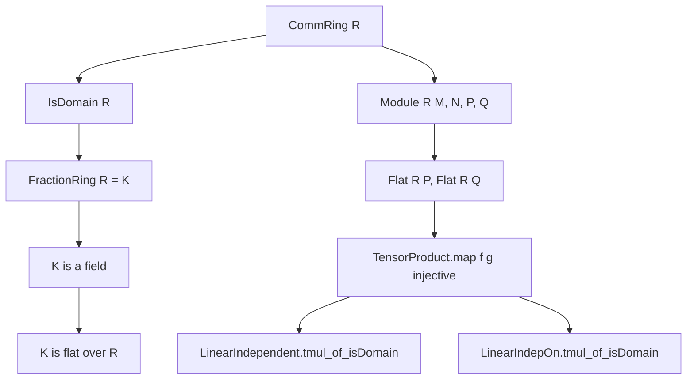
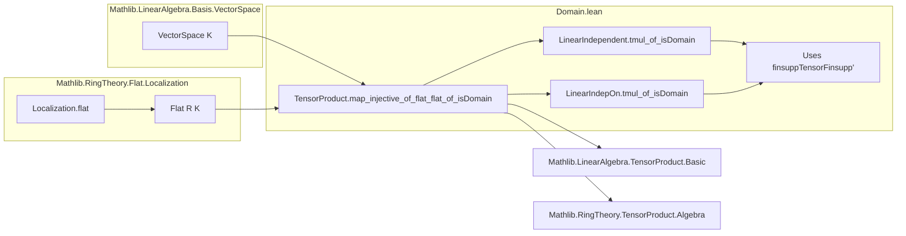

**Technical Brief: `Domain.lean` — Tensor Products over Integral Domains**

---

### 1. **Key Definitions & Theorems**

| Name | Type / Signature | Purpose |
|------|------------------|---------|
| `TensorProduct.map_injective_of_flat_flat_of_isDomain` | `(f : P →ₗ[R] M) (g : Q →ₗ[R] N) [Flat R P] [Flat R Q] → Injective f → Injective g → Injective (TensorProduct.map f g)` | Shows that the tensor product of two injective linear maps is injective over an integral domain, assuming both source modules are flat. |
| `LinearIndependent.tmul_of_isDomain` | `(hv : LinearIndependent R v) (hw : LinearIndependent R w) → LinearIndependent R (λ i ↦ v i.1 ⊗ₜ w i.2)` | Tensor product of linearly independent families remains linearly independent over domains. |
| `LinearIndepOn.tmul_of_isDomain` | `(hv : LinearIndepOn R v s) (hw : LinearIndepOn R w t) → LinearIndepOn R (λ i ↦ v i.1 ⊗ₜ w i.2) (s ×ˢ t)` | Localized version: tensor product preserves linear independence on subsets over domains. |

**Auxiliary lemmas used in proofs** (not top-level exports but critical):
- `TensorProduct.map_injective_of_flat_flat` — injectivity of tensor map under flatness *without* domain assumption.
- `Module.Flat.lTensor_preserves_injective_linearMap` — left tensoring with a flat module preserves injectivity.
- `Module.Flat.rTensor_preserves_injective_linearMap` — right tensoring with a flat module preserves injectivity.
- `AlgebraTensorModule.cancelBaseChange`, `assoc`, `lid` — structural isomorphisms for base change and associativity of tensor products over algebras.
- `FaithfulSMul.algebraMap_injective` — injectivity of the structure map $ R \to K $ when $ R $ is a domain and $ K = \mathrm{Frac}(R) $.

---

### 2. **Naming Conventions**

- **Prefixes**:
  - `map_`: for tensor product of linear maps (`TensorProduct.map`).
  - `lTensor_`, `rTensor_`: left/right tensoring functors.
  - `baseChange_`: extension of scalars along algebra maps.
  - `assoc_`, `cancelBaseChange_`: structural isomorphisms in tensor calculus.
  - `tmul_`: tensor product of families (e.g., `tmul_of_isDomain`, `tmul_of_flat_left`).
- **Suffixes**:
  - `_of_flat_flat`: conditions on source modules (both flat).
  - `_of_isDomain`: domain-specific variant (uses `FractionRing`).
  - `_of_flat_left`: one-side flatness suffices (in other files).
- **Variable naming**:
  - `f`, `g`: linear maps.
  - `v`, `w`: families (functions from index types to modules).
  - `s`, `t`: subsets of index sets.

---

### 3. **Tactic Stack**

| Tactic | Usage Frequency | Role |
|--------|-----------------|------|
| `convert` | High | Matches goal up to propositional equality via transitivity of injective maps. |
| `dsimp`, `simp` | Medium | Simplifies expressions involving tensor products, algebra maps, and `tmul`. |
| `ext` | Medium | Extensionality for functions/families. |
| `rw` | Medium | Rewriting using lemmas like `LinearEquiv.coe_toLinearMap`, `LinearMap.coe_comp`. |
| `change` | Low | Explicitly rewrites target to match known structure. |
| `refine` | High | Constructs proof by filling holes (e.g., `?_`). |
| `congr!` | Medium | Auto-simplifies congruence goals. |

> Note: `simp` is avoided in final step due to timeout; instead, `change` + `simp only` is used for targeted simplification.

---

### 4. **Proof Logic**

**General Strategy**:
1. **Reduction to field of fractions**: Extend scalars to $ K = \mathrm{Frac}(R) $, where modules become vector spaces (hence flat), and use known results over fields.
2. **Factorization via isomorphisms**: Decompose the tensor map over $ R $ into a composite of maps:
   - Base change to $ K $,
   - Tensor product over $ K $,
   - Associativity and cancellation isomorphisms,
   - Faithful scalar multiplication.
3. **Injectivity propagation**: Use that injectivity is preserved under composition and pre/post-composition with isomorphisms.
4. **Linear independence**: Reduce to injectivity of the tensor map on finitely supported functions (`finsuppTensorFinsupp'`), then apply the main lemma.

**Typical proof skeleton**:
```lean
refine .of_comp (f := ...) ?_
have H₁ := ...
have H₂ := ...
...
convert Hₙ.comp ...; dsimp; ext; simp only [...]
```

---

### 5. **Imports**

| Import | Purpose |
|--------|---------|
| `Mathlib.LinearAlgebra.Basis.VectorSpace` | Provides basis and vector space theory (used implicitly via `FractionRing` as field). |
| `Mathlib.RingTheory.Flat.Localization` | Supplies flatness results for localization, especially `FractionRing` over domains. |

> Core dependencies: `CommRing`, `IsDomain`, `Module`, `TensorProduct`, `FractionRing`, `Flat`, `AlgebraTensorModule`.

---

### 6. **Mermaid Diagrams**

#### **Dependency Graph (Theoretical)**



#### **File Overview & Theory Flow**



---

### 7. **Summary**

This file establishes foundational properties of tensor products over integral domains, especially how flatness and injectivity interact. It leverages the fact that localization at the fraction field turns modules into vector spaces, where tensor behavior is well-understood. The results are domain-specific refinements of more general flatness-based theorems (e.g., `TensorProduct.map_injective_of_flat_flat`), and they enable linear independence preservation under tensoring — a key tool in algebraic geometry and module theory.

Let me know if you'd like a formalized dependency graph (e.g., for `leanproject`), or a comparison with the non-domain version (`TensorProduct.map_injective_of_flat_flat`).
