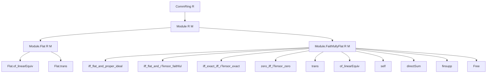
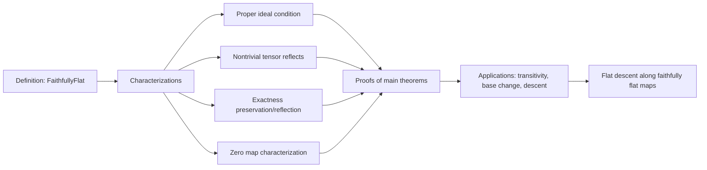

### Technical Brief: Faithfully Flat Modules in Lean 4 (Basic.lean)

---

#### **1. Key Definitions & Theorems**

| Name | Type / Signature | Purpose |
|------|------------------|---------|
| `FaithfullyFlat` | `class FaithfullyFlat : Prop extends Module.Flat R M` | Predicate asserting that an $R$-module $M$ is flat and satisfies $I \cdot M \ne M$ for all maximal ideals $I \subset R$. |
| `iff_flat_and_proper_ideal` | `FaithfullyFlat R M ↔ Flat R M ∧ ∀ I : Ideal R, I ≠ ⊤ → I • ⊤ ≠ ⊤` | Equivalence between faithful flatness and flatness + proper ideal condition. |
| `iff_flat_and_rTensor_faithful` | `FaithfullyFlat R M ↔ Flat R M ∧ ∀ N, Nontrivial N → Nontrivial (N ⊗[R] M)` | Faithful flatness ⇔ flat + tensoring with $M$ reflects nontriviality (right tensor). |
| `iff_flat_and_lTensor_faithful` | `FaithfullyFlat R M ↔ Flat R M ∧ ∀ N, Nontrivial N → Nontrivial (M ⊗[R] N)` | Same as above but for left tensor. |
| `iff_exact_iff_rTensor_exact` | `FaithfullyFlat R M ↔ ∀ l₁₂, l₂₃, Exact l₁₂ l₂₃ ↔ Exact (l₁₂ ⊗ M) (l₂₃ ⊗ M)` | Faithful flatness ⇔ tensoring with $M$ preserves *and reflects* exactness of sequences. |
| `zero_iff_lTensor_zero` | `f = 0 ↔ f.lTensor M = 0` | Characterization via zero maps: $f = 0$ iff $1 \otimes f = 0$. |
| `one_tmul_eq_zero_iff` | `(1 : A) ⊗ₜ m = 0 ↔ m = 0` | For faithfully flat algebra $A$, $1 \otimes m = 0$ iff $m = 0$. |
| `trans` | `[FaithfullyFlat R S] → [FaithfullyFlat S M] → FaithfullyFlat R M` | Transitivity of faithful flatness along scalar towers. |
| `self` | `FaithfullyFlat R R` | The ring $R$ is faithfully flat over itself. |
| `of_linearEquiv` | `N ≃ₗ[R] M → FaithfullyFlat R M → FaithfullyFlat R N` | Faithful flatness descends along linear equivalences. |
| `directSum` | `[∀ i, FaithfullyFlat R (M i)] → FaithfullyFlat R (⨁ i, M i)` | Arbitrary direct sums of faithfully flat modules are faithfully flat. |
| `finsupp`, `Free` | `[Nontrivial M] → Module.Free R M → FaithfullyFlat R M` | Free modules over nontrivial types are faithfully flat. |

---

#### **2. Naming Conventions**

- **Predicates / Classes**:
  - `FaithfullyFlat`: main predicate.
  - `Flat`: inherited from `Module.Flat`.
- ** Lemmas / Theorems**:
  - `iff_*`: characterizations as biconditionals.
  - `*_rTensor_*`: statements involving right tensor $- \otimes M$.
  - `*_lTensor_*`: statements involving left tensor $M \otimes -$.
  - `*_zero_iff_*`: characterizations in terms of zero maps.
  - `*_reflects_*`: reflection properties (e.g., `rTensor_reflects_triviality`).
  - `*_preserves_*`: preservation properties (used in `Flat` module).
  - `trans`, `of_linearEquiv`, `self`, `directSum`, `finsupp`, `Free`: structural lemmas.
- **Variables**:
  - `R`, `M`, `N`, `S`: standard module/algebra names.
  - `l12`, `l23`: linear maps in exact sequences.
  - `I`, `m`: ideals (often maximal).

---

#### **3. Tactic Stack**

Frequently used tactics in proofs:

| Tactic | Usage |
|--------|-------|
| `rw [faithfullyFlat_iff]` | Rewriting definition via `mk_iff`. |
| `simp`, `simp only [...]` | Simplifying goals using lemmas like `subsingleton_tensorProduct_iff_right`. |
| `exact`, `refine`, `obtain`, `rcases` | Constructing proofs and decomposing hypotheses. |
| `contrapose!`, `by_contra!` | Negating goals for contradiction-based arguments. |
| `ext`, `funext` | Extensionality for functions/maps. |
| `induction ... using TensorProduct.induction_on` | Structural induction on tensor products. |
| `aesop`, `tauto`, `linarith` | Automated reasoning for simple logical steps. |
| `convert`, `congr` | Congruence reasoning for equality of maps/tensors. |
| `apply_fun`, `apply_fun ... using LinearEquiv.injective _` | Applying functions to equalities, using injectivity. |
| `ring`, `ring1` | Simplifying ring expressions (e.g., in `self` proof). |
| `rw [← Submodule.Quotient.subsingleton_iff]` | Rewriting using quotient subsingleton characterizations. |

---

#### **4. Proof Logic**

The logical flow across most proofs follows this pattern:

1. **Reduction via characterizations**:
   - Use `iff_flat_and_proper_ideal`, `iff_flat_and_rTensor_faithful`, etc., to reduce to simpler conditions.
2. **Induction / structural decomposition**:
   - For tensor product arguments: use `TensorProduct.induction_on` to reduce to simple tensors.
3. **Exact sequence analysis**:
   - For exactness results: show inclusion `range ≤ ker`, then analyze cohomology $H = \ker / \operatorname{range}$.
   - Show $H \otimes M = 0 \Rightarrow H = 0$ using faithful flatness.
4. **Contrapositive / contradiction**:
   - Assume $f \ne 0$ or $N \ne 0$, derive contradiction via tensor nontriviality or nonvanishing of $I \cdot M$.
5. **Equivalence chaining**:
   - Use `iff_of_eq`, `and_congr_right_iff`, `forall_congr`, etc., to transform biconditionals.
6. **Tensor isomorphisms**:
   - Use `TensorProduct.comm`, `TensorProduct.assoc`, `quotTensorEquivQuotSMul`, `AlgebraTensorModule.*` to rearrange tensors.

---

#### **5. Imports**

| Import | Purpose |
|--------|---------|
| `Mathlib.LinearAlgebra.TensorProduct.Quotient` | Tensor products, quotient modules, universal properties. |
| `Mathlib.RingTheory.Flat.Stability` | Flatness properties, stability under various constructions. |

---

#### **6. Mermaid Diagrams**

##### **Dependency Graph (High-Level)**

##### **Overview of Theory Flow**

---

#### **7. Summary**

This file formalizes the theory of *faithfully flat modules* over commutative rings in Lean 4. It provides multiple equivalent characterizations—via ideals, tensor nontriviality, exactness, and zero maps—and establishes key structural properties: stability under linear equivalences, direct sums, free modules, and transitivity along scalar towers. It also proves *descent of flatness* along faithfully flat ring maps, a foundational result in descent theory.

The formalization is highly modular, leveraging existing `Flat` theory and tensor product machinery, with proofs relying on structural induction, quotient constructions, and tensor isomorphisms.
