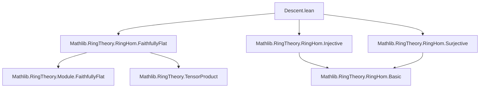

**Technical Brief: `Descent.lean` — Faithfully Flat Descent for Ring Homomorphism Properties**

---

### 1. **Key Definitions & Theorems**

| Name | Type / Signature | Purpose |
|------|------------------|---------|
| `algebraMap R T` | `R →ₐ[R] T` | The structure map of the `R`-algebra `T`. |
| `S ⊗[R] T` | `TensorProduct R S T` | Base change (extension of scalars) of `S` along `R → T`. |
| `Module.FaithfullyFlat R S` | `Prop` | `S` is a *faithfully flat* `R`-module (i.e., the functor `- ⊗[R] S` is conservative and exact). |
| `CodescendsAlong P FaithfullyFlat` | `Prop` | Property `P` *descends* along faithfully flat maps: if `f : R → S` is faithfully flat and `fₐ : S → S ⊗[R] T` has `P`, then `R → T` has `P`. |

#### Theorems

| Name | Type | Purpose |
|------|------|---------|
| `injective_of_tensorProduct` | `[FaithfullyFlat R S] → (inj. of `S → S ⊗[R] T`) ⇒ (inj. of `R → T`)` | Shows injectivity descends along faithfully flat maps. |
| `surjective_of_tensorProduct` | `[FaithfullyFlat R S] → (surj. of `S → S ⊗[R] T`) ⇒ (surj. of `R → T`)` | Shows surjectivity descends along faithfully flat maps. |
| `bijective_of_tensorProduct` | `[FaithfullyFlat R S] → (bij. of `S → S ⊗[R] T`) ⇒ (bij. of `R → T`)` | Combines the above for bijectivity. |
| `codescendsAlong_injective` | `CodescendsAlong (fun f ↦ Function.Injective f) FaithfullyFlat` | Formalizes injectivity as a property descending along faithfully flat maps. |
| `codescendsAlong_surjective` | `CodescendsAlong (fun f ↦ Function.Surjective f) FaithfullyFlat` | Formalizes surjectivity descent. |
| `codescendsAlong_bijective` | `CodescendsAlong (fun f ↦ Function.Bijective f) FaithfullyFlat` | Formalizes bijectivity descent (as conjunction of the above). |

---

### 2. **Naming Conventions**

- **Prefixes**:
  - `injective_of_`, `surjective_of_`, `bijective_of_`: Construct global property from base-changed version.
  - `codescendsAlong_`: Declare descent of a property along a class of morphisms (`FaithfullyFlat`).
- **Suffixes**:
  - `_of_tensorProduct`: Emphasizes that the hypothesis is about the *tensor product* map.
- **Helper lemmas**:
  - `algebraMap`: Standard notation for structure maps of algebras.
  - `algebraTensorModule.rid`: Right unitor for tensor product of modules over commutative rings.

---

### 3. **Tactic Stack**

| Tactic | Usage |
|--------|-------|
| `ext` | To prove extensionality of linear maps (e.g., in `lTensor` equality). |
| `simp` / `simpa` | Simplify using algebra/tensor product identities; `simpa [h] using H` rewrites `h` and applies `H`. |
| `apply ... mp` | Apply equivalence `↔` in forward direction (`mp`). |
| `rw [faithfullyFlat_algebraMap_iff]` | Rewrites hypothesis using characterization of faithfully flat algebra maps. |
| `⟨... , ...⟩` | Construct conjunctions (e.g., bijectivity as pair of injectivity + surjectivity). |
| `introv h H` | Intro + variable naming in `CodescendsAlong` proofs. |
| `exact h.injective_of_tensorProduct H` | Apply previously proven descent lemma. |

---

### 4. **Proof Logic**

- **Core idea**: Use the equivalence  
  $$
  \text{LinearMap.lTensor}_S(f) = g \circ \text{rid} \quad \Rightarrow \quad f \text{ has property } P \iff \text{lTensor}_S(f) \text{ has } P,
  $$
  where `P ∈ {injective, surjective}` and `g = algebraMap S (S ⊗[R] T)`.

- **Proof pattern**:
  1. Show that the tensor product map `S → S ⊗[R] T` is equal (up to the right unitor) to `lTensor S (R → T)`.
  2. Apply the *faithful flatness* criterion:  
     - `lTensor_injective_iff_injective` / `lTensor_surjective_iff_surjective`.
  3. Conclude descent via `mp` of the equivalence.

- **For `CodescendsAlong` lemmas**:
  - Use `CodescendsAlong.mk` with:
    - Proof that property `P` is stable under isomorphism (`P_respectsIso`).
    - Application of the above descent lemmas using `faithfullyFlat_algebraMap_iff`.

---

### 5. **Imports & Dependencies**

| Import | Purpose |
|--------|---------|
| `Mathlib.RingTheory.RingHom.FaithfullyFlat` | Defines `FaithfullyFlat`, `CodescendsAlong`, and key equivalences like `faithfullyFlat_algebraMap_iff`. |
| `Mathlib.RingTheory.RingHom.Injective` | Provides `injective_respectsIso`. |
| `Mathlib.RingTheory.RingHom.Surjective` | Provides `surjective_respectsIso`. |
| `TensorProduct` (via `open TensorProduct`) | Provides `⊗[R]`, `lTensor`, `rid`, etc. |

---

### 6. **Mermaid Diagrams**

#### **Dependency Graph (Module Level)**



#### **Overview of Theory Flow**

```mermaid
flowchart LR
  subgraph Setup
    R[CommRing R] -->|algebra| S[CommRing S]
    R -->|algebra| T[CommRing T]
    S -->|algebraMap| S⊗T[S ⊗[R] T]
  end

  subgraph Descent Lemmas
    injL[injective_of_tensorProduct]
    surjL[surjective_of_tensorProduct]
    bijL[bijective_of_tensorProduct]
  end

  subgraph Codescending
    codescendInj[codescendsAlong_injective]
    codescendSurj[codescendsAlong_surjective]
    codescendBij[codescendsAlong_bijective]
  end

  Setup -->|Hypothesis| DescentLemmas
  DescentLemmas -->|apply| Codescending
```

---

### 7. **Summary**

This file formalizes the *descent* of injectivity, surjectivity, and bijectivity of ring homomorphisms along **faithfully flat** maps. It leverages:
- The equivalence between descent of module maps and their tensor extensions,
- The characterization of faithfully flat algebra maps (`faithfullyFlat_algebraMap_iff`),
- And the categorical notion of `CodescendsAlong` to package descent as a reusable property.

The structure is clean and modular: first prove descent at the level of maps, then lift to the `CodescendsAlong` abstraction.

--- 

Let me know if you'd like a formalized summary in `lean` docstring format or a visualization of the proof term structure.
