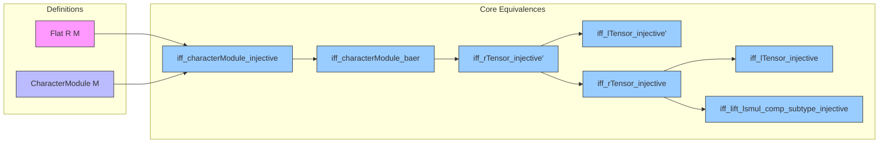

**Technical Brief: `Tensor.lean` — Flat Modules in Lean 4**

---

### 1. **Key Definitions & Theorems**

| Name | Type / Signature | Purpose |
|------|------------------|---------|
| `Flat R M` | `Prop` | `M` is a flat $R$-module: the functor $-\otimes_R M$ preserves finite limits (equivalently, monomorphisms). |
| `CharacterModule M` | `Type v` | Defined as `M →+ ℚ ⧸ ℤ`, the Pontryagin dual (additive group homs to $\mathbb{Q}/\mathbb{Z}$). |
| `injective_characterModule_iff_rTensor_preserves_injective_linearMap` | `↔` | Relates injectivity of `CharacterModule M` to preservation of injectivity under $-\otimes M$. |
| `iff_characterModule_injective` | `Flat R M ↔ Module.Injective R (CharacterModule M)` | Central equivalence: $M$ flat ⇔ its character module is injective (Lambek 1964). |
| `iff_characterModule_baer` | `Flat R M ↔ Baer R (CharacterModule M)` | Connects flatness of $M$ to Baer injectivity of its character module. |
| `iff_rTensor_injective'` | `Flat R M ↔ ∀ I : Ideal R, Function.Injective (rTensor M I.subtype)` | Flatness ⇔ tensoring the inclusion $I \hookrightarrow R$ with $M$ remains injective for *all* ideals $I$. |
| `iff_lTensor_injective'` | `Flat R M ↔ ∀ I : Ideal R, Function.Injective (lTensor M I.subtype)` | Left-tensor variant of above. |
| `iff_rTensor_injective` | `Flat R M ↔ ∀ ⦃I : Ideal R⦄, I.FG → Function.Injective (I.subtype.rTensor M)` | Flatness ⇔ tensoring with $M$ preserves injectivity for *finitely generated* ideals $I$. |
| `iff_lTensor_injective` | `Flat R M ↔ ∀ ⦃I : Ideal R⦄, I.FG → Function.Injective (I.subtype.lTensor M)` | Left-tensor variant for fg ideals. |
| `iff_lift_lsmul_comp_subtype_injective` | `Flat R M ↔ ∀ ⦃I : Ideal R⦄, I.FG → Function.Injective (TensorProduct.lift ((lsmul R M).comp I.subtype))` | Flatness ⇔ canonical map $I \otimes M \to M$ is injective for fg ideals. |

---

### 2. **Naming Conventions**

- **Prefixes**:
  - `iff_`: Logical equivalences (`↔`) — e.g., `iff_rTensor_injective`.
  - `injective_`, `baer_`: Properties of modules (injectivity, Baer criterion).
  - `rTensor_`, `lTensor_`: Right/left tensor variants.
  - `characterModule_`: Relating to the character module.

- **Suffixes**:
  - `'` (prime): Often denotes a stronger or more general version (e.g., `iff_rTensor_injective'` for *all* ideals vs `iff_rTensor_injective` for fg ideals).
  - `comp`: Composition-related maps (e.g., `lcomp`, `rTensor_comp`).
  - `subtype`: Refers to inclusion maps of submodules/ideals.

- **Operators**:
  - `rTensor M f`: Right tensor $f \otimes \mathrm{id}_M$
  - `lTensor M f`: Left tensor $\mathrm{id}_M \otimes f$
  - `lift (g)`: Universal property lift for tensor product.

---

### 3. **Tactic Stack**

- `rw`: Rewriting using equivalences and definitions.
- `simp_rw`: Simplify + rewrite (used heavily for unfolding definitions like `rTensor_injective_iff_lcomp_surjective`).
- `simp [← ...]`: Simplify with reversed lemmas (e.g., `comm_comp_rTensor_comp_comm_eq`).
- `exact`, `refine`, `apply`: For constructing proofs via known lemmas.
- `obtain ⟨...⟩`: Destruct existential/universal quantifiers and structure.
- `convert`, `congr`: For congruence reasoning (e.g., `Baer.congr`).
- ` rfl`: Reflexivity for definitional equalities.

No heavy automation (e.g., `aesop`, `linarith`) is used — proofs are mostly structural and rely on module/tensor categorical lemmas.

---

### 4. **Proof Logic**

- **Structure**: Most proofs follow a pattern:
  1. **Unfold definitions** (`Flat`, `Injective`, `Baer`, `CharacterModule`) via `simp_rw`.
  2. **Reduce to known criteria** (e.g., Baer’s criterion, injectivity via Hom).
  3. **Apply equivalences** (e.g., `iff_characterModule_injective`, `rTensor_injective_iff_lcomp_surjective`).
  4. **Use categorical properties** of tensor product: naturality, commutativity of $lTensor$/$rTensor$, universal property (`lift`).
  5. **Handle fg ideals** via `Submodule.exists_fg_le_eq_rTensor_inclusion`, a key lemma for reducing to finitely generated case.

- **Induction**: Not used directly; instead, structural module theory (e.g., existence of fg subideals containing a given element) is used.

- **Key logical flow**:
  ```
  Flat R M
    ↔ CharacterModule M injective      (iff_characterModule_injective)
    ↔ CharacterModule M Baer           (Baer ↔ injective for small modules)
    ↔ ∀ I, rTensor M I.subtype mono    (Baer criterion + lcomp-surj ↔ rTensor-inj)
    ↔ ∀ fg I, rTensor M I.subtype mono (via fg approximation)
  ```

---

### 5. **Imports**

| Import | Purpose |
|--------|---------|
| `Mathlib.Algebra.Module.CharacterModule` | Defines `CharacterModule M = M →+ ℚ/ℤ`, dual module theory, injectivity criteria. |
| `Mathlib.RingTheory.Flat.Basic` | Core flat module theory: definitions, basic properties, tensor product behavior. |

> Note: `Small.{v} R` is used to ensure set-theoretic size conditions for injectivity/Baer criteria.

---

### 6. **Mermaid Diagrams**

#### **Dependency Graph (Theoretical)**

```mermaid
graph TD
  A[Flat R M] --> B[CharacterModule M injective]
  B --> C[Baer R (CharacterModule M)]
  C --> D[∀ I, rTensor M I.subtype mono]
  D --> E[∀ fg I, rTensor M I.subtype mono]
  E --> A
  style A fill:#f9f,stroke:#333
  style B fill:#bbf,stroke:#333
  style C fill:#bfb,stroke:#333
  style D fill:#fcc,stroke:#333
  style E fill:#cfc,stroke:#333
```

#### **Overview of File Structure**



---

### 7. **Summary**

This file formalizes foundational results on flat modules in Lean 4, emphasizing the equivalence between flatness and injectivity of the character module, and the classical homological criterion via tensoring ideal inclusions. It leverages:
- The Baer criterion for injectivity,
- The adjunction between tensor product and Hom,
- Size conditions (`Small`) to apply injectivity results,
- Finitely generated approximation for practical verification.

The structure is clean and modular, with each theorem building on the previous via `simp_rw` and categorical naturality. It serves as a theoretical backbone for further homological algebra in Mathlib.
