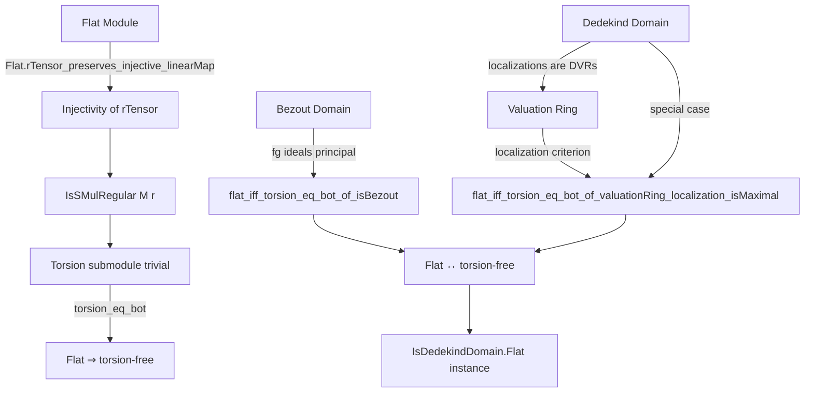
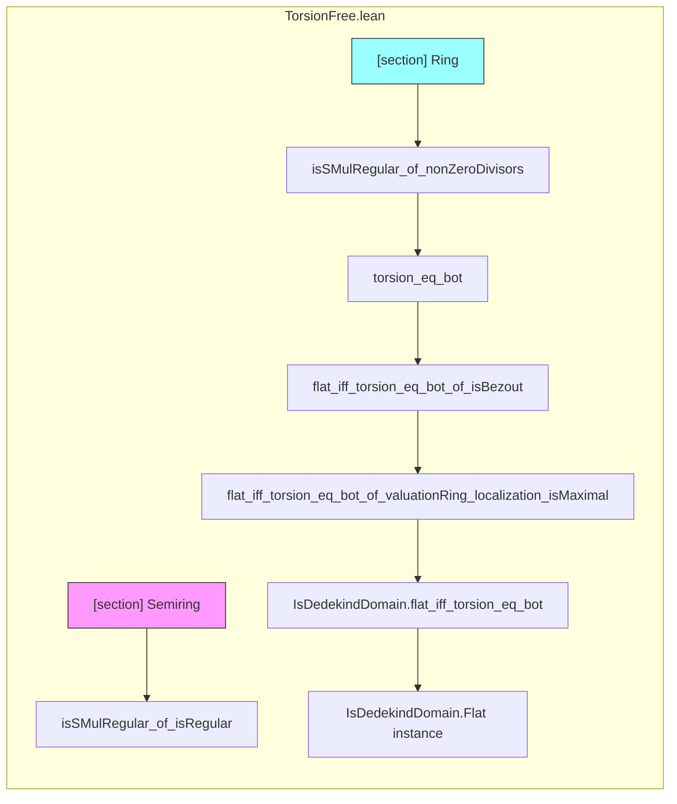

**Technical Brief: `TorsionFree.lean` (Lean 4)**  
*Domain: Commutative Algebra — Flatness and Torsionfreeness of Modules over Commutative Rings/Semirings*

---

### 1. **Key Definitions & Theorems**

| Name | Type / Signature | Purpose |
|------|------------------|---------|
| `isSMulRegular_of_isRegular` | `{r : R} → IsRegular r → [Flat R M] → IsSMulRegular M r` | Shows that multiplication by a regular element (i.e., non-zero-divisor on both sides) is injective on a flat module. |
| `isSMulRegular_of_nonZeroDivisors` | `{r : R} → r ∈ R⁰ → [Flat R M] → IsSMulRegular M r` | Specialization of above to non-zero-divisors in a ring (uses `R⁰` = non-zero-divisors). |
| `torsion_eq_bot` | `[Flat R M] → torsion R M = ⊥` | Flat modules have trivial torsion submodule. |
| `flat_iff_torsion_eq_bot_of_isBezout` | `[IsBezout R] [IsDomain R] → Flat R M ↔ torsion R M = ⊥` | Equivalence of flatness and torsionfreeness over Bezout domains. |
| `flat_iff_torsion_eq_bot_of_valuationRing_localization_isMaximal` | `[IsDomain R] → (∀ P : Ideal R, P.IsMaximal → ValuationRing (Localization P.primeCompl)) → Flat R M ↔ torsion R M = ⊥` | Generalizes the equivalence to rings whose localizations at maximal ideals are valuation rings. |
| `IsDedekindDomain.flat_iff_torsion_eq_bot` | `[IsDedekindDomain R] → Flat R M ↔ torsion R M = ⊥` | Special case for Dedekind domains (since their localizations at maximals are DVRs ⇒ valuation rings). |
| `IsDedekindDomain.Flat` | `[IsDedekindDomain R] [IsTorsionFree R M] → Flat R M` | Corollary: torsion-free modules over Dedekind domains are flat. |

**Notation & auxiliary definitions used:**
- `IsRegular r`: $r$ is regular (i.e., multiplication by $r$ is injective).
- `R⁰`: the submonoid of non-zero-divisors.
- `IsSMulRegular M r`: multiplication by $r$ on $M$ is injective.
- `torsion R M`: submodule of elements annihilated by some non-zero-divisor.
- `IsTorsionFree R M`: $ \text{torsion}(R,M) = \bot $.
- `ValuationRing S`: $S$ is a valuation ring (for any $x,y$, either $x \mid y$ or $y \mid x$).
- `Localization P.primeCompl`: localization at complement of prime ideal $P$.

---

### 2. **Naming Conventions**

- **Prefixes:**
  - `isSMulRegular_`: properties of scalar multiplication maps.
  - `torsion_`: related to torsion submodule.
  - `flat_`: properties of flat modules.
- **Suffixes:**
  - `_of_`: conditions under which equivalence holds (e.g., `of_isBezout`, `of_valuationRing_localization_isMaximal`).
- **Module-level namespace:** `Module.Flat` — all lemmas are in this namespace.
- **Open scopes:**
  - `nonZeroDivisors` (for `R⁰`)
  - `LinearMap`, `TensorProduct`, `Submodule`

---

### 3. **Tactic Stack**

| Tactic | Usage Frequency | Purpose |
|--------|-----------------|---------|
| `rw` | High | Rewriting definitions (e.g., `torsion_eq_bot`, `isSMulRegular`, `lift_lsmul_mul_eq_lsmul_lift_lsmul`). |
| `simp` / `simp_rw` | High | Simplifying using linear map/tensor product identities (e.g., `TensorProduct.lid`, `rTensor`, `Ideal.subtype_isoBaseOfIsPrincipal_eq_mul`). |
| `apply` / `exact` | High | Applying lemmas (e.g., `Flat.rTensor_preserves_injective_linearMap`). |
| `intro` / `rintro` | High | Introducing hypotheses and destructing existentials/conjunctions. |
| `ext` | Medium | Extensionality for functions/maps. |
| `convert` | Medium | Matching goals up to definitional equality (e.g., `convert Function.injective_id`). |
| `obtain` | Medium | Destructing disjunctions (`eq_or_ne I ⊥`) or existential statements. |
| `infer_instance` | Medium | Inferring class instances (e.g., `IsTorsionFree`, `ValuationRing`). |
| `refine` | Medium | Partial proof construction with holes. |
| `have` / `set` | Low | Intermediate claims (e.g., `have hprinc : I.IsPrincipal`). |

---

### 4. **Proof Logic**

The logical flow across proofs follows a **modular reduction strategy**:

1. **Reduction to known equivalences**:
   - Use `Flat.rTensor_preserves_injective_linearMap` to lift injectivity of $r \cdot -$ on $R$ to $R \otimes_R M \cong M$.
   - Use `LinearEquiv` to transport structure (e.g., `TensorProduct.lid`, `Ideal.isoBaseOfIsPrincipal`).

2. **Case analysis**:
   - In `flat_iff_torsion_eq_bot_of_isBezout`, split on $I = 0$ or $I \ne 0$.
   - For $I \ne 0$, use that finitely generated ideals in Bezout domains are principal.

3. **Localization-based global-to-local arguments**:
   - In valuation ring case, reduce to localizations at maximal ideals.
   - Use `flat_of_localized_maximal` and `flat_iff_of_isLocalization`.

4. **Chain of equivalences**:
   - `IsTorsionFree ↔ torsion = ⊥ ↔ Flat` via intermediate lemmas and `infer_instance`.

5. **Use of known structure theorems**:
   - Dedekind domains ⇒ localizations at maximals are DVRs ⇒ valuation rings.
   - Bezout domains ⇒ fg ideals principal.

---

### 5. **Imports & Dependencies**

| Import | Role |
|--------|------|
| `Mathlib.Algebra.Module.Torsion.Basic` | Core definitions: `torsion`, `IsTorsionFree`, `IsSMulRegular`. |
| `Mathlib.RingTheory.DedekindDomain.Dvr` | DVR properties, used to show localizations of Dedekind domains are valuation rings. |
| `Mathlib.RingTheory.Flat.Localization` | Flatness criteria via localization (e.g., `flat_of_localized_maximal`, `flat_iff_of_isLocalization`). |
| `Mathlib.RingTheory.Flat.Tensor` | Tensor-based flatness tools (e.g., `rTensor_preserves_injective_linearMap`). |
| `Mathlib.RingTheory.Ideal.IsPrincipal` | Principal ideal generation and equivalences (`IsPrincipal`, `isoBaseOfIsPrincipal`). |

---

### 6. **Mermaid Diagrams**

#### **Dependency Graph (Theoretical Structure)**

#### **File Overview (Module Structure)**

---

### 7. **Summary**

This file establishes foundational connections between **flatness** and **torsionfreeness** in module theory over commutative rings. It proceeds from general injectivity results (via tensor preservation), to specific structural theorems for Bezout domains and Dedekind domains. The proofs rely heavily on:
- Tensor product properties,
- Localization techniques,
- Structural theorems about ideals (Bezout, principal, valuation).

The final result is a powerful equivalence: over many important classes of rings (Bezout, Dedekind, valuation-localized), flatness and torsionfreeness coincide — a cornerstone for homological algebra in arithmetic geometry and algebraic number theory.

--- 

*Prepared for Domain-Specific AI Agent training.*
