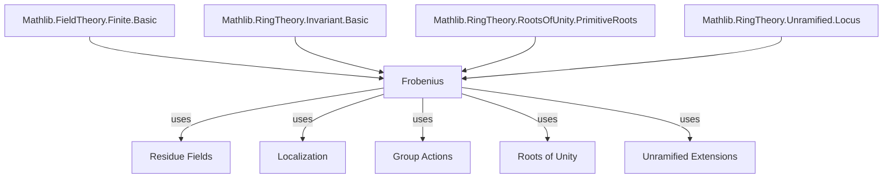
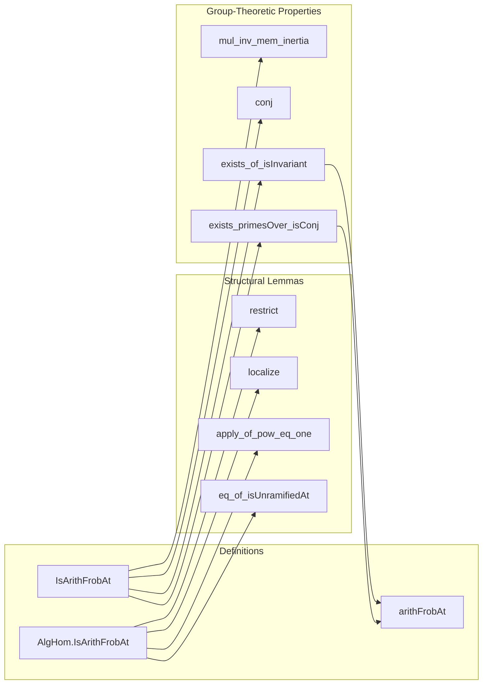

**Technical Brief: Frobenius Elements in Lean 4**

---

### 1. KEY DEFINITIONS & THEOREMS

| Name | Type / Signature | Purpose |
|------|------------------|---------|
| `AlgHom.IsArithFrobAt` | `φ : S →ₐ[R] S → Ideal S → Prop` | Defines when an $R$-algebra endomorphism $\varphi$ satisfies $\varphi(x) \equiv x^q \pmod{Q}$ for all $x \in S$, where $q = \#(R / (Q \cap R))$. |
| `AlgHom.IsArithFrobAt.restrict` | `H.restrict : S ⧸ Q →ₐ[R ⧸ Q.under R] S ⧸ Q` | The induced map on residue fields; coincides with the Frobenius $x \mapsto x^q$. |
| `AlgHom.IsArithFrobAt.apply_of_pow_eq_one` | `{ζ : S} → ζ^m = 1 → ↑m ∉ Q → φ ζ = ζ^q` | Frobenius acts as $x \mapsto x^q$ on roots of unity coprime to the residue characteristic. |
| `AlgHom.IsArithFrobAt.eq_of_isUnramifiedAt` | `[IsDomain S] → [NoetherianRing S] → ... → φ = ψ` | Uniqueness of Frobenius under unramifiedness and Noetherian hypotheses. |
| `IsArithFrobAt` | `σ : G → Ideal S → Prop` | Group-theoretic version: $\sigma \cdot x \equiv x^q \pmod{Q}$. |
| `IsArithFrobAt.mul_inv_mem_inertia` | `σ * σ'⁻¹ ∈ inertia_group(Q)` | Two Frobenius elements differ by an inertia group element. |
| `IsArithFrobAt.conj` | `τστ⁻¹` is Frobenius at $\tau \cdot Q$ | Frobenius conjugates under group action. |
| `IsArithFrobAt.exists_of_isInvariant` | `∃ σ : G, IsArithFrobAt σ Q` | Existence of Frobenius element under finite Galois-type invariance. |
| `arithFrobAt` | `[Q.IsPrime] → [Finite (S ⧸ Q)] → G` | A canonical choice of Frobenius element for each prime $Q$ with finite residue field, chosen so that Frobenius elements over the same base prime are conjugate. |

---

### 2. NAMING CONVENTIONS

- **Prefixes**:
  - `is_`: Predicate definitions (`isArithFrobAt`, `isUnramifiedAt`)
  - `mul_`, `comap_`, `map_`: Structural operations on ideals and actions
  - `restrict_`, `localize_`: Induced maps on quotients/localizations
- **Suffixes**:
  - `_at`: Denotes dependence on an ideal (e.g., `isArithFrobAt`, `eq_of_isUnramifiedAt`)
  - `_at_prime`: Used in localization context (`localize`, `isArithFrobAt_localize`)
- **Notation**:
  - `•`: Group action notation (`σ • x`)
  - `under`: Pullback of ideal along algebra map (`Q.under R`)
  - `primeCompl`: Complement of a prime ideal (used for localization)

---

### 3. TACTIC STACK

| Tactic | Frequency | Role |
|--------|-----------|------|
| `simp` / `simp_all` | High | Simplification using algebraic identities, ideal operations, and quotient properties |
| `rw` | Very High | Rewriting using lemmas like `map_pow`, `Ideal.Quotient.eq`, `mul_smul`, etc. |
| `exact` / `assumption` | Medium | Closing simple goals |
| `obtain` / `rcases` | Medium | Extracting witnesses from existential hypotheses |
| `congr` | Low-Medium | Congruence reasoning (e.g., for equality of functions) |
| `ext` | Medium | Extensionality for ring homomorphisms |
| `by_contra!` | Low | Contrapositive reasoning (e.g., proving finiteness of residue field) |
| `have` / `set` | Medium | Introducing intermediate lemmas or definitions |
| `convert` | Low | Flexible unification for proving equalities up to definitional equality |
| `ring` / `abel` | Not present | Not needed due to heavy reliance on ideal/quotient arithmetic |
| `aesop` | Not present | Not used; proofs are highly structured and manual |

---

### 4. PROOF LOGIC

The logical flow follows a **structured descent from general algebraic setup to concrete arithmetic consequences**:

1. **Setup & Definitions**:
   - Fix ring extension $R \subseteq S$, group $G$ acting on $S$ fixing $R$, and prime ideal $Q \subseteq S$.
   - Define Frobenius condition modulo $Q$.

2. **Structural Properties**:
   - Show Frobenius induces Frobenius on residue field $S/Q$.
   - Prove injectivity of restriction map under primality.
   - Show Frobenius restricts to automorphism on localization $S_Q$.

3. **Special Cases**:
   - Roots of unity: If $\zeta^m = 1$ and $m \notin Q$, then $\varphi(\zeta) = \zeta^q$.
   - Uniqueness: Under Noetherian + unramified + no zero-divisors in $Q$, Frobenius is unique.

4. **Group-Theoretic Refinement**:
   - Two Frobenius elements differ by inertia.
   - Conjugation rule: Frobenius at $Q$ maps to Frobenius at $\tau \cdot Q$.
   - Existence: Under finite $G$-invariance, Frobenius exists.

5. **Canonical Choice**:
   - Use choice + conjugacy to define `arithFrobAt`, ensuring Frobenius elements over same base prime are conjugate.

---

### 5. IMPORTS & DEPENDENCIES

| Module | Role |
|--------|------|
| `Mathlib.FieldTheory.Finite.Basic` | Finite fields, Frobenius automorphisms, characteristic |
| `Mathlib.RingTheory.Invariant.Basic` | Group actions, fixed subrings, invariants |
| `Mathlib.RingTheory.RootsOfUnity.PrimitiveRoots` | Roots of unity, primitive roots, cyclotomic structure |
| `Mathlib.RingTheory.Unramified.Locus` | Unramified extensions, inertia, decomposition groups |

---

### 6. MERMAID DIAGRAMS

#### Dependency Graph (Top-Level)

#### Overview of File Structure

---

### 7. THEORY CONTEXT

This file formalizes the **arithmetic Frobenius element** in the context of **Galois extensions with group actions**, generalizing the classical number-theoretic setting:

- **Classical case**: $L/K$ finite Galois, $\mathcal{O}_L/\mathcal{O}_K$ rings of integers, $Q \mid P$ primes, then $\mathrm{Frob}_{Q/P} \in \mathrm{Gal}(L/K)$ satisfies $\mathrm{Frob}(x) \equiv x^{| \mathcal{O}_K / P |} \mod Q$.
- **Abstracted setting**: $G$ finite group acting on ring $S$, $R = S^G$, $Q \subseteq S$ prime with finite residue field.
- **Key innovations**:
  - Uniqueness under unramifiedness (via localization and formal unramifiedness).
  - Conjugacy class independence of choice (via `arithFrobAt`).
  - Compatibility with roots of unity and localization.

This provides a foundation for local class field theory and decomposition/inertia groups in Lean.

--- 

Let me know if you'd like a formalization roadmap or a comparison with other Frobenius notions (e.g., geometric Frobenius).
