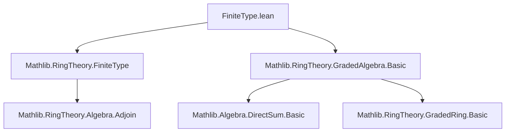

**Technical Brief: `FiniteType.lean` — Graded Rings of Finite Type**

---

### 1. **Key Definitions & Theorems**

| Name | Type / Signature | Purpose |
|------|------------------|---------|
| `GradedRing 𝒜` | Class | Asserts that `𝒜 : ι → σ` is a graded ring structure on `S`, i.e., $S = \bigoplus_{i \in \iota} \mathcal{A}_i$ as additive subgroups, with multiplication respecting grading. |
| `Algebra.FiniteType (𝒜 0) S` | Class | States that $S$ is a finitely generated algebra over the base ring $\mathcal{A}_0$. |
| `exists_finset_adjoin_eq_top_and_homogeneous` | `∃ s : Finset S, Algebra.adjoin (𝒜 0) s = ⊤ ∧ ∀ i ∈ s, IsHomogeneousElem 𝒜 i` | Shows $S$ is generated as an $\mathcal{A}_0$-algebra by a *finite* set of homogeneous elements. |
| `exists_finset_adjoin_eq_top_and_homogeneous_ne_zero` | `∃ s : Finset S, Algebra.adjoin (𝒜 0) s = ⊤ ∧ ∀ i ∈ s, ∃ n ≠ 0, i ∈ 𝒜 n` | Refines the above: generators can be chosen to be *nonzero homogeneous elements of positive degree*. |

---

### 2. **Naming Conventions**

- **Prefixes**:
  - `exists_...`: Existential statements.
  - `adjoin`: Refers to subalgebra generation (`Algebra.adjoin`).
  - `homogeneous`: Indicates properties related to grading.
- **Suffixes**:
  - `_eq_top`: Denotes that the generated subalgebra equals the whole algebra (`= ⊤`).
  - `_ne_zero`: Denotes additional nonzero condition on grading degree.

---

### 3. **Tactic Stack**

- `classical`: Classical reasoning (for existence proofs).
- `obtain ⟨F, hF⟩ := ...`: Destructuring existential hypotheses.
- `let ... := ...`: Local definitions (e.g., indexing by support of decomposition).
- `refine ⟨..., ?_, ...⟩`: Partial proof construction, deferring subgoals.
- `rw [← top_le_iff, ← hF, Algebra.adjoin_le_iff]`: Rewriting using lattice-theoretic characterizations of top elements and algebra generation.
- `intro s hs`, `rintro i hi`: Standard intro-style reasoning.
- `rw [← DirectSum.sum_support_decompose 𝒜 s]`: Rewriting using direct sum decomposition.
- `exact sum_mem ...`, `exact Algebra.subset_adjoin ...`: Direct proof steps using membership lemmas.
- `by_cases hi0 : n i = 0`: Case analysis on equality.
- `simpa using ...`: Simplify and discharge using a hypothesis.

---

### 4. **Proof Logic**

- **High-level strategy**:
  1. Use `Algebra.FiniteType.out` to get a finite generating set $F \subseteq S$ over $\mathcal{A}_0$.
  2. For each $x \in F$, decompose $x = \sum_{n \in \iota} x_n$ via `DirectSum.decompose`, where only finitely many $x_n \ne 0$.
  3. Collect all homogeneous components $x_n$ (indexed over $\Sigma (x : F), \operatorname{support}(\operatorname{decompose}(x))$) into a finite set.
  4. Show this finite set of homogeneous elements generates $S$ over $\mathcal{A}_0$ using:
     - `Algebra.adjoin_le_iff`: reduce to showing each generator $x \in F$ lies in the adjoin of homogeneous components.
     - `DirectSum.sum_support_decompose`: rewrite $x$ as sum of its homogeneous parts.
     - `sum_mem`: closure under finite sums.
  5. For the nonzero-positive-degree version:
     - Filter out homogeneous components of degree $0$ (which lie in $\mathcal{A}_0$, hence already in the base algebra).
     - Remaining components are nonzero homogeneous elements of *nonzero* degree; positivity follows from grading conventions (often $\iota = \mathbb{N}$ or $\mathbb{Z}_{\ge 0}$).

- **Key logical flow**:  
  `FiniteType` ⇒ finite generating set ⇒ decompose each generator ⇒ finite homogeneous generating set ⇒ filter nonzero positive-degree parts.

---

### 5. **Imports**

| Import | Role |
|--------|------|
| `Mathlib.RingTheory.FiniteType` | Provides `Algebra.FiniteType`, `Algebra.adjoin`, and related lemmas. |
| `Mathlib.RingTheory.GradedAlgebra.Basic` | Provides `GradedRing`, `DirectSum.decompose`, `IsHomogeneousElem`, and basic graded algebra facts. |

---

### 6. **Mermaid Diagrams**

#### **Dependency Graph (Module-Level)**



#### **Overview of Theoretical Flow**

```mermaid
flowchart LR
  A[Graded Ring 𝒜] --> B[Algebra.FiniteType (𝒜 0) S]
  B --> C[Finite generating set F ⊆ S]
  C --> D[Decompose each x ∈ F into homogeneous components]
  D --> E[Finite set s of homogeneous elements]
  E --> F[adjoin (𝒜 0) s = ⊤]
  F --> G[Filter nonzero positive-degree components]
  G --> H[adjoin (𝒜 0) s' = ⊤ ∧ ∀ i ∈ s', ∃ n ≠ 0, i ∈ 𝒜 n]
```

---

### 7. **Summary**

This module establishes a foundational structural result: **any graded ring $S$ finite over its degree-0 part $\mathcal{A}_0$ is generated by finitely many homogeneous elements of positive degree**. This is critical for applications in projective geometry, Hilbert functions, and graded resolutions. The proof leverages direct sum decompositions and standard adjoin calculus in commutative algebra.
