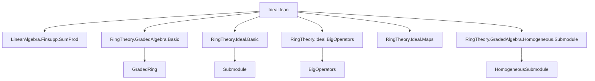
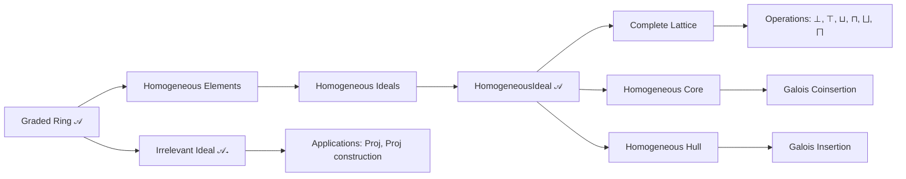

### Technical Brief: `Ideal.lean` — Homogeneous Ideals in Graded Algebras

---

#### **1. Key Definitions & Theorems**

| Name | Type / Signature | Purpose |
|------|------------------|---------|
| `Ideal.IsHomogeneous 𝒜 I` | `Prop` | States that ideal `I` is closed under homogeneous projection: all homogeneous components of elements in `I` lie in `I`. |
| `HomogeneousIdeal 𝒜` | `Type u` | Subtype of `Ideal A` consisting of homogeneous ideals (via `HomogeneousSubmodule`). |
| `Ideal.homogeneousCore' I 𝒜` | `Ideal A` | Largest *homogeneous* ideal contained in `I`, defined as `Ideal.span` of homogeneous elements of `I`. |
| `Ideal.homogeneousCore I 𝒜` | `HomogeneousIdeal 𝒜` | Homogeneous core as a structured object (subtype), using `homogeneousCore'`. |
| `Ideal.homogeneousHull I 𝒜` | `HomogeneousIdeal 𝒜` | Smallest homogeneous ideal containing `I`, defined via span of all homogeneous components of elements of `I`. |
| `HomogeneousIdeal.completeLattice` | `CompleteLattice (HomogeneousIdeal 𝒜)` | Homogeneous ideals form a complete lattice under inclusion. |
| `Ideal.homogeneousCore.gc` | `GaloisConnection toIdeal (homogeneousCore 𝒜)` | `toIdeal ⊣ homogeneousCore`: coercion and core form a Galois connection. |
| `Ideal.homogeneousCore.gi` | `GaloisCoinsertion toIdeal (homogeneousCore 𝒜)` | Refinement: the GC is a *coinsertion*, i.e., `homogeneousCore` is a right adjoint embedding. |
| `Ideal.homogeneousHull.gc` | `GaloisConnection (homogeneousHull 𝒜) toIdeal` | `homogeneousHull ⊣ toIdeal`. |
| `Ideal.homogeneousHull.gi` | `GaloisInsertion (homogeneousHull 𝒜) toIdeal` | `homogeneousHull` is a left adjoint embedding into ideals. |
| `HomogeneousIdeal.irrelevant` | `HomogeneousIdeal 𝒜` | The *irrelevant ideal* in a graded ring over a canonically ordered monoid: elements with zero degree-0 component. Notation: `𝒜₊`. |

**Key Theorems (Statements)**:
- `Ideal.IsHomogeneous.iff_exists`:  
  $I$ is homogeneous iff $I = \mathrm{span}(S)$ for some set $S$ of homogeneous elements.
- `Ideal.IsHomogeneous.iff_eq`:  
  $I$ is homogeneous iff $I = \mathrm{homogeneousCore}(I)$.
- `Ideal.mem_homogeneousCore_of_homogeneous_of_mem`: Homogeneous elements of $I$ lie in $\mathrm{homogeneousCore}(I)$.
- `Ideal.toIdeal_homogeneousHull_eq_iSup`:  
  $\mathrm{homogeneousHull}(I) = \bigvee_i \mathrm{span}(\mathrm{proj}_i[I])$.
- `irrelevant_eq_span`:  
  $\mathfrak{m}_+ = \mathrm{span}\left(\bigcup_{i > 0} \mathcal{A}_i\right)$.

---

#### **2. Naming Conventions**

| Pattern | Meaning | Examples |
|--------|---------|----------|
| `is_` | Predicate property | `isHomogeneous`, `isHomogeneousElem` |
| `homogeneous_` | Homogeneous variant | `homogeneousCore`, `homogeneousHull`, `homogeneous_span` |
| `toIdeal` | Coercion from `HomogeneousIdeal` → `Ideal` | `toIdeal`, `toIdeal_add`, `toIdeal_sup` |
| `coe_` | Coercion to underlying set | `coe_top`, `coe_bot`, `coe_sup` |
| `mem_` | Membership characterization | `mem_iff`, `mem_irrelevant_iff`, `mem_homogeneousCore_of_homogeneous_of_mem` |
| `ext` | Extensionality principle | `ext`, `ext'` |
| `gc`, `gi` | Galois (co)insertion | `homogeneousCore.gc`, `homogeneousHull.gi` |
| `mono` | Monotonicity | `homogeneousCore_mono`, `homogeneousHull_mono` |
| `le_` / `ge_` | Inclusion lemmas | `toIdeal_homogeneousCore_le`, `le_toIdeal_homogeneousHull` |

---

#### **3. Tactic Stack**

Frequent tactics used in proofs:
- `simp` / `simp_rw`: Simplify using definitional equalities and lemmas (e.g., `simp only`, `simp_rw [iff_exists]`).
- `rw`: Rewrite using equivalences and equalities.
- `exact`, `apply`, `intro`, `cases`: Basic proof structure.
- `aesop`: Automated reasoning for simple goals (e.g., in `mem_irrelevant_of_mem`).
- `ring`: For commutative semiring arithmetic (used implicitly in `mul_homogeneous_element_mem_of_mem`).
- `convert`: For congruence-based equality proofs (e.g., `HomogeneousIdeal.ext'`).
- `classical`: For classical reasoning (e.g., when using `decompose` decomposition).
- `interval_cases`, `split_ifs`: For case analysis on index equality (e.g., `decompose_of_mem`).
- `apply_fun`, `congr_arg`: For functional extensionality and image/sup/inf manipulations.

---

#### **4. Proof Logic**

**Typical proof patterns**:
- **Induction on finite support**: Many proofs use `DirectSum.sum_support_decompose` to reduce to finite sums of homogeneous components.
- **Span-based characterizations**: Use `Ideal.span` and `homogeneous_span` to reduce to verifying generators.
- **Galois (co)insertion machinery**: Prove monotonicity and unit/counit inequalities to derive adjunctions.
- **Extensionality via membership**: Use `HomogeneousIdeal.ext` or `ext'` to compare homogeneous ideals.
- **Decomposition lemmas**: `decompose_of_mem`, `decompose_of_mem_ne`, `proj_apply` are heavily used to reason about projections.
- **Set-theoretic manipulations**: `iSup`, `iInf`, `sSup`, `sInf` are often unfolded via `Set.image_iUnion`, `Set.mem_iUnion`, etc.

**Example flow** (e.g., `Ideal.IsHomogeneous.iff_exists`):
1. Use `iff_eq` to reduce to equality with core.
2. Apply `gc` properties: `homogeneousCore` is largest homogeneous subideal.
3. Use `homogeneous_span` to show any span of homogeneous elements is homogeneous.
4. Conclude via `Set.image_preimage` and `gc`-induced bijection.

---

#### **5. Imports**

| Module | Purpose |
|--------|---------|
| `Mathlib.LinearAlgebra.Finsupp.SumProd` | For `DirectSum`, `Finsupp`, and finite support tools. |
| `Mathlib.RingTheory.GradedAlgebra.Basic` | Defines `GradedRing`, `proj`, `decompose`, `gradedMul`. |
| `Mathlib.RingTheory.Ideal.Basic` | Basic ideal theory: `Ideal`, `span`, `mem`, `sup`, `inf`, etc. |
| `Mathlib.RingTheory.Ideal.BigOperators` | `iSup`, `iInf`, `sSup`, `sInf` over ideals. |
| `Mathlib.RingTheory.Ideal.Maps` | Ideal maps, pullbacks, pushforwards. |
| `Mathlib.RingTheory.GradedAlgebra.Homogeneous.Submodule` | Homogeneous submodules and elements (`IsHomogeneousElem`, `homogeneousSubmonoid`). |

---

#### **8. Mermaid Diagrams**

##### **Dependency Graph (Module-Level)**



##### **Conceptual Overview (Theory Flow)**



##### **Galois Connections Summary**

```mermaid
graph LR
  HomogIdeal[HomogeneousIdeal 𝒜] -- toIdeal --> Ideal[Ideal A]
  Ideal -- homogeneousCore --> HomogIdeal
  Ideal -- homogeneousHull --> HomogIdeal

  HomogIdeal <|--|gc| Ideal
  HomogIdeal |-->|gi| Ideal
```

- `homogeneousCore`: right adjoint → *coinsertion* (`toIdeal ⊣ homogeneousCore`)
- `homogeneousHull`: left adjoint → *insertion* (`homogeneousHull ⊣ toIdeal`)

---

This file formalizes the foundational theory of homogeneous ideals in graded algebras, emphasizing lattice-theoretic and adjointness properties, with applications to projective geometry (via the irrelevant ideal). It leverages Lean’s `SetLike`, `Submodule`, and `DirectSum` infrastructure to reason about graded structures.
