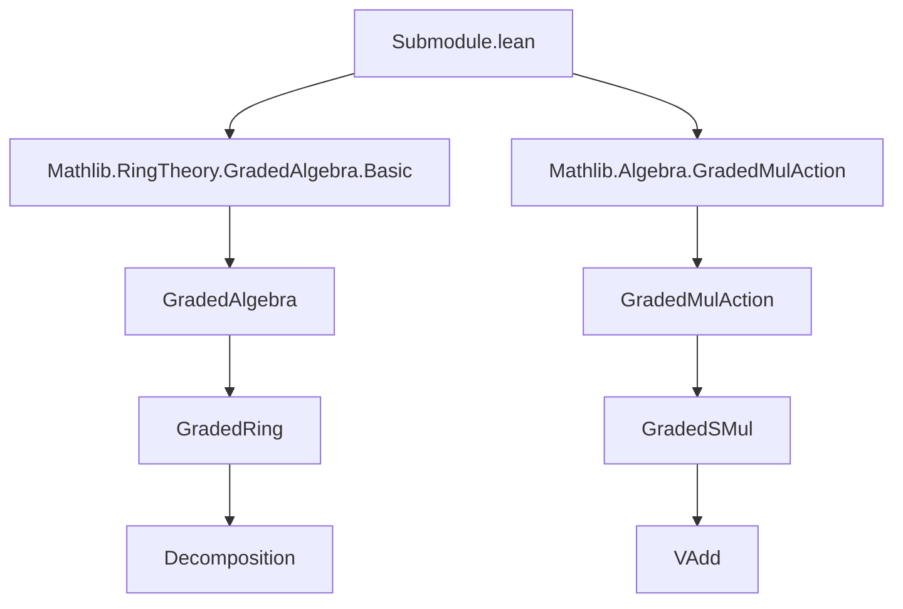
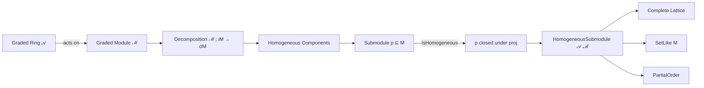

### Technical Brief: `Submodule.lean` — Homogeneous Submodules of Graded Modules

---

#### **1. Key Definitions & Theorems**

| Name | Type / Signature | Purpose |
|------|------------------|---------|
| `Submodule.IsHomogeneous` | `p : Submodule A M → (ιM → σM) → Prop` | Defines when a submodule `p` is *homogeneous*: closed under projection maps `decompose ℳ x i`. |
| `HomogeneousSubmodule` | `structure` extending `Submodule A M` with proof of homogeneity | Encapsulates homogeneous submodules as a type with inherited module structure. |
| `Submodule.IsHomogeneous.mem_iff` | `x ∈ p ↔ ∀ i, decompose ℳ x i ∈ p` | Characterizes membership in a homogeneous submodule via homogeneous components. |
| `HomogeneousSubmodule.isHomogeneous` | `p.toSubmodule.IsHomogeneous ℳ` | Extracts the homogeneity proof from a `HomogeneousSubmodule`. |
| `HomogeneousSubmodule.ext` | `(I.toSubmodule = J.toSubmodule) → I = J` | Extensionality: two homogeneous submodules are equal if their underlying submodules are. |
| `HomogeneousSubmodule.ext'` | `(∀ i x ∈ ℳ i, x ∈ I ↔ x ∈ J) → I = J` | Stronger extensionality using membership on homogeneous elements. |
| `HomogeneousSubmodule.toSubmodule_injective` | `Function.Injective toSubmodule` | Injectivity of the coercion to submodules. |

---

#### **2. Naming Conventions**

- **Prefixes**:
  - `is_`: Predicate properties (`IsHomogeneous`)
  - `to_`: Coercion / projection functions (`toSubmodule`)
  - `mem_`: Membership-related lemmas (`mem_toSubmodule_iff`)
- **Suffixes**:
  - `_iff`: Logical equivalence characterizations (`mem_iff`)
  - `_ext`, `_ext'`: Extensionality lemmas
- **Structure naming**:
  - `HomogeneousSubmodule` combines domain (`𝒜`, graded ring) and codomain (`ℳ`, graded module) parameters.

---

#### **3. Tactic Stack**

Frequently used tactics in this file:
- `simp`, `simp_rw`, `ext`, `intro`, `apply`, `exact`, `refine`, `cases`
- `simpa using` for simplifying goals using a hypothesis
- `funext`, `forall_congr'` for higher-order quantifier reasoning
- `ofSetLike` for deriving class instances from set-like behavior
- `rintro`, `rintro ⟨x, hx⟩` for destructuring structured hypotheses

No heavy automation (e.g., `aesop`, `ring`, `linarith`) appears—proofs are mostly structural and rely on definitional simplification.

---

#### **4. Proof Logic**

- **Structure-based reasoning**: Proofs often proceed by destructuring `HomogeneousSubmodule` as `⟨p, hp⟩`.
- **Extensionality via underlying submodule**: Equality of homogeneous submodules reduces to equality of their underlying submodules (`ext`), or further to pointwise equality on homogeneous components (`ext'`).
- **Membership characterization**: Key lemmas like `mem_iff` reduce membership in a homogeneous submodule to checking all homogeneous components.
- **Instance synthesis**: Careful ordering of typeclass arguments (e.g., `GradedRing`, `GradedSMul`) ensures that instances like `SetLike`, `PartialOrder`, and `SMulMemClass` can be synthesized automatically.

---

#### **5. Imports & Dependencies**

**Primary imports**:
- `Mathlib.RingTheory.GradedAlgebra.Basic`
- `Mathlib.Algebra.GradedMulAction`

**Key typeclasses used**:
- `[DecidableEq ιM]`, `[SetLike σM M]`, `[AddSubmonoidClass σM M]`, `[Decomposition ℳ]`
- `[GradedRing 𝒜]`, `[GradedSMul 𝒜 ℳ]`, `[VAdd ιA ιM]`

These imports and typeclasses define the *graded algebraic context* necessary for homogeneous decomposition.

---

#### **6. Mermaid Diagrams**

##### **Dependency Graph (Module-Level)**



##### **Conceptual Overview of Theory**



##### **Structure Hierarchy**

```mermaid
graph TD
  Submodule A M <-->|extends| HomogeneousSubmodule 𝒜 ℳ
  HomogeneousSubmodule 𝒜 ℳ -->|toSubmodule| Submodule A M
  HomogeneousSubmodule 𝒜 ℳ -->|is_homogeneous'| Prop
  Submodule A M -->|IsHomogeneous ℳ| Prop
```

---

#### **7. Summary**

This file formalizes the theory of *homogeneous submodules* in the context of a graded module over a graded ring. It introduces:
- A predicate `IsHomogeneous` for submodules,
- A dependent type `HomogeneousSubmodule` bundling submodules with homogeneity proofs,
- A rich set of instances (`SetLike`, `PartialOrder`, `AddSubmonoidClass`, `SMulMemClass`) enabling seamless interaction with the rest of Mathlib.

The design reflects Lean’s typeclass inference constraints: while homogeneity is definable without a graded ring, the *lattice structure* of homogeneous submodules requires the full graded context to ensure instance synthesis succeeds.

--- 

Let me know if you'd like a companion file (e.g., `HomogeneousSubmodule.lean`) or formalization of related results (e.g., homogeneous ideals, quotient modules, or intersection/sum properties).
