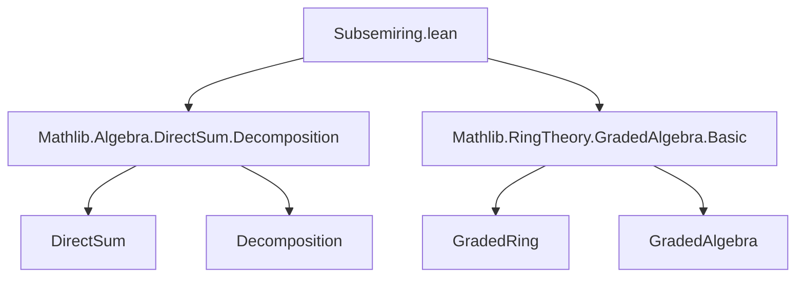
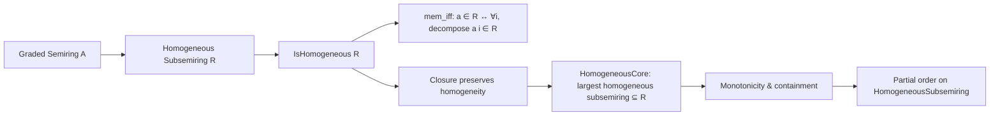

Here's a structured technical brief based on the provided `Subsemiring.lean` file:

---

### **1. Key Definitions & Theorems**

| Name | Type / Signature | Purpose |
|------|------------------|---------|
| `IsHomogeneous 𝒜 R` | `Prop` | States that a subsemiring `R` is *homogeneous*: closed under all homogeneous components (via `decompose`). |
| `HomogeneousSubsemiring 𝒜` | `Type _` | Type of subsemirings of `A` that are homogeneous w.r.t. grading `𝒜`. Extends `Subsemiring A` with proof of homogeneity. |
| `toSubsemiring` | `HomogeneousSubsemiring 𝒜 → Subsemiring A` | Forgetful map; injective (proven). |
| `mem_iff` | `a ∈ R ↔ ∀ i, decompose 𝒜 a i ∈ R` | Characterizes membership in a homogeneous subsemiring via decomposition. |
| `ext` / `ext'` | Equality criteria | Extensionality lemmas: equality follows from equality of underlying subsemirings or pairwise membership on homogeneous elements. |
| `Subsemiring.closure` | `Set A → Subsemiring A` | Free subsemiring generated by a set. |
| `IsHomogeneous.subsemiringClosure` | `(∀ i x ∈ s, decompose x i ∈ s) → IsHomogeneous (Subsemiring.closure s)` | Closure of a set closed under decomposition is homogeneous. |
| `IsHomogeneous.subsemiringClosure_of_isHomogeneousElem` | `(∀ x ∈ s, IsHomogeneousElem x) → IsHomogeneous (Subsemiring.closure s)` | Closure of a set of homogeneous elements is homogeneous. |
| `Subsemiring.homogeneousCore` | `R : Subsemiring A → HomogeneousSubsemiring 𝒜` | Largest homogeneous subsemiring contained in `R`. Constructed as closure of homogeneous elements in `R`. |
| `homogeneousCore_mono` | `R ≤ S ⇒ R.homogeneousCore ≤ S.homogeneousCore` | Monotonicity of `homogeneousCore`. |
| `toSubsemiring_homogeneousCore_le` | `(R.homogeneousCore).toSubsemiring ≤ R` | `homogeneousCore` is indeed contained in `R`. |
| `isHomogeneous_iff_forall_subset` / `subset_iInter` | `IsHomogeneous R ↔ ∀ i, R ⊆ proj⁻¹ R` | Alternative characterizations of homogeneity using projections. |

---

### **2. Naming Conventions**

- **Predicates**: `is_homogeneous'`, `IsHomogeneous`, `IsHomogeneousElem`
- **Constructors/Instances**: `homogeneousCore`, `HomogeneousSubsemiring`, `setLike`, `subsemiringClass`
- **Forgetful/Projection**: `toSubsemiring`
- **Membership/Extensionality**: `mem_iff`, `ext`, `ext'`
- **Closure-related**: `subsemiringClosure`, `closure_mono`, `closure_le`
- **Monotonicity/Order**: `mono`, `le`, `subset`

Prefixes/suffixes:
- `is_` for properties (`is_homogeneous'`)
- `homogeneousCore` for core construction
- `mem_iff` for iff-characterizations of membership
- `ext`/`ext'` for extensionality lemmas

---

### **3. Tactic Stack**

Frequently used tactics in proofs:
- `simp` / `simp_rw` (especially with `decompose_one`, `decompose_mul`, `of_eq_of_ne`)
- `induction ... using ... with | mem | zero | one | add | mul`
- `rw` (with lemmas like `decompose_mul`, `DirectSum.mul_eq_dfinsuppSum`)
- `refine sum_mem fun j _ ↦ ?_` (for finite sums over graded components)
- `obtain rfl | h := eq_or_ne i j` (case split on equality of indices)
- `set_like_tac` (via `SetLike` infrastructure)
- `aesop` likely used implicitly in `ofSetLike`, `PartialOrder.ofSetLike`

---

### **4. Proof Logic**

- **Inductive proofs** over `Subsemiring.closure` (e.g., `subsemiringClosure`, `subsemiringClosure_of_isHomogeneousElem`) using `Subsemiring.closure_induction`.
- **Case analysis** on index equality (`i = j`, `i = 0`, etc.) to simplify `decompose` using `decompose_of_mem`, `of_eq_of_ne`.
- **Decomposition-based reasoning**: membership in homogeneous subsemiring ⇔ closure under `decompose`.
- **Universal property arguments** for `homogeneousCore`: show it’s homogeneous, contained in `R`, and maximal such.
- **Set-theoretic reasoning** via `Set.image`, `preimage`, `closure_le`, `subset_iInter`.

---

### **5. Imports & Dependencies**

**Core imports**:
- `Mathlib.Algebra.DirectSum.Decomposition`
- `Mathlib.RingTheory.GradedAlgebra.Basic`

**Key underlying structures**:
- `AddMonoid ι` (grading index)
- `Semiring A` (graded semiring)
- `SetLike σ A`, `AddSubmonoidClass σ A` (abstract subsemiring interface)
- `GradedRing 𝒜` (graded ring structure on `𝒜 : ι → σ`)
- `DecidableEq ι` (for `eq_or_ne` case splits)

---

### **6. Mermaid Diagrams**

#### **Dependency Graph (Module-Level)**



#### **Overview of Theory Flow**



#### **Structure Hierarchy**

```mermaid
graph TD
  Subsemiring A -->|extends| HomogeneousSubsemiring 𝒜
  HomogeneousSubsemiring 𝒜 -->|toSubsemiring| Subsemiring A
  HomogeneousSubsemiring 𝒜 -->|is_homogeneous'| IsHomogeneous 𝒜
  HomogeneousSubsemiring 𝒜 -->|setLike| Set A
  HomogeneousSubsemiring 𝒜 -->|PartialOrder| HomogeneousSubsemiring 𝒜
```

---

Let me know if you'd like a formalized summary in Lean or a dependency graph for `HomogeneousElem`, `GradedRing`, etc.
