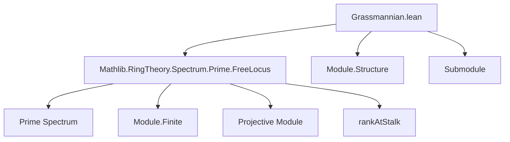
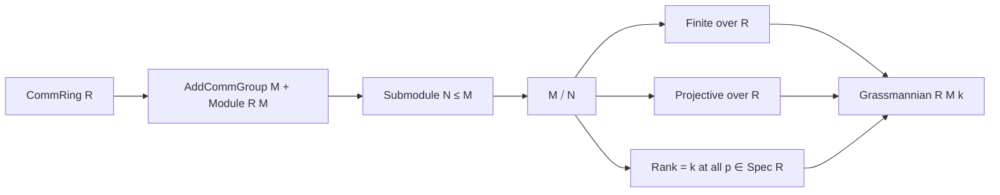

**Technical Brief: Grassmannian Module (Lean 4)**  
*Based on `Grassmannian.lean` (c) 2025 Kenny Lau, Apache 2.0*

---

### 1. KEY DEFINITIONS & THEOREMS

| Name | Type / Signature | Purpose |
|------|------------------|---------|
| `Grassmannian R M k` | `Structure` extending `Submodule R M` | Represents the $k$-th Grassmannian: submodules $N \subseteq M$ such that the quotient $M/N$ is **finitely generated**, **projective**, and has **constant rank $k$ at every prime ideal**. |
| `finite_quotient` | `Module.Finite R (M ⧸ N)` | Ensures the quotient is finitely generated. |
| `projective_quotient` | `Projective R (M ⧸ N)` | Ensures the quotient is projective (hence locally free in Noetherian contexts). |
| `rankAtStalk_eq` | `∀ p : Prime Spectrum R, rankAtStalk (M ⧸ N) p = k` | Enforces that the rank of the quotient is exactly $k$ at all stalks. |
| `ext` | `{N₁ N₂ : Grassmannian R M k} → (N₁ = N₂ : Submodule R M) → N₁ = N₂` | Extensionality principle: equality of underlying submodules implies equality of Grassmannian elements. |
| `CoeOut` | `CoeOut (Grassmannian R M k) (Submodule R M)` | Allows implicit coercion of a Grassmannian element to its underlying submodule. |
| `notation "G(" k ", " M "; " R ")"` | `→ Grassmannian R M k` | Shorthand for the Grassmannian object. |

> **Note**: The definition uses the *quotient convention* (EGA-style), not the subspace convention.

---

### 2. NAMING CONVENTIONS

- **Prefixes**:
  - `rankAtStalk_`: refers to rank at a prime stalk (e.g., `rankAtStalk_eq`).
  - `finite_`, `projective_`: properties of the quotient module.
- **Suffixes**:
  - `_eq`: indicates an equality condition (e.g., `rankAtStalk_eq`).
- **Structure field names**:
  - `toSubmodule`: inherited from `Submodule R M`.
  - `finite_quotient`, `projective_quotient`, `rankAtStalk_eq`: descriptive, explicit.

No recurring `is_`, `mul_`, or `dist_` prefixes — the focus is on *module-theoretic properties* of the quotient.

---

### 3. TACTIC STACK

- **`cases`**: Used in `ext` proof to destructure dependent pairs.
- **`congr 1`**: To finish extensionality proof after destructuring.
- **`[instance]` attribute**: Applied to `finite_quotient`, `projective_quotient` for automatic instance search.

No heavy automation (`aesop`, `ring`, `simp_rw`) appears in the visible snippet — the file is *definitionally lean*, relying on `Mathlib` infrastructure.

---

### 4. PROOF LOGIC

- **Structure-based reasoning**: Proofs are minimal; the logic is *declarative* and *axiomatic*.
- **Extensionality via coercion**: Equality is reduced to equality of underlying submodules (`ext` lemma).
- **No induction or case analysis beyond structure destructuring** — this is a *pure definition* section.

---

### 5. IMPORTS & DEPENDENCIES

| Import | Purpose |
|--------|---------|
| `Mathlib.RingTheory.Spectrum.Prime.FreeLocus` | Provides `rankAtStalk`, `Projective`, `Module.Finite`, and related tools for local rank and freeness. |

> This indicates the Grassmannian is defined in terms of **local properties** over the prime spectrum.

---

### 6. MERMAID DIAGRAMS

#### Dependency Graph (Module-Level)



#### Overview of Grassmannian Construction



#### Functorial Intent (TODO)

```mermaid
flowchart LR
  R[CommRing R] --> M[M R-module]
  M --> F[Functor A ↦ G(k, A ⊗_R M; A)]
  F --> Chart[Open affine charts chart x]
  Chart --> Rep[Representability?]
```

---

### 7. FUTURE WORK (TODO)

- Define the *subspace convention* Grassmannian (equivalent over fields).
- Define the **functor** `Grassmannian.functor R M k : R-Alg → Set`.
- Define **affine charts** `chart x` indexed by $x : \text{Fin } k \to M$, picking those $N$ where $R^k \to M \to M/N$ is iso.
- Lift to **schemes** and **quasi-coherent sheaves**.
- Prove **representability** of the functor (i.e., existence of a *scheme* representing it).

---

### 8. CONVENTION CLARIFICATION

| Convention | Subspace | Quotient (EGA) |
|-----------|----------|----------------|
| Parametrizes | $k$-dim subspaces $V' \subseteq V$ | $k$-rank locally free quotients $V \twoheadrightarrow Q$ |
| Over field $F$ | $G_{\text{sub}}(k, V; F)$ | $G_{\text{quot}}(k, V; F)$ |
| Relation | $G_{\text{sub}}(k, V) \cong G_{\text{quot}}(\dim V - k, V)$ | $G_{\text{quot}}(k, V) \cong G_{\text{sub}}(k, V^*)$ |
| Used here | ❌ | ✅ |

> The current definition aligns with **Grothendieck’s EGA I.9.7.3** and is suitable for *moduli-theoretic* generalizations.

--- 

Let me know if you'd like formalization of the *subspace convention*, the *functor*, or the *affine charts*.
