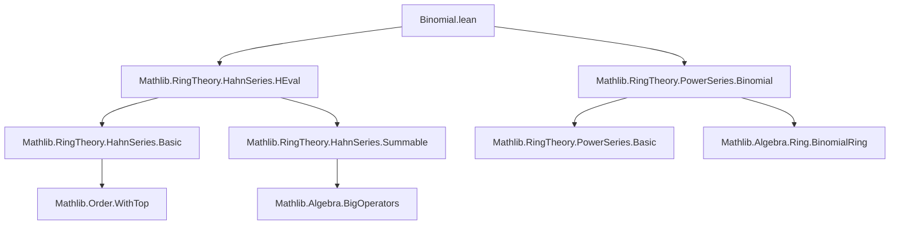

**Technical Brief: `Binomial.lean` (Hahn Series Binomial Expansions)**  
*Based on Lean 4 formalization by Scott Carnahan (2024)*

---

### 1. KEY DEFINITIONS & THEOREMS

| Name | Type / Signature | Purpose |
|------|------------------|---------|
| `binomialFamily` | `binomialFamily (x : A⟦Γ⟧) (r : R) : SummableFamily Γ A ℕ` | Formalizes the binomial expansion coefficients of $x^r = (1 + (x - 1))^r$ as a summable family over $\mathbb{N}$, using `PowerSeries.binomialSeries`. |
| `binomialFamily_apply` | `∀ x r n, 0 < (x - 1).orderTop → binomialFamily x r n = Ring.choose r n • (x - 1)^n` | Identifies the $n$-th term of the family when $x$ is close to 1 (i.e., $(x-1)$ has positive order). |
| `binomialFamily_apply_of_orderTop_nonpos` | `∀ x r n, ¬0 < (x - 1).orderTop → binomialFamily x r n = 0^n` | Handles the degenerate case where $x$ is not near 1: terms vanish except possibly $n=0$. |
| `binomialFamily_orderTop_pos` | `0 < n → 0 < (binomialFamily x r n).orderTop` | Ensures nonzero terms have positive order, crucial for convergence/summability. |
| `binomialFamily_mem_support` | $g \in \mathrm{support}(\mathrm{binomialFamily}\ x\ r\ n) \Rightarrow 0 \le g$ | Supports positivity of exponents in support — ensures no negative exponents appear. |
| `orderTop_hsum_binomialFamily_pos` | $0 < (\sum \mathrm{binomialFamily}\ x\ r - 1).\mathrm{orderTop}$ | Shows the sum of the binomial family is “close to 1” (i.e., differs from 1 by a positive-order element). |
| `instance : Pow (orderTopSubOnePos Γ R) R` | Defines $x^r$ for $x$ in the submonoid of Hahn series with $(x - 1).\mathrm{orderTop} > 0$. | Enables exponentiation by arbitrary $r \in R$ (via binomial expansion). |
| `binomial_power` | $x^r = \mathrm{toOrderTopSubOnePos}(\dots)$ | Equates the defined power with the Hahn series constructed from the binomial family. |
| `pow_add` | $x^{r+s} = x^r \cdot x^s$ | Verifies the expected additive law for exponents in this domain. |
| `coeff_toOrderTopSubOnePos_pow` | $\mathrm{coeff}_{k \cdot g}(x^s) = \binom{s}{k} \cdot r^k$ (for $0 < g$) | Gives explicit coefficients of powers in terms of binomial coefficients — key for computational use. |

---

### 2. NAMING CONVENTIONS

- **Prefixes**:
  - `binomialFamily_`: for definitions and lemmas about the binomial family.
  - `orderTop_`: for properties involving `orderTop`, especially positivity.
  - `coeff_`: for coefficient extraction lemmas.
  - `pow_`: for exponentiation-related results.

- **Suffixes**:
  - `_apply`: for evaluation of a definition on arguments.
  - `_of_`: for case distinctions (e.g., `of_orderTop_nonpos`).
  - `_pos`: for positivity conditions.
  - `_mem_support`: for support membership lemmas.

- **Structure**:
  - `orderTopSubOnePos Γ R`: type of Hahn series $x$ with $(x - 1).\mathrm{orderTop} > 0$.
  - `toOrderTopSubOnePos`: coercion from a Hahn series satisfying positivity condition to this subtype.

---

### 3. TACTIC STACK

Frequently used tactics:
- `simp` / `simp only`: heavily used for simplification with `@[simp]` lemmas.
- `rw`: rewriting using equalities (especially `binomialFamily_apply`, `coeff_hsum`, etc.).
- `by_cases`: to split on $n = 0$, $r = 0$, or order-top positivity.
- `exact`, `apply`, `intro`: standard natural deduction.
- `calc`: for chaining inequalities (e.g., in `binomialFamily_orderTop_pos`).
- `contrapose!`: for contrapositive reasoning (e.g., injectivity of $n \cdot g$).
- `ring`: implicit in `smul_eq_mul`, `one_smul`, etc., though not explicitly called.
- `aesop`: not used here — proof style is mostly `simp` + `rw` + manual reasoning.

---

### 4. PROOF LOGIC

**General proof strategy**:
- **Case analysis** on whether $(x - 1).orderTop > 0$ (i.e., $x$ near 1).
- **Induction or direct computation** on $n$ (especially for support/order-top bounds).
- **Order-theoretic reasoning** using properties of `orderTop`:
  - Monotonicity: $(x - 1)^n$ has order $\ge n \cdot (x - 1).orderTop$.
  - Positivity of support elements: if coefficient at $g$ is nonzero, then $g \ge 0$.
- **Hahn series summability**: leveraged via `hsum_*` lemmas (e.g., `hsum_orderTop_of_le`, `hsum_leadingCoeff_of_le`).
- **Coefficient extraction**: uses `coeff_hsum`, `finsum_eq_single`, and injectivity of scalar multiplication on positive orders.

**Typical flow**:
1. Reduce to case where $x$ is near 1 (via `binomialFamily_apply`).
2. Show terms have positive order → summable.
3. Compute leading coefficient (often $n=0$ term = 1).
4. Use support positivity to restrict to nonnegative exponents.
5. For coefficient formulas, isolate single term via `finsum_eq_single` and verify others vanish.

---

### 5. IMPORTS & DEPENDENCIES

| Module | Role |
|--------|------|
| `Mathlib.RingTheory.HahnSeries.HEval` | Provides `orderTop`, `coeff`, `hsum`, and basic Hahn series analysis. |
| `Mathlib.RingTheory.PowerSeries.Binomial` | Supplies `PowerSeries.binomialSeries`, `Ring.choose`, and formal binomial series over power series. |
| `Mathlib.Algebra.BigOperators.Basic` (implicit) | For `finsum`, `hsum`, `SummableFamily`. |
| `Mathlib.Algebra.Group.Basic`, `Mathlib.Algebra.Module.Basic` | For `smul`, `algebra`, `comm_ring`. |
| `Mathlib.Order.WithTop` | For `WithTop Γ`, used in `orderTop : A⟦Γ⟧ → WithTop Γ`. |
| `Mathlib.Algebra.Ring.BinomialRing` | Assumes `BinomialRing R`, giving meaning to $\binom{r}{n}$ for $r \in R$. |

---

### 6. MERMAID DIAGRAMS

#### Dependency Graph (Module-Level)



#### Overview of Theory Flow

```mermaid
flowchart LR
  A[Γ: Linearly Ordered Additive Comm. Monoid] --> B[HahnSeries A⟦Γ⟧]
  C[R: CommRing + BinomialRing] --> D[Ring.choose r n]
  B --> E[(x - 1).orderTop > 0]
  E --> F[binomialFamily x r n = choose r n • (x-1)^n]
  F --> G[SummableFamily]
  G --> H[hsum = x^r]
  H --> I[define Pow on orderTopSubOnePos]
  I --> J[pow_add, coeff formula]
```

#### Core Logical Flow (Proof of `pow_add`)

```mermaid
flowchart LR
  A[x ∈ orderTopSubOnePos] --> B[binomial_power]
  B --> C[x^(r+s) = hsum(binomialFamily x (r+s))]
  C --> D[hsum_powerSeriesFamily_mul]
  D --> E[= hsum(binomialFamily x r) * hsum(binomialFamily x s)]
  E --> F[= x^r * x^s]
```

---

### 7. SUMMARY

This module constructs **binomial exponentiation** for Hahn series $x$ near 1 (i.e., $(x-1)$ has positive order), using formal binomial series and summable families. It establishes:
- Correctness of the binomial expansion (`binomial_power`),
- Algebraic laws (`pow_add`),
- Explicit coefficient formulas (`coeff_toOrderTopSubOnePos_pow`).

The development is highly structured around the `orderTop` function, leveraging positivity to ensure convergence and support control — a hallmark of Hahn series analysis.

--- 

Let me know if you'd like a **dependency graph of definitions** (e.g., `binomialFamily` → `powerSeriesFamily` → `binomialSeries`) or a **proof outline for `coeff_toOrderTopSubOnePos_pow`**.
