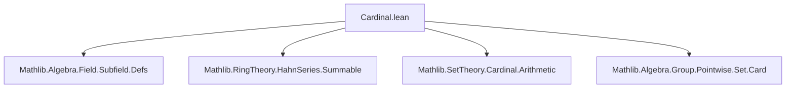
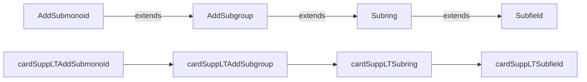

### Technical Brief: `Cardinal.lean` — Cardinality of Hahn Series

---

#### **1. Key Definitions & Theorems**

| Name | Type / Signature | Purpose |
|------|------------------|---------|
| `cardSupp` | `def cardSupp (x : R⟦Γ⟧) : Cardinal` | Defines the cardinality of the support of a Hahn series. |
| `cardSupp_congr` | `{x : R⟦Γ⟧} {y : S⟦Γ⟧} → x.support = y.support → x.cardSupp = y.cardSupp` | Equality of supports implies equality of cardinalities. |
| `cardSupp_mono` | `x.support ⊆ y.support → x.cardSupp ≤ y.cardSupp` | Monotonicity of `cardSupp` w.r.t. inclusion of supports. |
| `cardSupp_zero` | `cardSupp 0 = 0` | Support of zero series is empty. |
| `cardSupp_single_of_ne` | `r ≠ 0 → cardSupp (single a r) = 1` | Single-term series has support of size 1. |
| `cardSupp_single_le` | `cardSupp (single a r) ≤ 1` | Upper bound for single-term series. |
| `cardSupp_map_le` | `(x.map f).cardSupp ≤ x.cardSupp` | Support size non-increases under homomorphic map. |
| `cardSupp_add_le` | `cardSupp (x + y) ≤ cardSupp x + cardSupp y` | Subadditivity of support size under addition. |
| `cardSupp_mul_le` | `cardSupp (x * y) ≤ cardSupp x * cardSupp y` | Submultiplicativity of support size under multiplication (requires ordered cancellative additive monoid structure on Γ). |
| `cardSupp_pow_le` | `cardSupp (x ^ n) ≤ cardSupp x ^ n` | Support size under powers. |
| `cardSupp_hsum_le` | `lift s.hsum.cardSupp ≤ sum fun a ↦ (s a).cardSupp` | Bound on support of Hahn series sum over an index family. |
| `cardSupp_hsum_powers_le` | `cardSupp (∑' n, x ^ n) ≤ max ℵ₀ cardSupp x` | Support size of geometric series (requires field & linear order). |
| `cardSupp_inv_le` | `cardSupp x⁻¹ ≤ max ℵ₀ cardSupp x` | Support size of inverse in field of Hahn series. |
| `cardSupp_div_le` | `cardSupp (x / y) ≤ cardSupp x * max ℵ₀ cardSupp y` | Support size of division. |
| `cardSuppLTAddSubmonoid` | `AddSubmonoid R⟦Γ⟧` | Submonoid of Hahn series with support size < κ. |
| `cardSuppLTAddSubgroup` | `AddSubgroup R⟦Γ⟧` | Subgroup of Hahn series with support size < κ. |
| `cardSuppLTSubring` | `Subring R⟦Γ⟧` | Subring of Hahn series with support size < κ. |
| `cardSuppLTSubfield` | `Subfield R⟦Γ⟧` | Subfield of Hahn series with support size < κ (requires ℵ₀ < κ). |

---

#### **2. Naming Conventions**

- **Prefixes**:
  - `cardSupp_`: All functions/lemmas about support cardinality.
  - `mem_cardSuppLT*`: Membership criteria for bounded substructures.
- **Suffixes**:
  - `_le`: Inequality bounds (e.g., `cardSupp_add_le`).
  - `_lt`: Strict inequality (e.g., `add_mem'` uses `add_lt_of_lt`).
  - `_congr`: Congruence (equality under equivalence).
  - `_mono`: Monotonicity.
- **Structure names**:
  - `cardSuppLT*`: Substructures bounded by cardinal κ (LT = “less than”).

---

#### **3. Tactic Stack**

Frequently used tactics:
- `simp`, `simp_rw`: Simplify using definitions and rewrite rules.
- `aesop`: For automated reasoning with `add simp [...]`.
- `rw`, `refine`, `exact`: Basic rewriting and construction.
- `induction`: Inductive proofs (e.g., for `cardSupp_pow_le`).
- `gcongr`, `trans`, `trans_lt`, `trans_le`: Chain inequalities.
- `grw`: Rewrite using `ge`/`le`-oriented lemmas.
- `split_ifs`, `cases`: Case analysis on `if` or sum types.
- `simpa`: Simplify and discharge goal using assumptions.

---

#### **4. Proof Logic**

- **Inductive structure**: Proofs often proceed by:
  - **Case analysis** on whether a coefficient is zero (`eq_or_ne x 0`).
  - **Induction** on natural numbers (e.g., for powers).
  - **Monotonicity + cardinal arithmetic**: Most bounds reduce to:
    - `support op ⊆ ...` → `mk_le_mk_of_subset`
    - Then apply cardinal arithmetic lemmas like `mk_union_le`, `mk_add_le`, `mul_le_mul_*`.
- **Key logical flow**:
  1. Show inclusion of supports (via `support_*_subset` lemmas).
  2. Apply `mk_le_mk_of_subset`.
  3. Use cardinal arithmetic to bound the resulting expression.
  4. For strict inequalities (`< κ`), use `aleph0_pos`, `one_lt_aleph0`, and `hκ.out`.

---

#### **5. Imports & Dependencies**

| Module | Role |
|--------|------|
| `Mathlib.Algebra.Field.Subfield.Defs` | Definitions of subfields, needed for `cardSuppLTSubfield`. |
| `Mathlib.RingTheory.HahnSeries.Summable` | Hahn series, support, summable families, `hsum`, `powers`. |
| `Mathlib.SetTheory.Cardinal.Arithmetic` | Cardinal arithmetic (e.g., `ℵ₀`, `sum`, `mul`, `max`). |
| `Mathlib.Algebra.Group.Pointwise.Set.Card` | Cardinality of sets under group actions (used for `mk_*` lemmas). |

---

#### **6. Mermaid Diagrams**

##### **Dependency Graph (Module-Level)**



##### **Overview of Theory Flow**

```mermaid
graph TD
  H[HahnSeries R⟦Γ⟧] --> S[Support Support(x) ⊆ Γ]
  S --> C[Cardinal #Support(x)]
  C --> B1[Bounds on operations: +, *, -, ^, inv, div]
  C --> B2[Substructures: AddSubmonoid, AddSubgroup, Subring, Subfield]
  B1 --> B2
  B2 --> K[κ-bounded substructures: {x | #supp x < κ}]
  K --> F[Field of κ-bounded Hahn series if ℵ₀ < κ]
```

##### **Structure Hierarchy**



---

#### **7. Summary**

This file formalizes the **cardinal arithmetic of Hahn series**, focusing on how the size of the support behaves under algebraic operations. It introduces the function `cardSupp`, proves key inequalities (subadditivity, submultiplicativity, etc.), and constructs **κ-bounded substructures** (monoids, groups, rings, fields) of Hahn series whose supports have cardinality strictly less than a given infinite cardinal κ. The proofs rely heavily on:
- Support inclusion lemmas (`support_*_subset`)
- Cardinal monotonicity (`mk_le_mk_of_subset`)
- Cardinal arithmetic (especially involving ℵ₀)

The results are foundational for constructing valued fields and Hahn series fields with prescribed support constraints — a key step in model theory and valuation theory.

--- 

Let me know if you'd like a formalized dependency graph (e.g., in `.graphml`), or a summary of how this module fits into the broader Hahn series ecosystem (e.g., `HahnSeries.lean`, `ValuationRing.lean`).
