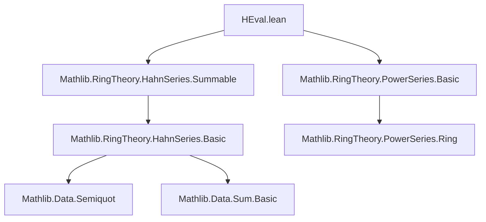
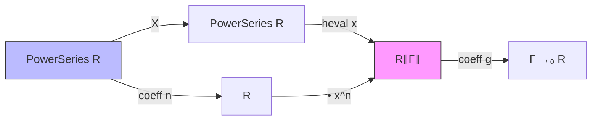

### Technical Brief: `HEval.lean`

---

#### **1. Key Definitions & Theorems**

| Name | Type / Signature | Purpose |
|------|------------------|---------|
| `powerSeriesFamily` | `x : V⟦Γ⟧ → f : PowerSeries R → SummableFamily Γ V ℕ` | Constructs a summable family of Hahn series where each term is $ f_n \cdot x^n $, with $ f_n $ the $ n $-th coefficient of $ f $. |
| `heval` | `x : R⟦Γ⟧ → PowerSeries R →ₐ[R] R⟦Γ⟧` | The $ R $-algebra homomorphism evaluating a formal power series at a Hahn series $ x $ of *positive order*, i.e., $ f(X) \mapsto \sum_n f_n x^n $. |
| `powerSeriesFamily_of_not_orderTop_pos` | `¬ 0 < x.orderTop → powerSeriesFamily x f = powerSeriesFamily 0 f` | If $ x $ has non-positive order (i.e., $ x = 0 $), then substitution reduces to constant-term-only evaluation. |
| `powerSeriesFamily_of_orderTop_pos` | `0 < x.orderTop → powerSeriesFamily x f n = f.coeff n • x ^ n` | When $ x $ has positive order, the $ n $-th term of the family is exactly $ f_n \cdot x^n $. |
| `powerSeriesFamily_hsum_zero` | `(powerSeriesFamily 0 f).hsum = f.constantCoeff • 1` | Evaluation at zero yields the constant term times the multiplicative identity in $ R⟦Γ⟧ $. |
| `hsum_powerSeriesFamily_mul` | `(powerSeriesFamily x (a * b)).hsum = ((powerSeriesFamily x a).mul (powerSeriesFamily x b)).hsum` | Ensures that substitution respects multiplication: evaluation of a product equals the product of evaluations (via Cauchy product in Hahn series). |
| `heval_mul` | `heval x (a * b) = heval x a * heval x b` | Multiplicativity of `heval`. |
| `heval_C` | `heval x (C r) = r • 1` | Compatibility with scalars: constant power series maps to scalar multiple of identity. |
| `heval_X` | `0 < x.orderTop → heval x X = x` | The variable $ X $ maps to $ x $, as intended. |
| `heval_unit` | `IsUnit u → IsUnit (heval x u)` | Units map to units under evaluation (requires positivity of order). |
| `coeff_heval` | `(heval x f).coeff g = ∑ᶠ n, ((powerSeriesFamily x f).coeff g) n` | Coefficient extraction commutes with evaluation (via finitely supported sum). |
| `coeff_heval_zero` | `(heval x f).coeff 0 = constantCoeff f` | The constant term of the evaluated series equals the constant term of the original power series. |

---

#### **2. Naming Conventions**

- **Prefixes**:
  - `powerSeriesFamily_`: properties of the family construction.
  - `heval_`: properties of the evaluation map.
  - `coeff_`: coefficient-related lemmas.
  - `support_`: support containment lemmas.

- **Suffixes**:
  - `_subset`: set inclusion lemmas.
  - `_zero`: statements about the zero coefficient or zero element.
  - `_pos` / `_not_pos`: case distinctions on order positivity.

- **Structure**:
  - `heval` is short for *Hahn evaluation*.
  - `powerSeriesFamily` reflects its role as a family indexed by $ \mathbb{N} $ derived from a power series.

---

#### **3. Tactic Stack**

Frequently used tactics in proofs:

| Tactic | Role |
|--------|------|
| `simp` / `simp only` | Simplify using definitions, especially of `coeff`, `hsum`, `smulFamily`, `powers`, `powerSeriesFamily`. |
| `rw` / `refine` / `apply` | Rewrite using lemmas, especially `coeff_hsum`, `hsum_mul`, `sum_sigma'`, `sum_subset`. |
| `by_cases` | Split on $ 0 < x.\text{orderTop} $, $ n = 0 $, $ g = 0 $, etc. |
| `ext` | Extensionality for equality of Hahn series or functions. |
| `finsum_eq_single` / `finsum_eq_zero_of_forall_eq_zero` | Reduce infinite sums to single terms or zero. |
| `sum_sigma'` / `sum_subset` | Reindex sums over product or subset. |
| `intro` / `contrapose!` | Logical reasoning, especially in coefficient-level arguments. |
| `ring` / `abel` | Not used here — algebraic simplifications handled via `simp` and `rw`. |

---

#### **4. Proof Logic**

The proofs follow a **case analysis on order positivity**, then **coefficient-wise reasoning**:

1. **Case split** on whether $ 0 < x.\text{orderTop} $:
   - If *true*, use `powers_of_orderTop_pos` to simplify powers of $ x $.
   - If *false*, $ x = 0 $, so only the $ n = 0 $ term survives.

2. **Coefficient-level analysis**:
   - Use `coeff_hsum`, `coeff_support`, and `finsum` lemmas to reduce to finite sums.
   - For multiplication, prove inclusion of supports (via `support_powerSeriesFamily_subset`) and apply `sum_subset` + injectivity of addition map $ (i,j) \mapsto i+j $.

3. **Algebraic structure checks**:
   - `heval` is defined as a `→ₐ[R]` homomorphism; proofs verify:
     - `map_one'`, `map_mul'`, `map_zero'`, `map_add'`, `commutes'`.
   - For units: use `Units.val_inv` and `← heval_mul`.

4. **Inductive/structural reasoning**:
   - Not induction on $ f $, but *term-wise* reasoning using coefficient formulas and finiteness of support.

---

#### **5. Imports**

| Module | Purpose |
|--------|---------|
| `Mathlib.RingTheory.HahnSeries.Summable` | Provides `SummableFamily`, `hsum`, `smulFamily`, and basic Hahn series arithmetic. |
| `Mathlib.RingTheory.PowerSeries.Basic` | Defines `PowerSeries`, `coeff`, `X`, `C`, multiplication, and algebra structure. |

These imports define the ambient categorical and algebraic context: Hahn series over an ordered abelian group $ \Gamma $, and formal power series over a commutative ring $ R $.

---

#### **6. Mermaid Diagrams**

##### **Dependency Graph (Module-Level)**

##### **Overview of Theory Flow**

- **Input**: Formal power series $ f = \sum f_n X^n $.
- **Construction**: For $ x \in R⟦Γ⟧ $ with $ 0 < x.\text{orderTop} $, form $ \sum f_n x^n $ as a Hahn series.
- **Output**: Element of $ R⟦Γ⟧ $, via `heval x f`.

---

#### **7. Notes on Correctness & Scope**

- **Positivity of order** is essential: ensures $ x^n \to 0 $ in the $ \Gamma $-adic topology, guaranteeing summability of $ \sum f_n x^n $.
- The `heval` map is only defined for *positive-order* $ x $; the `TODO` item `MvPowerSeries.heval` suggests future generalization to multivariate case.
- All proofs are *noncomputable*, as they rely on classical choice in `finsum` and `hsum`.

--- 

Let me know if you'd like a formalized summary in Lean syntax or a diagram of `heval` as a universal property.
