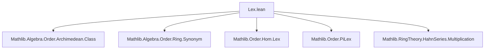
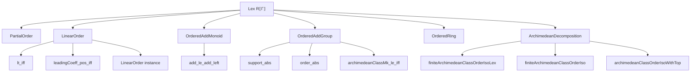

### Technical Brief: Lexicographical Order on Hahn Series (`Lex R⟦Γ⟧`)

---

#### **1. Key Definitions & Theorems**

| Name | Type / Signature | Purpose |
|------|------------------|---------|
| `PartialOrder (Lex R⟦Γ⟧)` | `instance [Zero R] [PartialOrder R] : PartialOrder (Lex R⟦Γ⟧)` | Lifts partial order on `R` to lexicographic order on Hahn series via coefficients. |
| `lt_iff` | `a < b ↔ ∃ i, (∀ j < i, a.j = b.j) ∧ a.i < b.i` | Characterizes strict inequality in `Lex R⟦Γ⟧` by first differing coefficient. |
| `LinearOrder (Lex R⟦Γ⟧)` | `instance [Zero R] [LinearOrder R] : LinearOrder (Lex R⟦Γ⟧)` | Constructs linear order on `Lex R⟦Γ⟧` using well-foundedness of support union and minimal index of difference. |
| `leadingCoeff_pos_iff` | `0 < (ofLex x).leadingCoeff ↔ 0 < x` | Relates positivity of leading coefficient to positivity of series. |
| `leadingCoeff_nonneg_iff` | `0 ≤ (ofLex x).leadingCoeff ↔ 0 ≤ x` | Analogous for non-negativity. |
| `IsOrderedAddMonoid (Lex R⟦Γ⟧)` | `instance [PartialOrder R] [AddCommMonoid R] [AddLeftStrictMono R] [IsOrderedAddMonoid R]` | Shows `Lex R⟦Γ⟧` inherits ordered additive monoid structure. |
| `support_abs`, `orderTop_abs`, `order_abs`, `leadingCoeff_abs` | `|x|` properties | Show absolute value preserves support, order, and leading coefficient up to sign. |
| `abs_lt_abs_of_orderTop_ofLex` | `(ofLex y).orderTop < (ofLex x).orderTop → |x| < |y|` | Compares magnitudes via leading-order terms. |
| `archimedeanClassMk_le_archimedeanClassMk_iff_of_orderTop_ofLex` | Equality of orders ⇒ comparison reduces to leading coefficients | Key lemma for decomposing Archimedean classes. |
| `archimedeanClassMk_le_archimedeanClassMk_iff` | Full decomposition: `x ≤ y` iff either `order(x) < order(y)` or equal orders and `lc(x) ≤ lc(y)` | Main structural theorem for Archimedean comparison. |
| `archimedeanClassMk_eq_archimedeanClassMk_iff` | Equality of Archimedean classes ⇔ equal orders and equal Archimedean classes of leading coefficients | Characterizes equality in `FiniteArchimedeanClass (Lex R⟦Γ⟧)`. |
| `finiteArchimedeanClassOrderHomLex` | `FiniteArchimedeanClass (Lex R⟦Γ⟧) →o Γ ×ₗ FiniteArchimedeanClass R` | Order-preserving map sending a class to `(orderTop, lc-class)`. |
| `finiteArchimedeanClassOrderHomInvLex` | Inverse of above | Constructs class from `(order, lc-class)`. |
| `finiteArchimedeanClassOrderIsoLex` | `FiniteArchimedeanClass (Lex R⟦Γ⟧) ≃o Γ ×ₗ FiniteArchimedeanClass R` | **Main isomorphism**: finite Archimedean classes decompose lexicographically. |
| `finiteArchimedeanClassOrderIso` | `[Archimedean R] → FiniteArchimedeanClass (Lex R⟦Γ⟧) ≃o Γ` | Simplifies to just `Γ` when `R` is Archimedean (unique finite Archimedean class). |
| `archimedeanClassOrderIsoWithTop` | `ArchimedeanClass (Lex R⟦Γ⟧) ≃o WithTop Γ` | Extends to full Archimedean classes (including zero) via `WithTop`. |
| `embDomainOrderEmbedding` | `Γ ↪o Γ' ⇒ Lex R⟦Γ⟧ ↪o Lex R⟦Γ'⟧` | Embeds series domain order-theoretically. |
| `embDomainOrderAddMonoidHom` | `Γ ↪o Γ' ⇒ Lex R⟦Γ⟧ →+o Lex R⟦Γ'⟧` | Adds monoid homomorphism structure. |
| `IsOrderedRing (Lex R⟦Γ⟧)` | `[IsOrderedRing R] [NoZeroDivisors R]` | Shows `Lex R⟦Γ⟧` inherits ordered ring structure. |
| `IsStrictOrderedRing (Lex R⟦Γ⟧)` | `[IsDomain R] [IsStrictOrderedRing R]` | Strict ordered ring structure under domain assumptions. |

---

#### **2. Naming Conventions**

- **Prefixes**:
  - `leadingCoeff_`: properties of leading coefficient.
  - `orderTop_`, `order_`: properties related to `orderTop` (max support element).
  - `archimedeanClassMk_`: statements about Archimedean class representatives.
  - `finiteArchimedeanClassOrderIsoLex`: main structural isomorphism.
  - `abs_`: absolute value behavior.
  - `embDomain_`: domain embedding constructions.

- **Suffixes**:
  - `_iff`: biconditional characterizations.
  - `_hom`, `_inv`, `_iso`: homomorphism, inverse, isomorphism.
  - `_order`, `_coeff`: decomposition components.

- **Notable patterns**:
  - `ofLex` used to coerce `Lex R⟦Γ⟧` → `R⟦Γ⟧`.
  - `toLex` used to lift from `R⟦Γ⟧` back to `Lex R⟦Γ⟧`.
  - `untop` used to extract underlying `Γ` from `WithTop Γ`.

---

#### **3. Tactic Stack**

| Tactic | Frequency | Role |
|--------|-----------|------|
| `rw` / `simp_rw` | Very High | Rewriting definitions, lemmas, and simplifying goals. |
| `simp` | Very High | Simplifying using `@[simp]` lemmas (e.g., `leadingCoeff_pos_iff`). |
| `rcases` / `obtain` | High | Case analysis on `eq_or_ne`, `lt_trichotomy`, `le_total`. |
| `exact` / `refine` | High | Constructing witnesses for existential goals (e.g., `⟨i, hj, hi⟩`). |
| `apply` / `intro` | Medium | Applying lemmas, introducing hypotheses. |
| `convert` | Medium | Matching goals up to definitional equality (e.g., `leadingCoeff_abs`). |
| `induction` | Medium | Induction on `FiniteArchimedeanClass` (via `mk`). |
| `contrapose!` | Medium | Turning implications into contrapositive forms. |
| `linarith` / `ring` | Low | Not prominent; arithmetic handled via order properties. |
| `aesop` | Low | Not used — proofs are highly structured and manual. |

---

#### **4. Proof Logic**

- **Inductive structure**:
  - Proofs often proceed by **case analysis** on equality (`eq_or_ne`) and order (`lt_trichotomy`, `le_total`).
  - For `LinearOrder`, the key idea is:
    - Define `u = support(a) ∪ support(b)`, `v = {i | a.i ≠ b.i}`.
    - Show `v` is well-founded (subset of wf set `u`).
    - Let `i = min v` (exists since `a ≠ b`).
    - Use minimality to show all earlier coefficients match, and compare at `i`.

- **Archimedean decomposition**:
  - First prove `≤` iff `(order(x) < order(y)) ∨ (order(x) = order(y) ∧ lc(x) ≤ lc(y))`.
  - Prove equality version via antisymmetry.
  - Use `finiteArchimedeanClass.liftOrderHom` to build the isomorphism.

- **Order isomorphism construction**:
  - Define forward map using `orderTop` and `leadingCoeff`.
  - Define inverse using `single`-based construction (Hahn series with single nonzero term).
  - Verify mutual inverses and monotonicity.

- **Ring structure**:
  - Reduce to `leadingCoeff` and `orderTop` properties.
  - Use `leadingCoeff_mul`, `leadingCoeff_nonneg_iff`, and `ofLex_mul`.

---

#### **5. Imports**

| Module | Purpose |
|--------|---------|
| `Mathlib.Algebra.Order.Archimedean.Class` | Archimedean classes, `ArchimedeanClass`, `FiniteArchimedeanClass`. |
| `Mathlib.Algebra.Order.Ring.Synonym` | Ordered ring synonyms and aliases. |
| `Mathlib.Order.Hom.Lex` | Lexicographic order on products and homs. |
| `Mathlib.Order.PiLex` | Lexicographic order on dependent products (used for `Lex R⟦Γ⟧`). |
| `Mathlib.RingTheory.HahnSeries.Multiplication` | Multiplication and basic algebraic structure of Hahn series. |

---

#### **6. Mermaid Diagrams**

##### **Dependency Graph (Module-Level)**



##### **Theory Overview (Lex R⟦Γ⟧ Structure)**



##### **Decomposition Isomorphism Flow**

```mermaid
graph LR
  A[FiniteArchimedeanClass (Lex R⟦Γ⟧)] -->|finiteArchimedeanClassOrderHomLex| B[Γ ×ₗ FiniteArchimedeanClass R]
  B -->|finiteArchimedeanClassOrderHomInvLex| A
  A <-->|orderIso| B
  B -->|proj1| Γ
  B -->|proj2| FiniteArchimedeanClass R
```

---

#### **7. Summary**

This file establishes the **order-theoretic structure** of lexicographically ordered Hahn series `Lex R⟦Γ⟧`. It shows:
- When `Γ` and `R` are linearly ordered, `Lex R⟦Γ⟧` inherits a linear order.
- The Archimedean classes of `Lex R⟦Γ⟧` decompose as lexicographic pairs of `Γ` and `FiniteArchimedeanClass R`.
- Under Archimedean assumptions on `R`, this simplifies to `FiniteArchimedeanClass (Lex R⟦Γ⟧) ≃o Γ`.
- The ring and ordered ring structures lift under suitable assumptions on `R`.

The proofs rely heavily on properties of **support**, **leading coefficient**, and **orderTop**, with careful handling of well-foundedness and minimality arguments. The main result is the **order isomorphism** `finiteArchimedeanClassOrderIsoLex`, which serves as a foundational tool for further analysis of Hahn series in ordered algebra.
