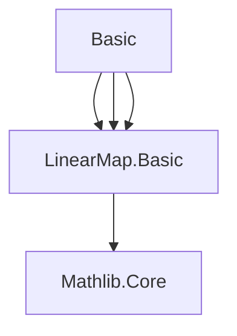

### Technical Brief: `Basic.lean` — Hopf Algebra Formalization in Lean 4

---

#### **1. Key Definitions & Theorems**

| Name | Type / Signature | Purpose |
|------|------------------|---------|
| `HopfAlgebraStruct R A` | `class` extending `Bialgebra R A` | Isolates the *antipode* as an `R`-linear map `A →ₗ[R] A`, without yet imposing axioms. |
| `HopfAlgebra R A` | `class` extending `HopfAlgebraStruct R A` | Full Hopf algebra structure: a bialgebra equipped with an antipode satisfying two axioms (left/right convolution inverses of identity). |
| `antipode R` | `A →ₗ[R] A` | The antipode map; the core structure of a Hopf algebra. |
| `mul_antipode_rTensor_comul` | `LinearMap.mul' R A ∘ₗ antipode.rTensor A ∘ₗ comul = algebraMap R A ∘ₗ counit` | Right convolution inverse axiom: $m \circ (\text{antipode} \otimes \mathrm{id}) \circ \Delta = \eta \circ \varepsilon$. |
| `mul_antipode_lTensor_comul` | `LinearMap.mul' R A ∘ₗ antipode.lTensor A ∘ₗ comul = algebraMap R A ∘ₗ counit` | Left convolution inverse axiom: $m \circ (\mathrm{id} \otimes \text{antipode}) \circ \Delta = \eta \circ \varepsilon$. |
| `antipode_one` | `antipode R 1 = 1` | Antipode preserves unit. |
| `counit_antipode` | `counit (antipode a) = counit a` | Antipode preserves counit. |
| `sum_antipode_mul_eq_algebraMap_counit` | `∑ … = algebraMap R A (counit a)` | Explicit summation form of the right antipode axiom using a representation `repr`. |
| `sum_mul_antipode_eq_algebraMap_counit` | `∑ … = algebraMap R A (counit a)` | Summation form of the left antipode axiom. |
| `toHopfAlgebra` | `instance CommSemiring.toHopfAlgebra` | Every commutative semiring $R$ is a Hopf algebra over itself via identity antipode. |
| `antipode_eq_id` | `antipode R (A := R) = id` | For $R$ over itself, antipode is identity. |

---

#### **2. Naming Conventions**

- **Prefixes**:
  - `antipode_`: properties of the antipode (`antipode_one`, `counit_antipode`, `antipode_eq_id`).
  - `mul_antipode_*`: convolution identities involving multiplication and antipode.
  - `sum_*`: summation forms of axioms using `Repr` (coalgebra comultiplication decomposition).
- **Suffixes**:
  - `_rTensor_comul`: right tensor factor with antipode.
  - `_lTensor_comul`: left tensor factor with antipode.
  - `_eq_*`: equational lemmas (e.g., `eq_algebraMap_counit`, `eq_smul`).
- **Type parameters**:
  - `R` for base commutative (semi)ring.
  - `A` for the underlying module/algebra.

---

#### **3. Tactic Stack**

| Tactic | Usage Frequency | Purpose |
|--------|-----------------|---------|
| `simp` / `simpa` | High | Simplify using `@[simp]` lemmas, especially `mul_antipode_*_apply`. |
| `ext` | Medium | Extensionality for linear maps and functions. |
| `rw` | Medium | Rewrite using previously proved equalities (e.g., `sum_antipode_mul_eq_smul`). |
| `congr` | Low | Congruence for applying equalities under function application (e.g., `congr($(mul_antipode_rTensor_comul a))`). |
| `calc` | Low | Chain equalities in `counit_antipode`. |
| `simp_rw` | Low | Simplify while rewriting (used in `counit_antipode`). |

---

#### **4. Proof Logic**

- **Structure**: Definitions are layered: `HopfAlgebraStruct` → `HopfAlgebra`.
- **Axioms**: Two convolution identities (`mul_antipode_*`) are taken as primitive; all other properties (e.g., `antipode_one`, `counit_antipode`) are *derived*.
- **Derivation pattern**:
  - Use `mul_antipode_*_apply` (simplified versions of axioms).
  - Apply `map_sum`, `counit_mul`, `smul_eq_mul`, etc., to convert tensor expressions into sums.
  - Use representation `repr : Repr R a` (from `Coalgebra`) to unpack `comul a = ∑ repr.left i ⊗ repr.right i`.
- **Example proof sketch** (`counit_antipode`):
  1. Expand `antipode a` using the left antipode axiom in summed form (`sum_mul_antipode_eq_smul`).
  2. Apply `counit` to both sides.
  3. Use `counit_mul`, `map_sum`, and `sum_counit_smul` to reduce.
  4. Simplify to `counit a`.

---

#### **5. Imports & Dependencies**

| Module | Role |
|--------|------|
| `Mathlib.RingTheory.Bialgebra.Basic` | Provides `Bialgebra`, `Coalgebra`, `Algebra.TensorProduct`, `LinearMap.*`, etc. |
| `universe u v w` | Universe polymorphism for generality. |
| `open Bialgebra` | Brings bialgebra operations (`comul`, `counit`, `mul`, `unit`) into scope. |

---

#### **6. Mermaid Diagrams**

##### **Dependency Graph (Module-Level)**



##### **Conceptual Overview (Theory Flow)**

```mermaid
graph LR
  Bialgebra[R-Bialgebra A] --> HopfAlgebraStruct[Antipode Map]
  HopfAlgebraStruct --> HopfAlgebra[Antipode Axioms]
  HopfAlgebra --> AntipodeProps[Properties: antipode(1)=1, counit∘S=counit, etc.]
  CommSemiring -->|instance| HopfAlgebra
  HopfAlgebra -->|future| HopfAlgCat[Category of Hopf Algebras]
```

##### **Proof Dependency (for `counit_antipode`)**

```mermaid
graph TD
  counit_antipode --> sum_mul_antipode_eq_smul
  sum_mul_antipode_eq_smul --> mul_antipode_lTensor_comul
  mul_antipode_lTensor_comul --> mul_antipode_lTensor_comul_apply
  mul_antipode_lTensor_comul_apply -->[simp] mul_antipode_lTensor_comul
```

---

#### **7. Future Work (from TODO)**

- **Uniqueness**: If two Hopf algebra structures share the same bialgebra structure, their antipodes coincide.
- **Algebra homomorphism**: If $A$ is commutative, then $\text{antipode}(ab) = \text{antipode}(b)\,\text{antipode}(a)$, so $S$ is an *anti*-algebra map; in commutative case, it *is* an algebra map.
- **Bijectivity & involution**: For commutative $A$, $S$ is bijective and $S^2 = \mathrm{id}$.
- **Categorical equivalence**: `HopfAlgCat R ≌ Hopf (ModuleCat R)` — transfer results from braided monoidal category theory.

---

#### **8. Summary**

This file formalizes the *axiomatic core* of Hopf algebras over a commutative semiring, building on bialgebras. It introduces the antipode as a linear map and enforces the convolution-inverse axioms. The proofs are largely computational, leveraging coalgebraic decomposition (`Repr`) and simplification via `simp`. The `CommSemiring.toHopfAlgebra` instance shows that the simplest case (the base ring over itself) is trivial — antipode is identity.

This is a foundational module; subsequent files would likely prove the properties listed in the TODO, and develop the category-theoretic aspects.
