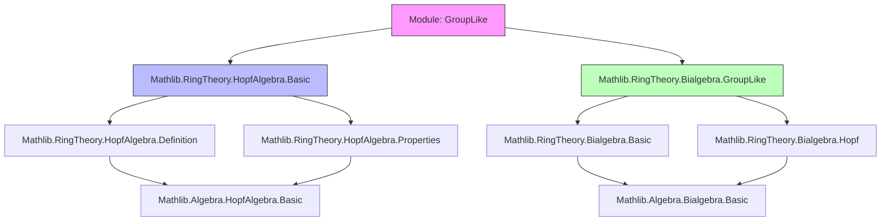
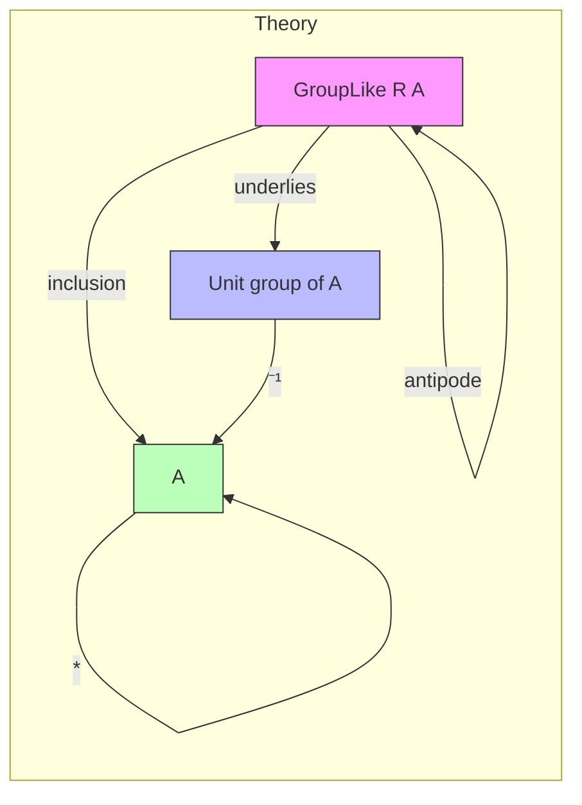

### Technical Brief: `GroupLike.lean`

---

#### **1. Key Definitions & Theorems**

| Name | Type / Signature | Purpose |
|------|------------------|---------|
| `IsGroupLikeElem R a` | Predicate on `a : A` | Expresses that `a` is *group-like*: $\Delta(a) = a \otimes a$, $\varepsilon(a) = 1$ |
| `antipode_mul_cancel`, `mul_antipode_cancel` | `antipode R a * a = 1`, `a * antipode R a = 1` | Antipode acts as two-sided inverse for group-like elements |
| `GroupLike.toUnits` | `GroupLike R A →* Aˣ` | Canonical monoid homomorphism embedding group-like elements into units of `A`, with inverse given by antipode |
| `IsGroupLikeElem.isUnit` | `IsUnit a` | Every group-like element is a unit |
| `IsGroupLikeElem.antipode` | `IsGroupLikeElem R (antipode R a)` | Antipode of a group-like element is again group-like |
| `IsGroupLikeElem.antipode_antipode` | `antipode R (antipode R a) = a` | Antipode is an involution on group-like elements |
| `GroupLike.instInv` | `Inv (GroupLike R A)` | Defines inversion on `GroupLike R A` via antipode |
| `GroupLike.instGroup` | `Group (GroupLike R A)` | Proves group axioms for `GroupLike R A` under multiplication inherited from `A` |
| `GroupLike.instCommGroup` | `CommGroup (GroupLike R A)` | If `A` is commutative, then group-like elements form an *abelian* group |

---

#### **2. Naming Conventions**

- **Predicates**: `IsGroupLikeElem` — standard `is_` prefix for properties.
- **Lemmas about inverses**: `*_mul_cancel`, `mul_*_cancel` — indicate cancellation laws.
- **Structure projections**: `val`, `inv`, `val_inv`, `inv_val` — standard for `Subtype`/`Units`-style constructions.
- **Typeclass instances**: `inst*` — e.g., `instInv`, `instGroup`, `instCommGroup`.
- **Definitional names**: `GroupLike.toUnits` — `to*` for canonical maps into algebraic structures.

---

#### **3. Tactic Stack**

- `simp` / `simpa` — heavily used to discharge goals using `simp` lemmas (e.g., `mul_antipode_*_apply`, `ha`).
- `ext` — for extensionality proofs (equality of group-like elements or units).
- `rfl` — for definitional equalities.
- `left_inv_eq_right_inv` — used to prove equality of left/right inverses in monoids.
- `by ext; rfl` — common pattern to prove equality of group-like elements or units.

No heavy automation (e.g., `aesop`, `linarith`, `ring`) is needed — proofs are mostly algebraic manipulations using Hopf algebra axioms.

---

#### **4. Proof Logic**

- **Structure**: The proof proceeds in layers:
  1. **Basic properties** of group-like elements: antipode gives inverse (`antipode_mul_cancel`, `mul_antipode_cancel`).
  2. **Embedding into units**: Define `GroupLike.toUnits`, show it's a monoid homomorphism.
  3. **Closure under antipode**: Show antipode of group-like is group-like (`antipode` lemma), and antipode is involutive (`antipode_antipode`).
  4. **Group structure**: Define inversion via antipode, verify group axioms (`inv_mul_cancel`).
  5. **Commutativity**: If `A` is commutative, then `GroupLike R A` is abelian.

- **Induction**: Not used — all arguments are direct algebraic manipulations using Hopf algebra identities.

- **Key logical flow**:
  > From definition of `IsGroupLikeElem`, derive antipode inverse laws → construct monoid map to `Aˣ` → lift to group structure on `GroupLike R A`.

---

#### **5. Imports & Dependencies**

- **Core dependencies**:
  - `Mathlib.RingTheory.HopfAlgebra.Basic` — defines Hopf algebras, antipode, comultiplication, counit.
  - `Mathlib.RingTheory.Bialgebra.GroupLike` — defines `IsGroupLikeElem` and basic properties.

- **Implicit assumptions**:
  - `R` is a commutative semiring.
  - `A` is a semiring (resp. commutative semiring) and a Hopf algebra over `R`.

---

#### **6. Theory Overview & Dependencies**

- **Main result**: `GroupLike R A` is a group (abelian if `A` is commutative), canonically embedded in `Aˣ`.
- **Broader context**: Part of the theory of *Hopf algebra representation theory* and *quantum groups*, where group-like elements model symmetries or coalgebraic analogues of group elements.

---

#### **7. Formalization Highlights**

- Uses `Subtype` (`GroupLike R A` = `{a // IsGroupLikeElem R a}`).
- Leverages `HopfAlgebra` structure to derive antipode identities.
- Avoids redundant assumptions: only `CommSemiring R`, `Semiring A` needed for group structure; `CommSemiring A` for commutativity.
- `@[simps]` used to ensure definitional equalities for projections.

---

#### **8. Example Formula**

For $a \in A$ group-like:

$$
\Delta(a) = a \otimes a,\quad \varepsilon(a) = 1,\quad S(a)^{-1} = S(a),\quad S(S(a)) = a
$$

and the group operation on `GroupLike R A` is inherited from multiplication in $A$.

--- 

Let me know if you'd like a dependency graph of the entire `Mathlib` Hopf algebra module or a comparison with `Group.lean`/`Units.lean`.
